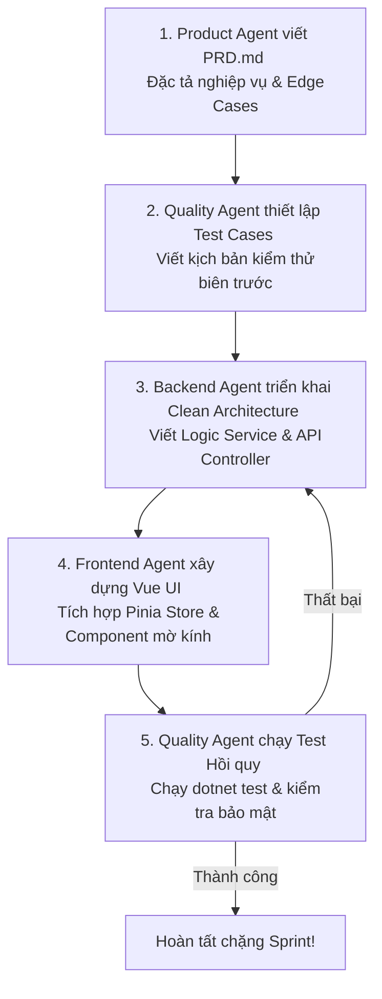
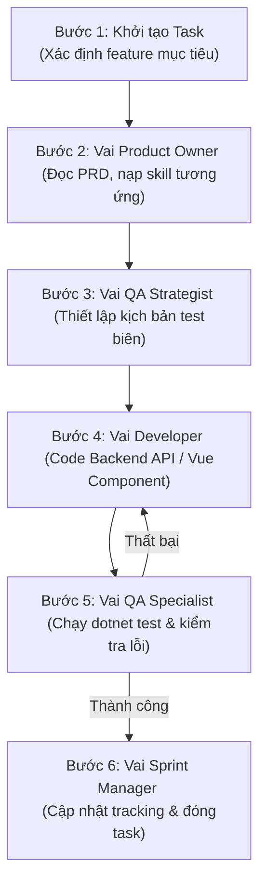

# 🤖 Cẩm Nang Hợp Tác Tác Nhân AI (AI Multi-Agent Collaboration Playbook - MyPetClinic)

Chào mừng bạn đến với hạt nhân vận hành của **MyPetClinic**. Dự án này được thiết kế theo trường phái **AI-First & AI-Disciplined Development**, nơi mọi quy trình phát triển từ PRD, lập trình cho đến kiểm thử tự động đều được giao phó và phối hợp nhịp nhàng giữa các Tác nhân AI chuyên biệt (AI Agents).

Tài liệu này đóng vai trò hướng dẫn phân vai, vận hành và quy chuẩn giao tiếp giữa các AI Agents để bảo đảm tính nhất quán kiến trúc cao nhất trong suốt hành trình phát triển toàn bộ các Phase chức năng.

---

## 🏛️ Bản Đồ Phân Vai Tác Nhân AI (AI Agent Role Directory)

Hệ thống được chia nhỏ thành các Tổ chuyên môn chính nằm tại thư mục `skills/`. Mỗi AI Agent khi tiếp quản dự án bắt buộc phải tự động nạp (load) các tệp tin kỹ năng tương ứng trước khi thực thi mã nguồn:

### 1. Tổ Kiến Trúc & Nghiệp Vụ Backend (`skills/backend/`)
Chịu trách nhiệm về lõi Clean Architecture .NET (WebApi, Application, Domain, Infrastructure), Entity Framework Core, và bảo mật hệ thống.
- **[foundation.md](./skills/backend/foundation.md)**: Hướng dẫn cơ bản về lập trình C#, cấu trúc Clean Architecture, và các nguyên tắc SOLID cơ bản.
- **[core.md](./skills/backend/core.md)**: Kỹ năng xử lý nghiệp vụ nghiệp vụ của Pet Clinic (tránh đặt lịch trùng, xử lý hàng đợi, hóa đơn).
- **[advanced.md](./skills/backend/advanced.md)**: Kỹ năng tối ưu hóa EF Core, xử lý song song, bảo mật RBAC, JWT và phân quyền nâng cao.
- **[expert.md](./skills/backend/expert.md)**: Kiến trúc hệ thống mở rộng, tích hợp AI (Gemini SDK) và xây dựng background worker (Quartz.NET/HostedService) gửi thư tự động nhắc lịch.

### 2. Tổ Giao Diện & Trải Nghiệm Frontend (`skills/frontend/`)
Chịu trách nhiệm về giao diện SPA (Single Page Application) sử dụng Vue 3, Pinia State Management, TailwindCSS / Vanilla CSS và tích hợp Chart.js.
- **[foundation.md](./skills/frontend/foundation.md)**: Các quy tắc thiết kế Premium UI, tối ưu biến CSS HSL, và xây dựng bố cục Glassmorphism tinh tế.
- **[core.md](./skills/frontend/core.md)**: Quản lý Component tái sử dụng, tương tác Form validation phía client và định dạng tiền tệ/ngày giờ.
- **[advanced.md](./skills/frontend/advanced.md)**: Thiết lập Router Guard bảo vệ trang Admin/Bác sĩ/Lễ tân và quản lý trạng thái luồng timeline lịch hẹn bằng Pinia.
- **[expert.md](./skills/frontend/expert.md)**: Vẽ biểu đồ doanh thu nâng cao, xử lý realtime updates và tối ưu hiệu suất tải trang SPA.

### 3. Tổ Kế Hoạch & Thiết Kế Sản Phẩm (`skills/product/`)
Chịu trách nhiệm phân tích yêu cầu nghiệp vụ phòng khám thú y, viết PRD chi tiết và phân chia roadmap sprint.
- **[foundation.md](./skills/product/foundation.md)**: Định nghĩa chân dung khách hàng, bác sĩ, lễ tân, thu ngân và các luồng nghiệp vụ cơ bản.
- **[core.md](./skills/product/core.md)**: Cách viết PRD 4 trụ cột chi tiết và lập kế hoạch bàn giao tính năng MVP.
- **[advanced.md](./skills/product/advanced.md)**: Thiết kế chỉ số đo lường hiệu quả (KPIs) và luồng đi của hồ sơ bệnh án qua các phòng ban.
- **[expert.md](./skills/product/expert.md)**: Chiến lược phát hành sản phẩm và phản hồi tự động hóa qua AI Chatbot.

### 4. Tổ Kiểm Soát Chất Lượng (`skills/quality/`)
Chịu trách nhiệm đảm bảo hệ thống vận hành trơn tru, không phát sinh lỗi trùng lịch hẹn, tràn bộ nhớ hay lỗi bảo mật IDOR.
- **[foundation.md](./skills/quality/foundation.md)**: Hướng dẫn viết Unit Test cơ bản với xUnit và FluentAssertions phía Backend.
- **[core.md](./skills/quality/core.md)**: Viết Integration Test kiểm thử liên thông API (đăng ký -> duyệt -> thanh toán).
- **[advanced.md](./skills/quality/advanced.md)**: Thiết lập bộ kịch bản kiểm thử bảo mật nâng cao (chặn truy cập IDOR hồ sơ thú cưng khác).
- **[expert.md](./skills/quality/expert.md)**: Tự động hóa kiểm thử hiệu năng tải và rà soát rò rỉ bộ nhớ.

---

## 🔄 Quy Trình Giao Tiếp Song Hành Giữa Các Agents (Inter-Agent Collaboration Workflow)

Để bảo đảm không bao giờ xảy ra lỗi nghẽn hoặc kiến trúc chắp vá giữa Frontend và Backend, các Agents phải thực hiện quy trình phát triển nghiêm ngặt 5 bước:

1. **Bước 1 (Định hình):** `Product Agent` soạn thảo tài liệu PRD, mô tả chi tiết User Story và tiêu chí nghiệm thu (Acceptance Criteria).
2. **Bước 2 (Chốt chặn trước):** `Quality Agent` lập tức phác thảo bộ kịch bản kiểm thử (Test Cases) và giả lập API dựa trên tài liệu giao ước kết nối API (`api-spec.md`).
3. **Bước 3 (Thực thi Lõi Backend):** `Backend Agent` thiết lập Domain Entity, Database Migration, Application Service và API Endpoint. Đảm bảo lọc dữ liệu an sau dựa trên `currentUserId`.
4. **Bước 4 (Phát triển giao diện):** `Frontend Agent` tạo các Component giao diện Glassmorphism, thiết lập Pinia store để lưu cache dữ liệu và thực hiện các bước validation dữ liệu phía Client.
5. **Bước 5 (Đóng gói & Kiểm thử):** Chạy `dotnet test` để kiểm tra độ tin cậy của mã nguồn Backend, đồng thời kiểm tra bảo mật API chống tấn công IDOR trước khi Scrum Master duyệt merge PR.

---

## 🔄 Quy Trình Thực Thi Đơn Tác Nhân (Single-Agent Step-by-Step Protocol)

Khi một AI Agent tiếp nhận yêu cầu phát triển tính năng trong MyPetClinic, Agent bắt buộc phải tự giác đóng vai tuần tự theo quy trình 6 bước khép kín dưới đây:

- **Bước 1 (Khởi tạo):** Đọc hiểu yêu cầu của người dùng để xác định tính năng cần xử lý trong bản đồ phân rã (`plan/features/deep-decomposition/`).
- **Bước 2 (Chuyển vai Product):** Đọc kỹ tài liệu `PRD.md` và `TECHNICAL_SPEC.md` của tính năng đó. Chủ động nạp các tệp tin trong thư mục `skills/` có liên quan.
- **Bước 3 (Chuyển vai QA thiết lập trước):** Định hình các điều kiện biên trước khi viết code (ví dụ: ngày đặt lịch khám không được là quá khứ, vắc-xin sắp hết hạn phải được cảnh báo).
- **Bước 4 (Chuyển vai Fullstack Dev):**
  - _Nếu là Backend:_ Cập nhật logic Service, xử lý truy cập an toàn bằng JWT, viết các truy vấn LINQ tối ưu trực tiếp trên Database Server.
  - _Nếu là Frontend:_ Dựng giao diện Premium, đăng ký các dynamic style, kết nối Pinia Store xử lý cập nhật bất tuần tự.
- **Bước 5 (Chuyển vai QA xác thực):** Chạy lệnh kiểm thử `dotnet test` cho Backend hoặc kiểm tra console log phía Frontend để đảm bảo không rò rỉ bộ nhớ hay cảnh báo nghiêm trọng.
- **Bước 6 (Chuyển vai Sprint Manager đóng chặng):** Cập nhật tiến trình thực tế vào các tệp tin tracking.

---

## 🔄 Quy Tắc Bắt Buộc Cập Nhật Tracking Sau Mọi Task (Mandatory Tracking Update Protocol)

> **ĐÂY LÀ QUY TẮC SẮT, KHÔNG CÓ NGOẠI LỆ.** Mọi AI Agent phải cập nhật các file tracking tương ứng **ngay lập tức sau khi hoàn thành mỗi task**. Không được chuyển sang task tiếp theo nếu chưa cập nhật tracking.

### Bảng Mapping: Task → File Tracking Phải Cập Nhật

| Loại task vừa hoàn thành | File bắt buộc cập nhật |
| :--- | :--- |
| Triển khai xong tính năng / đặc tả mới | `plan/tracking/progress.md` — Cập nhật trạng thái Sprint tương ứng |
| Hoàn thành 11-12 file đặc tả chi tiết | `plan/features/deep-decomposition/README.md` — Đổi trạng thái từ `❌ SPEC ONLY` thành `✅ CODE DONE` |
| Sửa xong lỗi hoặc bug nghiệp vụ | `plan/tracking/errors.md` — Ghi nhận lỗi, nguyên nhân và giải pháp khắc phục |
| Thay đổi quyết định thiết kế kiến trúc | `plan/tracking/decisions.md` — Ghi nhận tài liệu thiết kế kiến trúc (ADR) mới |
| Tích hợp thêm thư viện NuGet / NPM mới | `plan/tracking/dependencies.md` — Lưu tên thư viện, phiên bản và mục đích sử dụng |
| Bổ sung thêm các kịch bản kiểm thử | `plan/tracking/features-tested.md` — Ghi nhận các API/Feature đã được bao phủ bởi Unit/Integration test |

### Quy Tắc Đánh Dấu Trạng thái Trong `progress.md`:
1. `✅ CODE DONE` — Chỉ áp dụng khi code đã viết xong, test pass 100%, đã tích hợp thành công vào codebase.
2. `🟡 IN PROGRESS (X%)` — Đang triển khai code, ghi rõ những phần việc còn thiếu.
3. `❌ SPEC ONLY` — Mới chỉ có tài liệu đặc tả thiết kế, chưa viết bất kỳ dòng code thực thi nào.

---

## 📜 Kỷ Luật Sắt Cho AI Agents Khi Sửa Code (Agent Code Disciplines)

- **Quy tắc 1 (Tính Độc Lập - SRP):** Mỗi API Endpoint và Service Method chỉ giải quyết đúng 1 trách nhiệm nghiệp vụ được phân rã. Không viết các service khổng lồ (God classes).
- **Quy tắc 2 (Tối ưu hóa Database):** Luôn biên dịch các phép tính toán tổng hợp (Sum, Count) xuống Database Server bằng cách áp dụng aggregate LINQ trực tiếp trên `IQueryable`. Không tải danh sách thô vào bộ nhớ Server rồi mới lọc.
- **Quy tắc 3 (Bảo Mật Quyền Sở Hữu):** Chặn đứng nguy cơ tấn công IDOR bằng cách luôn đối chiếu `ownerId`/`userId` của thực thể được yêu cầu thay đổi với `currentUserId` giải mã từ JWT Token.
- **Quy tắc 4 (Đồng bộ tài liệu và code):** Code viết ra đến đâu, tài liệu đặc tả và file tracking phải phản ánh đúng thực tế đến đó. Tài liệu sai lệch hoặc thiếu đồng bộ sẽ làm đứt gãy chuỗi hợp tác của các Agent tiếp theo.
