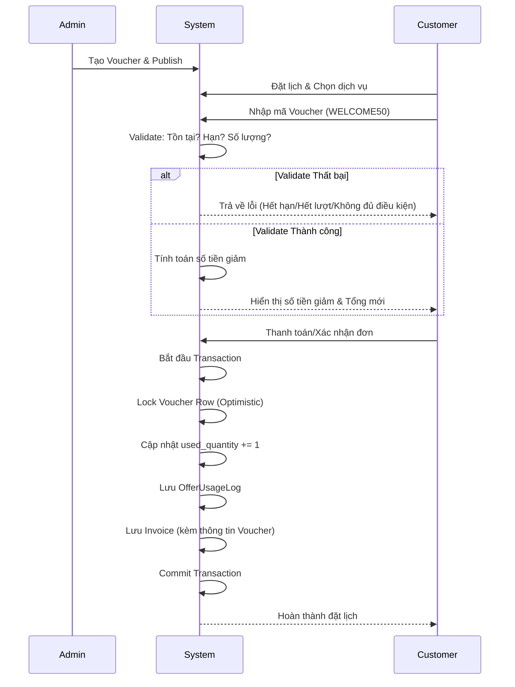

# Kế Hoạch Triển Khai: Hệ Thống Quản Lý Mã Giảm Giá (Voucher Module)

Kế hoạch này phác thảo thiết kế chi tiết cho Module Voucher của MyPetClinic, đáp ứng tiêu chuẩn doanh nghiệp (tương tự Shopee, Grab) và được tối ưu hóa cho mô hình phòng khám thú y, sử dụng kiến trúc .NET Core Web API, Vue.js 3, và PostgreSQL.

## User Review Required

> [!IMPORTANT]
> **Quyết định về Sinh mã tự động**: Hiện tại thiết kế tập trung vào mã nhập thủ công (VD: `WELCOME50`) theo yêu cầu. Việc sinh mã tự động (auto-generated unique codes) được đưa vào phần mở rộng tương lai. Vui lòng xác nhận nếu bạn muốn tích hợp sinh mã tự động ngay trong giai đoạn này.

> [!WARNING]
> **Xử lý Concurrency (Đồng thời)**: Đề xuất sử dụng Optimistic Concurrency Control (Row Versioning/xmin trong PostgreSQL) cho bảng `offers` để xử lý Race Condition khi giảm số lượng (`quantity`) voucher. Vui lòng xác nhận.

## 1. Phân Tích Business

**Mục tiêu:** Tăng trưởng doanh thu, thu hút khách hàng mới, giữ chân khách hàng cũ, và kích cầu cho các dịch vụ ít người sử dụng.

**Lợi ích:**
- **Phòng khám:** Tăng doanh số trong giờ thấp điểm (Happy Hour), đẩy mạnh các gói dịch vụ mới (Spa, Tiêm phòng), tăng tỷ lệ quay lại.
- **Khách hàng:** Tiết kiệm chi phí, trải nghiệm dịch vụ cao cấp với giá ưu đãi.

**Trường hợp sử dụng (Use Cases):**
- Khách hàng mới đặt lịch lần đầu.
- Kỷ niệm ngày thành lập phòng khám, lễ, tết.
- Tri ân khách hàng VIP/khách hàng cũ quay lại sau 6 tháng.

**Trường hợp KHÔNG nên sử dụng:**
- Dịch vụ cấp cứu (Emergency) - vì tính chất khẩn cấp và chi phí khó ước lượng trước.
- Thuốc đặc trị khan hiếm (tránh bán phá giá).

**Rủi ro gian lận & Cách phòng chống:**
- *Tạo nhiều tài khoản ảo để lạm dụng voucher cho khách mới:* Chống bằng cách giới hạn số lần sử dụng trên mỗi thiết bị/SĐT, và yêu cầu xác thực SĐT/Email.
- *Nhân viên phòng khám tự ý thêm voucher cho người nhà:* Phân quyền chặt chẽ, mọi hành động áp dụng voucher thủ công tại quầy phải được ghi log (Auditing).
- *Dùng brute-force để đoán mã:* Tích hợp Rate Limiting (chặn IP nếu nhập sai quá 5 lần/phút).

**Các loại Voucher:**
- Giảm theo phần trăm (VD: Giảm 20% tối đa 100k).
- Giảm số tiền cố định (VD: Giảm 50k cho đơn từ 300k).
- Tặng kèm dịch vụ (Free cắt móng khi tắm sấy - *mở rộng sau*).

---

## 2. Thiết Kế Database (PostgreSQL)

> [!NOTE]
> Database được chuẩn hóa để dễ mở rộng (ví dụ: áp dụng voucher theo dịch vụ, danh mục). Sử dụng UUID cho bảo mật.

### Bảng `offers` (Voucher/Khuyến mãi)
Lưu thông tin chính của chương trình khuyến mãi.
- `id` (UUID, PK): Định danh.
- `code` (VARCHAR(50), UNIQUE, INDEX): Mã nhập (VD: `WELCOME50`). Index để tìm kiếm nhanh.
- `name` (VARCHAR(255)): Tên chương trình.
- `description` (TEXT): Mô tả chi tiết.
- `discount_type` (VARCHAR(20)): `PERCENTAGE` hoặc `FIXED_AMOUNT`.
- `discount_value` (DECIMAL): Giá trị giảm (số tiền hoặc %).
- `max_discount` (DECIMAL, NULLABLE): Giảm tối đa (chỉ dùng cho `PERCENTAGE`).
- `min_order_value` (DECIMAL): Giá trị đơn hàng tối thiểu.
- `total_quantity` (INT, NULLABLE): Tổng số lượng phát hành (NULL = không giới hạn).
- `used_quantity` (INT, DEFAULT 0): Số lượng đã sử dụng. Dùng Optimistic Concurrency (`xmin` trong PG) để tránh race condition.
- `usage_limit_per_user` (INT, DEFAULT 1): Số lần dùng tối đa mỗi user.
- `start_date` (TIMESTAMPTZ): Thời gian bắt đầu.
- `end_date` (TIMESTAMPTZ): Thời gian kết thúc.
- `status` (VARCHAR(20)): `DRAFT`, `ACTIVE`, `EXPIRED`, `LOCKED`.
- `is_public` (BOOLEAN): Voucher ẩn hay hiện trên UI của user.
- `created_at`, `updated_at`, `created_by` (UUID, FK tới bảng Users).

### Bảng `offer_services` & `offer_categories` (Ràng buộc Dịch vụ)
- Chỉ áp dụng voucher cho dịch vụ/danh mục cụ thể (nếu để trống tức là áp dụng toàn shop).
- Gồm: `offer_id` (FK), `service_id`/`category_id` (FK). Composite PK.

### Bảng `user_offers` (Ví Voucher)
Lưu các voucher user đã thu thập/được tặng (như ví Shopee).
- `id` (UUID, PK)
- `user_id` (UUID, FK)
- `offer_id` (UUID, FK)
- `collected_at` (TIMESTAMPTZ)
- `is_used` (BOOLEAN, DEFAULT FALSE)

### Bảng `offer_usage_logs` (Lịch sử sử dụng)
- `id` (UUID, PK)
- `offer_id` (UUID, FK)
- `user_id` (UUID, FK)
- `appointment_id` / `invoice_id` (UUID, FK): Áp dụng cho hóa đơn/lịch khám nào.
- `discount_applied` (DECIMAL): Số tiền đã giảm thực tế.
- `applied_at` (TIMESTAMPTZ)
- `ip_address` (VARCHAR(50))
- `status` (VARCHAR(20)): `APPLIED`, `REVERTED` (khi hủy đơn thì hoàn lượt).

---

## 3. Business Rule (Quy tắc Nghiệp vụ)

- **Trạng thái:** `status` phải là `ACTIVE`.
- **Thời gian:** `start_date` <= NOW <= `end_date`.
- **Số lượng:** Nếu `total_quantity` IS NOT NULL, `used_quantity` < `total_quantity`.
- **Giới hạn người dùng:** Số log trong `offer_usage_logs` của `user_id` với `offer_id` < `usage_limit_per_user`.
- **Điều kiện hóa đơn:** Tổng tiền tạm tính >= `min_order_value`.
- **Logic tính tiền:**
  - Nếu `FIXED_AMOUNT`: Giảm = MIN(Giá trị hóa đơn, `discount_value`). (Tránh hóa đơn âm).
  - Nếu `PERCENTAGE`: Giảm = MIN((Giá trị hóa đơn * `discount_value` / 100), `max_discount`).
- **Phạm vi (Scope):** Nếu `offer_services` có dữ liệu, voucher chỉ tính giảm giá trên tổng tiền của các dịch vụ được phép. (Rất quan trọng, tránh lỗi logic giảm cả đơn mua thuốc).
- **Độc quyền:** Chỉ 1 voucher được áp dụng trên 1 hóa đơn (hiện tại).
- **Hoàn trả:** Nếu hủy đơn hàng, hệ thống tự động `REVERT` log và giảm `used_quantity`, trả lại voucher cho người dùng.

---

## 4. Admin Features

**Quản lý Voucher:**
- **Danh sách:** Có Grid table phân trang, filter theo Status (`ACTIVE`, `EXPIRED`), Search theo mã/tên.
- **Cột hiển thị:** Mã, Tên, Loại (%, Tiền), Đơn tối thiểu, Giảm tối đa, Số lượng (Đã dùng/Tổng), Thời hạn, Trạng thái.
- **Form Tạo Mới/Cập nhật:**
  - Validation chặt chẽ phía Client (Vue) và Server (.NET).
  - Chọn dịch vụ áp dụng (Dropdown/Multi-select).
- **Xem chi tiết & Thống kê:** Hiển thị biểu đồ số lượt dùng theo ngày, danh sách user đã dùng.
- **Hành động:** Khóa (Lock) khẩn cấp nếu phát hiện gian lận.

---

## 5. Tạo Mã Voucher

- **Giai đoạn hiện tại:** Admin nhập thủ công (`Code`). Validation đảm bảo `Code` là duy nhất, viết hoa, không chứa ký tự đặc biệt, dễ đọc (VD: `SUMMER24`, `PETSPA50`).
- **Phân tích phương án sinh tự động (Mở rộng):** Sử dụng thuật toán sinh mã ngẫu nhiên có prefix (VD: `REF-A3X9-L2M1`), check trùng lặp (collision) trước khi lưu. Sinh theo batch.

---

## 6. Luồng Nghiệp Vụ (Workflow)



---

## 7. Backend (RESTful API)

- `GET /api/v1/offers`: Admin lấy danh sách (có phân trang, filter).
- `GET /api/v1/offers/public`: User lấy danh sách voucher hợp lệ đang active.
- `GET /api/v1/offers/{id}`: Lấy chi tiết.
- `POST /api/v1/offers`: Admin tạo mới.
- `PUT /api/v1/offers/{id}`: Admin sửa.
- `PATCH /api/v1/offers/{id}/status`: Admin đổi trạng thái (Lock).
- `POST /api/v1/offers/validate`: 
  - **Request:** `{ "code": "ABC", "orderAmount": 500000, "serviceIds": ["uuid-1", "uuid-2"] }`
  - **Response:** `{ "isValid": true, "discountAmount": 50000, "message": "Thành công" }` (HTTP 200) hoặc lỗi kinh doanh (HTTP 400).
- `POST /api/v1/offers/apply` (Thường tích hợp thẳng vào API Checkout/CreateInvoice): Ghi nhận sử dụng.

---

## 8. Validation

- **Code:** Bắt buộc, duy nhất, độ dài 3-20 ký tự, `^[A-Z0-9]+$`.
- **Discount:** 
  - Nếu `PERCENTAGE`: 0 < value <= 100.
  - Nếu `FIXED_AMOUNT`: value > 0.
- **Date:** `start_date` phải là tương lai hoặc hiện tại. `end_date` > `start_date`.
- **Quantity:** `total_quantity` >= 0 (hoặc NULL). `usage_limit_per_user` > 0.
- **Order:** `min_order_value` >= 0.

---

## 9. Thuật toán (Pseudocode)

### `ValidateVoucher(code, user_id, order_details)`
```text
1. Fetch offer = DB.Offers.FirstOrDefault(o => o.Code == code)
2. IF offer IS NULL THEN RETURN Error("Voucher không tồn tại")
3. IF offer.Status != ACTIVE THEN RETURN Error("Voucher không khả dụng")
4. IF NOW() < offer.StartDate OR NOW() > offer.EndDate THEN RETURN Error("Voucher ngoài thời gian áp dụng")
5. IF offer.TotalQuantity != NULL AND offer.UsedQuantity >= offer.TotalQuantity THEN RETURN Error("Voucher đã hết lượt")
6. 
7. used_count = DB.OfferUsageLogs.Count(l => l.OfferId == offer.Id AND l.UserId == user_id)
8. IF used_count >= offer.UsageLimitPerUser THEN RETURN Error("Bạn đã dùng hết lượt voucher này")
9.
10. eligible_amount = Tính tổng tiền các dịch vụ trong order_details thuộc offer_services (hoặc tổng tiền nếu ko ràng buộc)
11. IF eligible_amount < offer.MinOrderValue THEN RETURN Error("Chưa đạt giá trị tối thiểu")
12.
13. discount = CaculateDiscount(offer, eligible_amount)
14. RETURN Success(discount)
```

---

## 10. Concurrency (Xử lý đồng thời)

**Vấn đề:** 1 voucher chỉ còn 1 lượt. 2 user cùng lúc gọi API `ApplyVoucher`. Nếu chỉ check IF (`used_quantity` < `total_quantity`) rồi update, sẽ bị vượt quá số lượng (Race Condition).

**Giải pháp:** Sử dụng **Optimistic Concurrency Control** kết hợp Entity Framework Core `[Timestamp]` (hoặc `xmin` trong PG) hoặc kiểm tra điều kiện ngay trong câu lệnh UPDATE.
```csharp
// Logic EF Core / SQL:
UPDATE Offers 
SET UsedQuantity = UsedQuantity + 1 
WHERE Id = @offerId AND UsedQuantity < TotalQuantity;

// Nếu số dòng update (RowsAffected) == 0 -> Bắn lỗi: "Voucher vừa mới hết lượt do người khác nhanh tay hơn." -> Rollback Transaction.
```
- Sử dụng Database Transaction khi tạo Hóa Đơn và Ghi Log Voucher để đảm bảo tính nguyên vẹn (ACID). Nếu tạo hóa đơn xịt -> Rollback Voucher Log.

---

## 11. Logging

Bảng `offer_usage_logs` đã thiết kế ở trên, lưu rõ:
- Ai dùng (`user_id`).
- Voucher nào (`offer_id`).
- Hóa đơn nào (`invoice_id`).
- Giảm bao nhiêu (`discount_applied`).
- Thời gian (`applied_at`).
- IP (`ip_address`) - phòng chống gian lận.
- Kết quả (`status` = `APPLIED` / `REVERTED`).

---

## 12. UI/UX Design (Vue.js 3 + Tailwind CSS)

**Customer (Giao diện Chọn Voucher Hiện Đại):**
- **Modal/Bottom Sheet "Khuyến Mãi (Promotions)":** Thay vì chỉ có ô nhập mã đơn điệu ở trang thanh toán, khi người dùng bấm "Chọn Voucher", một Bottom Sheet (trên mobile) hoặc Modal (trên PC) sẽ bật lên.
- **Khu vực nhập mã thủ công:** Vẫn giữ ô text input "Nhập mã khuyến mãi..." ở trên cùng cho các mã ẩn (Private Voucher).
- **Danh sách "Tất cả khuyến mãi" (Voucher Cards):**
  - Hiển thị danh sách các voucher dưới dạng **Ticket Card** (thẻ có đường viền răng cưa/đứt nét mô phỏng vé).
  - Có icon/hình ảnh bên trái, chi tiết ưu đãi ở giữa (VD: "Giảm 6% tối đa 50k").
  - Bên phải là **Checkbox/Radio Button** để chọn nhanh voucher.
- **Phân loại trạng thái Voucher:**
  - **Hợp lệ:** Thẻ hiển thị rõ ràng, cho phép chọn.
  - **Không hợp lệ:** Thẻ bị mờ (opacity thấp), Checkbox bị disable, kèm theo dòng text cảnh báo lỗi màu đỏ ngay trên thẻ (VD: *"Đơn hàng chưa đạt tối thiểu 200k"* hoặc *"Chỉ áp dụng cho dịch vụ Spa"*).
- **Floating Bottom Bar:** Dưới cùng của Modal luôn ghim một thanh bar nổi hiển thị **Tổng số tiền tiết kiệm được** (Animation nhảy số tiền) và nút **ÁP DỤNG (Apply)** kích thước lớn, màu chủ đạo bắt mắt.
- **Ví Voucher (My Vouchers):** Hiển thị thanh tiến trình (progress bar) cho lượng voucher còn lại để tạo cảm giác khan hiếm (FOMO).

**Admin:**
- Sử dụng Glassmorphism / Dashboard UI.
- Thống kê (Chart.js) hiển thị số voucher đã dùng theo ngày/tháng để đánh giá chiến dịch.
- Badge màu cho Trạng thái: Xanh (Active), Xám (Expired), Đỏ (Locked).

---

## 13. Phân Quyền (RBAC)

- **Admin/Manager:** Có toàn quyền CRUD `offers`, Publish, Lock, xem `offer_usage_logs`.
- **Receptionist (Lễ tân):** Chỉ được xem danh sách voucher (để tư vấn khách), được phép áp dụng voucher thủ công khi tạo hóa đơn tại quầy, KHÔNG được tạo mới hay xóa.
- **Customer:** Chỉ được xem voucher `is_public = true`, xem ví voucher của mình, và thực hiện Apply voucher.

---

## 14. Test Cases (Tổng quan 40+ Cases)

- **Happy Case (Thành công):** Nhập mã giảm %, tính đúng tiền. Nhập mã giảm tiền, tính đúng tiền. Áp dụng mã cho khách mới thành công.
- **Validation:** Mã rỗng, mã chứa ký tự đặc biệt, tạo voucher % > 100, tạo giá trị âm, Ngày KT < Ngày BĐ.
- **Boundary (Biên):** Đơn hàng bằng chính xác `min_order_value` (Phải thành công). Sử dụng lượt cuối cùng của voucher (Phải thành công). Giảm % chạm mốc `max_discount` (Phải cắt ngọn ở `max_discount`).
- **Exception (Ngoại lệ):** Nhập mã đã hết hạn. Nhập mã chưa bắt đầu. Nhập mã bị khóa. Đơn hàng chưa đạt tối thiểu. Dịch vụ không nằm trong danh mục áp dụng.
- **Security & Concurrency:** 2 user cùng apply mã chỉ còn 1 lượt cuối (1 pass, 1 fail). User A sửa request API để dùng voucher của User B (IDOR -> Phải chặn qua JWT UserId). Bắn API liên tục (Rate limiting).

---

## 15. Lộ Trình Triển Khai (Execution Roadmap)

Để đảm bảo chất lượng, hạn chế tối đa sai sót và làm kỹ càng từng thành phần, chúng ta sẽ chia quá trình lập trình thành **6 Giai Đoạn (Phases)**. Nguyên tắc là hoàn thành dứt điểm 100% (cả Test) giai đoạn trước mới chuyển sang giai đoạn sau.

### Giai Đoạn 1: Database Foundation & Core Models (Backend)
- Định nghĩa các Entity Classes (`Offer`, `OfferService`, `UserOffer`, `OfferUsageLog`) trong thư mục Domain.
- Cấu hình Entity Framework Core mapping (Fluent API), đảm bảo tạo Index cho cột `Code` và cấu hình Optimistic Concurrency cho `UsedQuantity`.
- Viết Database Migrations và cập nhật DB (Supabase/PostgreSQL).
- **Tiêu chí hoàn thành (DoD):** Database được tạo đúng chuẩn, các quan hệ FK chính xác, lưu được dữ liệu mẫu bằng pgAdmin/DBeaver.

### Giai Đoạn 2: Core Business Logic & API (Backend)
- Xây dựng DTOs (Data Transfer Objects) và FluentValidation rules.
- Viết `OfferService` chứa toàn bộ lõi thuật toán (Quy tắc số 9). Đảm bảo tách biệt rõ ràng việc tính toán và việc ghi dữ liệu.
- Viết API Controllers (`OffersController`) cho cả Admin (CRUD) và Customer (Lấy danh sách & Apply).
- Cấu hình JWT Authorization (Admin/Customer roles).
- **Tiêu chí hoàn thành (DoD):** Swagger có thể test được API, dữ liệu được validate chặt chẽ (vd: nhập sai ngày kết thúc sẽ báo lỗi 400).

### Giai Đoạn 3: Unit Testing & Concurrency Testing (QA)
- Viết Unit Tests cho `OfferService` sử dụng xUnit và Moq (Bao phủ 40+ Test Cases đã thiết kế ở mục 14).
- Đặc biệt viết Integration Test mô phỏng 2 Request gọi API `ApplyVoucher` cùng một thời điểm tính bằng milliseconds để kiểm tra xem hệ thống có bắt được lỗi Race Condition và chặn cấp phát thừa voucher hay không.
- **Tiêu chí hoàn thành (DoD):** Test Coverage > 85%, tất cả test cases (Happy, Biên, Lỗi) phải Pass xanh.

### Giai Đoạn 4: Admin Management UI (Frontend Vue.js)
- Cấu hình Pinia Store (`offerStore.js`) để call API lấy dữ liệu.
- Dựng UI Dashboard cho Admin (List, Filter, Phân trang).
- Dựng UI Form Tạo/Sửa Voucher (áp dụng validation phía client).
- **Tiêu chí hoàn thành (DoD):** Admin có thể tự thao tác chu trình khép kín: Tạo Voucher -> Xem danh sách -> Sửa -> Xóa/Khóa.

### Giai Đoạn 5: Customer Promotions UI (Frontend Vue.js)
- Triển khai UI Modal/Bottom Sheet chứa danh sách "Ticket Cards" như đã mô tả ở mục 12.
- Gọi API get danh sách voucher public, xử lý logic disable các thẻ không đạt "Đơn tối thiểu".
- Tích hợp hàm Apply voucher vào lúc checkout, hiển thị Animation nhảy số và tổng tiền tiết kiệm được dưới Floating Bar.
- **Tiêu chí hoàn thành (DoD):** Giao diện cực mượt, bấm áp dụng/hủy áp dụng tiền nhảy realtime không bị delay. Cảm giác thao tác sang trọng (Premium UI).

### Giai Đoạn 6: Tích hợp Toàn Hệ Thống & UAT
- Liên kết flow hoàn chỉnh: Admin tạo -> Khách nhìn thấy -> Khách đặt lịch -> Khách chọn voucher -> Trừ tiền -> Thanh toán -> Giảm số lượng -> Ghi Log.
- Cập nhật lại file theo dõi công việc (`progress.md`, `features-tested.md`).

---

## 16. Mở Rộng Tương Lai (Future Enhancements)

- **Sinh mã tự động (Auto-gen Codes):** Admin tạo 1 chương trình mẹ, sinh ra 1000 mã con duy nhất (VD: gửi qua email marketing).
- **Voucher sự kiện & sinh nhật:** Tự động gửi voucher giảm 20% vào tháng sinh nhật của thú cưng.
- **Chương trình giới thiệu (Referral):** "Mời 1 bạn, nhận 50k".
- **Voucher tích điểm (Loyalty/Membership):** Hạng Vàng được voucher giảm nhiều hơn Hạng Bạc.
- **Tặng kèm dịch vụ:** Mua gói tiêm phòng, tặng voucher cắt móng miễn phí.
