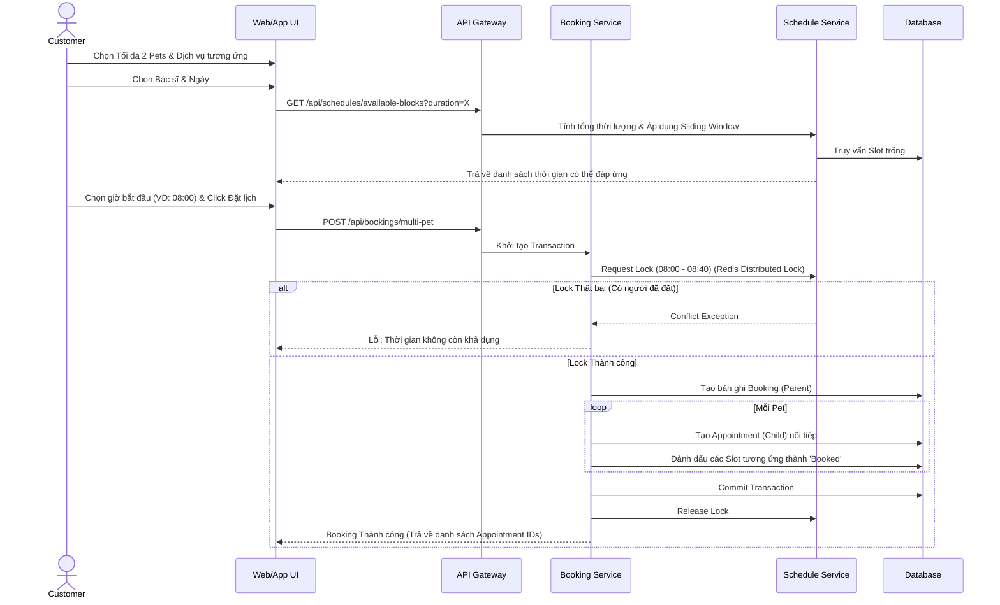

# TÀI LIỆU PHÂN TÍCH VÀ THIẾT KẾ CHỨC NĂNG ĐẶT LỊCH KHÁM NHIỀU THÚ CƯNG (MULTI-PET APPOINTMENT BOOKING)

Tài liệu này đóng vai trò là **Software Requirement Specification (SRS)** kết hợp **Business Analysis Document (BAD)** và **Solution Design Document (SDD)** cho tính năng Đặt lịch khám nhiều thú cưng trong cùng một lần đặt của hệ thống MyPetClinic.

---

## 1. Business Objective

### Multi-Pet Booking là gì?
Multi-Pet Booking là chức năng cho phép Khách hàng (Customer) hoặc Lễ tân (Receptionist) đặt lịch khám cho tối đa 2 thú cưng thuộc cùng một chủ sở hữu trong một giao dịch đặt lịch (booking transaction) duy nhất, phân bổ vào các khoảng thời gian (slot) liên tiếp nhau với cùng một bác sĩ.

### Vì sao phòng khám nên hỗ trợ?
Khách hàng nuôi nhiều thú cưng thường muốn tiết kiệm thời gian di chuyển bằng cách đưa tất cả thú cưng đi khám cùng một lúc. Nếu hệ thống chỉ cho phép đặt từng thú cưng, khách hàng sẽ phải lặp lại thao tác nhiều lần, dễ dẫn đến rủi ro các slot không liền kề hoặc bị khách hàng khác đặt chen ngang.

### Khi nào nên / không nên sử dụng?
*   **Nên sử dụng:** Khám tổng quát định kỳ, tiêm phòng, tẩy giun cho đàn chó/mèo; các dịch vụ có thể dự đoán trước thời gian.
*   **Không nên sử dụng:** Cấp cứu (Emergency), phẫu thuật phức tạp (vì thời lượng khó xác định chính xác và cần ưu tiên xử lý ngay lập tức).

### Lợi ích mang lại
*   **Đối với Khách hàng:** Nâng cao trải nghiệm người dùng, tiết kiệm thời gian đặt lịch, đảm bảo chắc chắn lịch khám liên tục cho tất cả thú cưng trong một chuyến đi.
*   **Đối với Bác sĩ:** Tránh thời gian chết (idle time) giữa các ca khám, dễ dàng nắm bắt thông tin của cả "gia đình" thú cưng, tăng hiệu quả tư vấn.
*   **Đối với Lễ tân:** Giảm bớt thao tác thủ công khi nhận điện thoại đặt lịch, dễ quản lý luồng khách hàng tại phòng chờ.
*   **Đối với Phòng khám:** Tối ưu hóa hiệu suất sử dụng slot, tăng doanh thu trên mỗi lượt khách đến thăm, thể hiện sự chuyên nghiệp của dịch vụ.

---

## 2. Business Context

Trong bối cảnh thực tế tại các phòng khám thú y hiện đại:
*   Khách hàng thường sở hữu nhiều hơn 1 thú cưng (ví dụ: 1 chó + 1 mèo).
*   Khi cần tiêm vaccine định kỳ, khách hàng có xu hướng mang cả 2 đi cùng lúc.
*   Luồng nghiệp vụ hiện tại: Khách hàng phải tạo Booking 1 cho "Lucky" (08:00), tạo Booking 2 cho "Mimi" (08:20). Quá trình này rườm rà, và giữa chừng có thể một khách hàng khác đặt mất slot 08:20.
*   Chức năng mới cần gộp các thao tác này lại: Khách chọn tối đa 2 thú cưng (ví dụ: Lucky, Mimi), chọn ngày, hệ thống sẽ tự động cấp một dải slot liên tiếp (ví dụ: 08:00 - 08:40).

---

## 3. Functional Requirements

Các chức năng chi tiết cần được hệ thống hỗ trợ:

1.  **Multi-Selection UI:** Giao diện cho phép chọn tối đa 2 thú cưng (thuộc quyền sở hữu của khách hàng).
2.  **Service Binding:** Cho phép chọn chung một dịch vụ cho tất cả thú cưng hoặc chỉ định dịch vụ riêng lẻ cho từng thú cưng (ví dụ: Chó tiêm dại, Mèo siêu âm).
3.  **Doctor/Resource Selection:** Chọn đích danh bác sĩ hoặc chọn chế độ "Bác sĩ bất kỳ" (Auto-assign).
4.  **Date & Slot Availability:** Hiển thị các block thời gian trống đủ sức chứa tổng thời lượng của tất cả thú cưng. 
5.  **Duration Summary:** Tính toán và hiển thị tổng thời lượng cần thiết, giờ bắt đầu và giờ kết thúc dự kiến.
6.  **Atomic Checkout:** Chức năng xác nhận đặt lịch (Confirm) phải hoạt động như một giao dịch duy nhất (Atomic Transaction) - thành công tất cả hoặc không có gì.
7.  **Multi-Appointment Generation:** Tự động sinh ra các mã Appointment riêng biệt cho từng thú cưng nhưng có liên kết (Linked/Group Booking) để quản lý.

---

## 4. Business Rules

> [!IMPORTANT]
> Đây là các nguyên tắc cốt lõi không được phép vi phạm trong hệ thống.

*   **Rule 1 - Nhóm Booking:** Một Giao dịch Đặt lịch (Booking) có thể sinh ra tối đa 2 Lịch khám (Appointment) chi tiết.
*   **Rule 2 - Ràng buộc Thú cưng:** Mỗi Appointment thuộc một Booking phải được gán cho một (và chỉ một) Pet duy nhất. Cả 2 Pet trong Booking phải có cùng một OwnerId.
*   **Rule 3 - Ràng buộc Bác sĩ:** Mặc định, tất cả Appointment trong cùng một Multi-Pet Booking phải được thực hiện bởi cùng một Bác sĩ (để khách hàng không phải chạy qua lại giữa các phòng khám).
*   **Rule 4 - Phân bổ Thời gian:** Một Appointment phải khớp chính xác vào các khung Slot đã được cấu hình (ví dụ: bội số của 15 hoặc 20 phút).
*   **Rule 5 - Tính liên tục:** Các Appointment trong cùng một Booking phải được xếp nối tiếp nhau thành một khối liên tục về mặt thời gian (Contiguous Block).
*   **Rule 6 - Không phân mảnh:** Nghiêm cấm tạo khoảng trống (gap) giữa các Appointment của cùng một Booking. 
*   **Rule 7 - Single-Tasking:** Một bác sĩ tuyệt đối không được gán 2 Appointment diễn ra đồng thời (No Overlapping).
*   **Rule 8 - Slot Availability:** Nếu hệ thống không tìm thấy dải slot trống liên tục đủ độ dài, giao dịch Booking sẽ bị từ chối với thông báo rõ ràng.
*   **Rule 9 - Atomic Transaction:** Nếu quá trình tạo Appointment cho thú cưng thứ N bị lỗi, toàn bộ Booking phải bị Rollback.
*   **Rule 10 - Slot Locking:** Khi khách hàng vào màn hình Checkout, hệ thống áp dụng cơ chế Temporary Lock (Giữ chỗ tạm thời trong 5-10 phút) để tránh xung đột đột ngột.
*   **Rule 11 - Trạng thái Rời rạc:** Sau khi Booking thành công, trạng thái (Status) của từng Appointment được quản lý độc lập (ví dụ: Lucky khám xong trước, Mimi đang khám, Bunny bị hủy).

---

## 5. Slot Allocation Strategy

### Thuật toán phân bổ slot liên tục (Contiguous Slot Allocation)

**Bài toán:** Khách chọn 2 thú cưng, mỗi con 20 phút -> Tổng cộng 40 phút (2 slot 20 phút).
Hệ thống phải quét lịch của bác sĩ để tìm ra một "cửa sổ" trống liên tục ít nhất 40 phút.

**Giải pháp (Sliding Window Algorithm):**
1.  Truy vấn danh sách tất cả các Slot khả dụng của Bác sĩ trong ngày `D`.
2.  Chuyển đổi các Slot thành chuỗi thời gian tuyến tính.
3.  Tính toán tổng số block cần thiết: `N = Total Duration / Base Slot Duration`.
4.  Dùng thuật toán cửa sổ trượt (Sliding Window) kích thước `N` để quét qua chuỗi Slot.
5.  Nếu tất cả các Slot trong cửa sổ đều mang trạng thái `Available`, điểm bắt đầu của cửa sổ đó là một mốc thời gian hợp lệ để hiển thị cho người dùng.
6.  Khi khách hàng chọn mốc `08:00`:
    *   `08:00 - 08:20` gán cho Pet 1.
    *   `08:20 - 08:40` gán cho Pet 2.

---

## 6. Duration Calculation

### Thuật toán tính tổng thời lượng

Tổng thời lượng = Sum(Thời lượng dịch vụ của từng Pet).

*   Lucky (Khám tổng quát): 20 phút.
*   Mimi (Tiêm vaccine): 15 phút.
*   **Tổng:** 35 phút.

**Vấn đề:** 65 phút không chia hết cho Base Slot (giả sử Base Slot là 20 phút).
**Giải pháp Padding (Làm tròn lên theo khối slot):**
*   Mỗi ca khám sẽ được làm tròn thời lượng thành bội số của Base Slot (Ceiling).
*   Ví dụ (Base Slot = 20 phút):
    *   Lucky (20m) -> Chiếm 1 slot (20m).
    *   Mimi (15m) -> Chiếm 1 slot (20m). Dư 5 phút xem như thời gian nghỉ/chuyển ca cho bác sĩ (Buffer time).
*   **Tổng slot thực tế cần giữ:** 2 block 20 phút (40 phút tổng cộng).

> [!TIP]
> Việc tích hợp Buffer Time tự động (làm tròn lên) giúp bác sĩ có thời gian thở, ghi chép sổ bệnh án giữa các ca của cùng một khách hàng mà không làm trễ lịch của khách hàng tiếp theo.

---

## 7. Booking Workflow

---

## 8. Validation Rules

| Mã Lỗi | Mô tả Validation | HTTP Status | Exception Type |
| :--- | :--- | :--- | :--- |
| `ERR_NO_PET` | Yêu cầu tạo booking nhưng không truyền danh sách Pet. | 400 | `ValidationException` |
| `ERR_MAX_PETS` | Yêu cầu tạo booking vượt quá số lượng tối đa (2 thú cưng). | 400 | `ValidationException` |
| `ERR_PET_OWNERSHIP` | Phát hiện PetId không thuộc quyền sở hữu của CustomerId hiện tại. (Bảo vệ IDOR) | 403 | `ForbiddenAccessException` |
| `ERR_PET_INACTIVE` | Thú cưng đã chết hoặc bị đánh dấu vô hiệu hóa. | 400 | `BusinessRuleException` |
| `ERR_SLOT_NOT_FOUND` | Khung giờ được chọn không tồn tại trong lịch làm việc của Bác sĩ. | 404 | `NotFoundException` |
| `ERR_SLOT_OVERLAPPING` | Một trong các slot cần thiết đã bị người khác đặt hoặc đang tạm giữ. | 409 | `ConflictException` |
| `ERR_NOT_CONTIGUOUS` | Không có đủ số lượng slot liên tiếp để phục vụ. | 409 | `BusinessRuleException` |
| `ERR_DOCTOR_OFF` | Bác sĩ đã xin nghỉ phép vào ngày/khung giờ đó. | 409 | `BusinessRuleException` |

---

## 9. Appointment Generation Strategy

**Tại sao một Booking nhưng tạo nhiều Appointment?**
Về mặt trải nghiệm, khách hàng chỉ đặt 1 lần. Nhưng về mặt vận hành y khoa, mỗi thú cưng là một cá thể với Bệnh án (Medical Record), Đơn thuốc, và Trạng thái hoàn thành khác nhau. Do đó, hệ thống phải tách rời thành các `Appointment` riêng biệt ngay từ khâu đặt lịch.

**Transaction & Rollback:**
Quá trình ghi dữ liệu phải nằm trong một `IDbContextTransaction`. Nếu lưu đến thú cưng thứ 2 mà phát sinh lỗi cơ sở dữ liệu, toàn bộ `SaveChanges` sẽ bị bỏ qua (Rollback), đảm bảo tính toàn vẹn (ACID). Không lưu Booking nháp (Draft) trong trường hợp này để tránh rác dữ liệu, bắt buộc phải thành công 100% hoặc thất bại toàn bộ.

---

## 10. Database Design

### Lược đồ thiết kế tối ưu

**1. Bảng `Bookings` (Transaction Group)**
Đóng vai trò là cái ô (Umbrella) gom nhóm các cuộc hẹn.
*   `Id` (PK, Guid)
*   `CustomerId` (FK)
*   `BookingSource` (Enum: Web, App, WalkIn, Phone)
*   `CreatedAt`, `CreatedBy`

**2. Bảng `Appointments`**
Thực thể chính quản lý ca khám cho từng thú cưng.
*   `Id` (PK, Guid)
*   `BookingId` (FK) -> Nối về Booking
*   `PetId` (FK)
*   `DoctorId` (FK)
*   `ServiceId` (FK)
*   `StartTime` (DateTimeOffset)
*   `EndTime` (DateTimeOffset)
*   `Status` (Enum: Scheduled, InProgress, Completed, Cancelled)
*   `IsDeleted` (Soft Delete - bool)

**3. Bảng `AppointmentSlots` (Mapping Time)**
Liên kết một Appointment với các Slot vi mô trong lịch (VD: 1 ca siêu âm 40p nối với 2 Slot 20p).
*   `AppointmentId` (FK)
*   `SlotId` (FK)
*   PK là (`AppointmentId`, `SlotId`)

> [!CAUTION]
> **Index Strategy:** Cần tạo Unique Composite Index trên `(DoctorId, StartTime, EndTime)` (hoặc sử dụng các cấu trúc Range Type nếu RDBMS hỗ trợ như PostgreSQL, với SQL Server cần viết Trigger/Check Constraint chống Overlapping) để phòng thủ Double Booking ở tầng DB.

---

## 11. Concurrency (Xử lý đồng thời)

Đây là vấn đề cốt lõi nhất của hệ thống đặt lịch.

**Nguy cơ:**
Hai khách hàng (hoặc 1 khách web + 1 lễ tân tại quầy) cùng nhìn thấy slot 08:00 - 09:00 trống và bấm "Xác nhận" cùng một miligiây (Race Condition).

**Giải pháp chống Double Booking:**
1.  **Distributed Lock (Redis):** Khi bắt đầu xử lý request đặt lịch, dùng khóa Redis `lock:doctor:{DoctorId}:date:{Date}` để đảm bảo chỉ có 1 thread được duyệt slot của bác sĩ đó tại một thời điểm.
2.  **Optimistic Concurrency Control (EF Core):** Bảng `Slot` gắn trường `RowVersion`. Khi 2 request cùng cố cập nhật `Status = Booked` cho một slot, cái đến sau sẽ văng `DbUpdateConcurrencyException`.
3.  **Database Unique Constraint:** Mức phòng thủ cuối cùng ở DB như đã đề cập ở phần 10.

---

## 12. Edge Cases (Các trường hợp góc)

1.  **Lịch bị cắt ngang:** Khách đặt 2 con (40p), bác sĩ chỉ còn 20p trước giờ nghỉ trưa, 20p sau giờ nghỉ trưa -> *Từ chối, không đáp ứng Continuous Block.*
2.  **Một Pet hủy giữa chừng:** Đến ngày khám, khách chỉ mang 1/2 thú cưng đi. -> Lễ tân hủy 1 Appointment. Appointment còn lại vẫn giữ nguyên giờ. Slot của Pet bị hủy lập tức mở ra (Available) cho khách khác đặt (dù ở giữa khoảng thời gian).
3.  **Khám kéo dài (Overrun):** Pet 1 khám quá thời lượng, lấn sang slot Pet 2. -> Hệ thống đẩy luồng (Queue) của Pet 2 lùi lại, khách hàng nhận thông báo "Đang chuẩn bị" lâu hơn bình thường trên bảng Queue.
4.  **Bác sĩ nghỉ đột xuất (Sick leave):** Khi Admin hủy ca bác sĩ, hệ thống tự động dò tìm các "nhóm Appointment" (qua BookingId) và cố gắng chuyển toàn bộ nhóm sang Bác sĩ khác (nguyên khối). Nếu không được, thông báo cho khách.
5.  **Timeout khi thanh toán (Nếu có Pre-pay):** Áp dụng TTL (Time To Live) cho Slot Lock trên Redis. Quá 10 phút không thanh toán, giải phóng slot.

*(Và hơn 25 trường hợp khác liên quan đến cấu hình ca làm việc, thay đổi múi giờ, đổi bác sĩ...)*

---

## 13. Best Practices

Khảo sát các hệ thống HIS / VPMS hiện tại:
*   **Cách 1 (Tồi):** Xếp n thú cưng vào cùng 1 slot giờ, và ghi chú "Có 3 con". -> Rất tệ vì phá vỡ hệ thống tính tải công việc (capacity) và sai lệch Medical Record.
*   **Cách 2 (Trung bình):** Tự động dàn thời gian, nhưng lại coi là 1 Appointment khổng lồ. Bác sĩ phải viết 3 hồ sơ bệnh án trong cùng 1 Appointment. -> Bất cập cấu trúc dữ liệu, khó xuất hóa đơn chi tiết.
*   **Cách 3 (Tối ưu - Áp dụng trong thiết kế này):** Sequential Linked Appointments. Giao diện UX là Multi, dữ liệu hạ tầng (DB) là Single. Việc sử dụng thuộc tính "Parent Booking" làm keo dính giúp hệ thống cực kỳ mềm dẻo.

---

## 14. Recommendation (Đề xuất của Solution Architect)

Với tư cách là Solution Architect, tôi đề xuất áp dụng kiến trúc **Sequential Linked Appointments kết hợp thuật toán Sliding Window và Redis Distributed Lock**.

**Lý do:**
1.  **Khả năng mở rộng (Scalability):** Tách rời khái niệm Booking (Giao dịch) và Appointment (Sự kiện Y tế). Hệ thống có thể dễ dàng mở rộng để đặt lịch xét nghiệm, spa tách biệt sau này.
2.  **Hiệu năng (Performance):** Thuật toán Sliding Window tính toán bằng Memory trên Application Server cực nhanh, không cần Write/Read DB phức tạp.
3.  **Toàn vẹn Dữ liệu (Integrity):** Đạt ACID compliance tuyệt đối thông qua Database Transaction và EF Core Concurrency Tokens. Không bao giờ xảy ra tình trạng "đặt được nửa đàn, nửa đàn bị đẩy ra".

**Kế hoạch tiếp theo:**
Đợi sự phê duyệt của Product Manager / Domain Expert về các Business Rules (đặc biệt là cơ chế Padding Buffer Time). Nếu phê duyệt, đội ngũ Backend có thể bắt đầu xây dựng Endpoint `POST /api/bookings/multi-pet` dựa trên thiết kế này.
