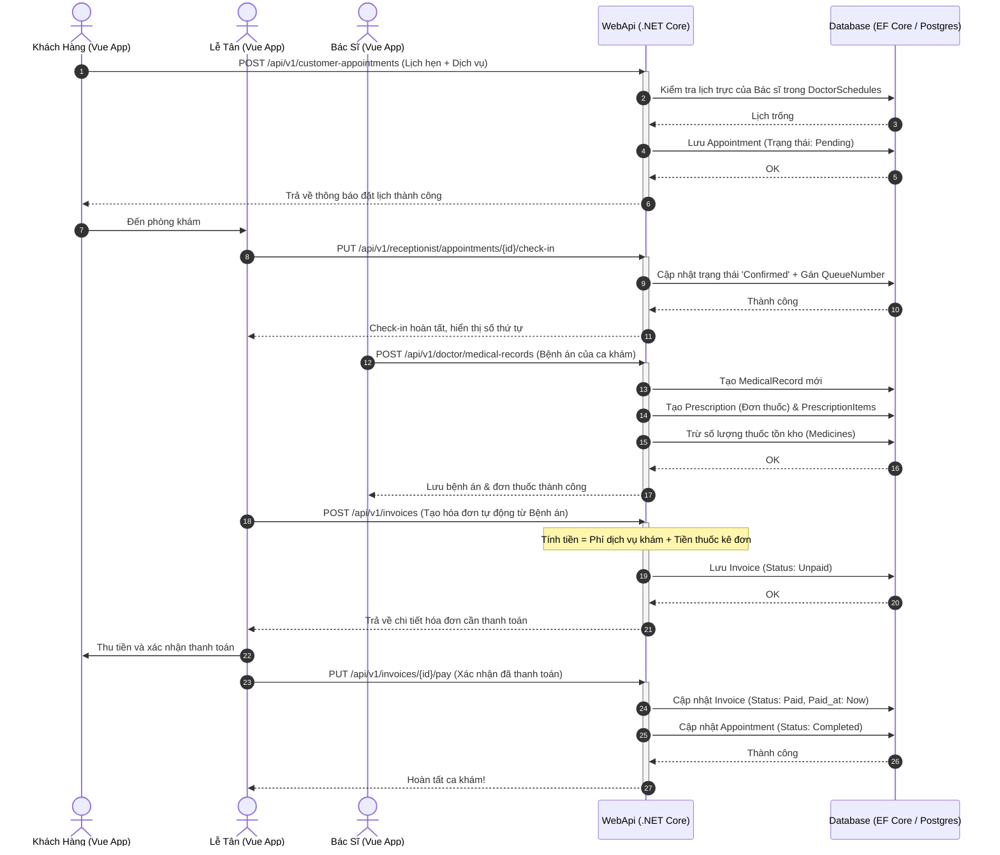

# 🏛️ Kiến Trúc Tổng Thể Hệ Thống - System Architecture Blueprint

Tài liệu này đặc tả chi tiết kiến trúc phân tầng, luồng luân chuyển dữ liệu và cơ cấu tổ chức thư mục của dự án **MyPetClinic** (.NET 8 Clean Architecture & Vue 3 SPA).

---

## 1. Sơ Đồ Kiến Trúc Phân Tầng (Clean Architecture Blueprint)

Dự án được thiết kế theo nguyên lý **Clean Architecture**, phân tách rõ ràng các mối bận tâm và đặt lõi nghiệp vụ (Domain) làm trung tâm, không phụ thuộc vào framework hay cơ sở dữ liệu bên ngoài:

```
                  +-----------------------------------+
                  |            Presentation           |
                  |     (Vue 3 SPA + WebApi Controllers)
                  +-----------------+-----------------+
                                    |
                                    v
                  +-----------------+-----------------+
                  |            Application            |
                  |     (Business Logic, Services)    |
                  +-----------------+-----------------+
                                    |
                                    v
                  +-----------------+-----------------+
                  |              Domain               |
                  |      (Entities, Value Objects)    |
                  +-----------------+-----------------+
                                    ^
                                    |
                  +-----------------+-----------------+
                  |          Infrastructure           |
                  |     (EF Core, PostgreSQL, Sec)    |
                  +-----------------------------------+
```

*   **Tầng Domain (Lõi nghiệp vụ):** Chứa các thực thể (Entities), giá trị (Value Objects) và luật nghiệp vụ bất biến. Tầng này hoàn toàn độc lập, không phụ thuộc vào bất kỳ thư viện hay tầng nào khác.
*   **Tầng Application (Ứng dụng):** Định nghĩa các Use Case, DTO (Data Transfer Object), Interfaces cho cơ sở dữ liệu và dịch vụ ngoài. Tầng này chỉ phụ thuộc vào Domain.
*   **Tầng Infrastructure (Hạ tầng):** Triển khai các interface từ tầng Application như kết nối database (EF Core DbContext), cấu hình bảo mật, mã hóa mật khẩu, dịch vụ gửi mail/SMS.
*   **Tầng Presentation (WebApi & Frontend):** WebApi chứa các Controllers điều phối HTTP requests. Frontend viết bằng Vue 3 giao tiếp với WebApi qua giao ước RESTful API.

---

## 2. Các Thành Phần Cốt Lõi (Core Layers)

### 2.1. Lớp Trình Bày Client (Vue 3 Single Page Application)
*   **Vue 3 (Composition API):** Quản lý trạng thái và vòng đời component giao diện.
*   **Vue Router:** Định tuyến trang client-side (Dashboard, Home, History, Profile, Services,...).
*   **Axios:** Thư viện client HTTP để kết nối và gọi API tới WebApi Backend kèm cấu hình JWT Token tự động ở Headers.
*   **TailwindCSS / Vanilla CSS:** Thiết kế giao diện hiện đại, tối ưu hóa trải nghiệm người dùng trên cả Desktop và Mobile.

### 2.2. Lớp Máy Chủ API (C# .NET WebApi)
*   **Controllers:** Tiếp nhận và xử lý đầu vào từ Client, thực hiện kiểm định (Validation) và gọi các Use Case thích hợp ở tầng Application.
*   **JWT Bearer Authentication:** Cơ chế xác thực không trạng thái (Stateless Authentication) dựa trên token.

### 2.3. Lớp Hạ Tầng & Lưu Trữ (Infrastructure & Persistence)
*   **Entity Framework Core (EF Core):** Bộ ánh xạ quan hệ đối tượng (ORM) kết nối cơ sở dữ liệu PostgreSQL.
*   **BCrypt.Net:** Cơ chế mã hóa và băm mật khẩu một chiều có muối (Salted BCrypt) bảo mật cao.

---

## 3. Kiến Trúc Thư Mục Chi Tiết Dự Án (Detailed Directory Structure)

### 3.1. Cấu Trúc Frontend (Vue 3 + Vite + TS)

```
e:\DATN\MyPetClinic\frontend\
├── index.html                   # Điểm khởi đầu của Single Page Application (SPA)
├── package.json                 # Cấu hình dự án, thư viện phụ thuộc và scripts chạy (dev, build)
├── tsconfig.json                # Cấu hình TypeScript toàn cục
├── vite.config.ts               # Cấu hình công cụ bundler Vite
├── src/                         # Mã nguồn ứng dụng
    ├── main.ts                  # Khởi tạo Vue app, Router và gắn kết vào DOM
    ├── App.vue                  # Component gốc định hình Layout tổng thể
    ├── assets/                  # Tài nguyên hình ảnh, SVG tĩnh
    ├── router/                  # Cấu hình các tuyến đường chuyển trang
    ├── services/                # Các dịch vụ gọi API (Auth, Appointment, Pet services,...)
    ├── shared/                  # Tiện ích dùng chung (helper, constants, formatters)
    ├── styles/                  # Định nghĩa style và CSS custom
    ├── views/                   # Các trang hiển thị chính của ứng dụng
    │   ├── Home.vue             # Trang chủ giới thiệu
    │   ├── Login.vue            # Trang đăng nhập tài khoản
    │   ├── Register.vue         # Trang đăng ký khách hàng mới
    │   ├── Profile.vue          # Quản lý hồ sơ cá nhân chủ nuôi
    │   ├── Dashboard.vue        # Dashboard tổng quan cho Admin/Bác sĩ/Lễ tân
    │   ├── History.vue          # Xem lại lịch sử khám bệnh và dịch vụ
    │   ├── TinTuc.vue           # Trang cẩm nang kiến thức
    │   ├── Team.vue             # Trang giới thiệu đội ngũ bác sĩ
    │   ├── Contact.vue          # Trang thông tin liên hệ phòng khám
    │   └── services/            # Nhóm trang về các dịch vụ chuyên biệt
    │       ├── KhamDieuTri.vue  # Dịch vụ khám chữa trị bệnh
    │       ├── SpaGrooming.vue  # Dịch vụ chăm sóc spa, tắm cắt lông
    │       ├── SucKhoe.vue      # Dịch vụ kiểm tra sức khỏe định kỳ
    │       └── TiemPhong.vue    # Dịch vụ tiêm phòng vắc-xin định kỳ
    └── components/              # Các UI Components tái sử dụng (Buttons, Modals, Forms...)
```

### 3.2. Cấu Trúc Backend (C# .NET Clean Architecture)

```
e:\DATN\MyPetClinic\backend\
├── MyPetClinic.slnx                       # Tệp quản lý giải pháp giải pháp thế hệ mới
├── src/
│   ├── MyPetClinic.Domain/                # LÕI NGHIỆP VỤ (DOMAIN LAYER)
│   │   ├── Entities/                      # Các thực thể database cốt lõi
│   │   │   ├── Role.cs                    # Định nghĩa vai trò (Admin, Doctor, Customer...)
│   │   │   ├── User.cs                    # Tài khoản người dùng (bao gồm cả nhân viên và khách)
│   │   │   ├── Pet.cs                     # Hồ sơ chi tiết thú cưng
│   │   │   ├── ServiceCategory.cs         # Danh mục dịch vụ phòng khám
│   │   │   ├── Service.cs                 # Gói dịch vụ chi tiết kèm giá cả
│   │   │   ├── DoctorSchedule.cs          # Lịch đăng ký làm việc của Bác sĩ
│   │   │   ├── Appointment.cs             # Lịch hẹn khám chữa bệnh
│   │   │   ├── MedicalRecord.cs           # Hồ sơ bệnh án sau khám
│   │   │   ├── Medicine.cs                # Thông tin kho thuốc điều trị
│   │   │   ├── Prescription.cs            # Đơn thuốc
│   │   │   ├── PrescriptionItem.cs        # Chi tiết từng loại thuốc kê đơn
│   │   │   ├── Vaccine.cs                 # Thông tin các loại vắc-xin phòng bệnh
│   │   │   ├── VaccinationRecord.cs       # Sổ tiêm phòng của thú cưng
│   │   │   ├── Post.cs                    # Bài viết cẩm nang y tế thú y
│   │   │   ├── Invoice.cs                 # Hóa đơn thanh toán viện phí
│   │   │   ├── InvoiceItem.cs             # Dòng chi tiết hóa đơn
│   │   │   └── Review.cs                  # Đánh giá dịch vụ từ khách hàng
│   │
│   ├── MyPetClinic.Application/           # LỚP NGHIỆP VỤ ỨNG DỤNG (APPLICATION LAYER)
│   │   ├── DTOs/                          # Các đối tượng luân chuyển dữ liệu
│   │   └── Interfaces/                    # Định nghĩa các giao diện nghiệp vụ & lưu trữ
│   │
│   ├── MyPetClinic.Infrastructure/        # LỚP HẠ TẦNG KỸ THUẬT (INFRASTRUCTURE LAYER)
│   │   ├── Persistence/                   # Hiện thực hóa lưu trữ cơ sở dữ liệu
│   │   │   ├── ApplicationDbContext.cs    # Lớp DbContext quản lý ánh xạ thực thể EF Core
│   │   │   ├── ApplicationDbSeeder.cs     # Seed dữ liệu mặc định ban đầu
│   │   │   └── database.sql               # Kịch bản DDL SQL tạo bảng PostgreSQL
│   │   ├── Repositories/                  # Cài đặt mẫu thiết kế Repository pattern
│   │   └── Services/                      # Các dịch vụ tích hợp bên thứ ba
│   │
│   └── WebApi/                            # CỔNG TRÌNH BÀY API (PRESENTATION LAYER)
│       ├── Program.cs                     # Điểm khởi chạy cấu hình ứng dụng
│       ├── Controllers/                   # Các API endpoints tiếp nhận HTTP Request
│       │   ├── AccountController.cs       # Đăng nhập, đăng ký và cấp quyền
│       │   ├── ProfileController.cs       # Xem và cập nhật thông tin cá nhân
│       │   ├── MyPetsController.cs        # API cho khách hàng tự quản lý thú cưng của mình
│       │   ├── CustomerAppointmentController.cs # Khách hàng tự đặt và theo dõi lịch hẹn
│       │   ├── DoctorController.cs        # Các API chuyên biệt cho bác sĩ chẩn đoán
│       │   ├── ReceptionistController.cs  # Quản lý hàng chờ, check-in, lịch hẹn của lễ tân
│       │   ├── InvoiceController.cs       # Quản lý hóa đơn và thanh toán viện phí
│       │   ├── AiChatbotController.cs     # Trợ lý ảo tư vấn chăm sóc sức khỏe thú cưng
│       │   ├── DashboardController.cs     # Thống kê số liệu hoạt động của phòng khám
│       │   └── HomeController.cs          # Trang chủ API kiểm tra kết nối
│
└── tests/                                 # HỆ THỐNG KIỂM THỬ (TESTING SUITE)
    └── MyPetClinic.Tests/                 # Unit Tests kiểm thử nghiệp vụ cốt lõi
        └── AppointmentServiceTests.cs     # Kiểm thử luồng đặt lịch hẹn, tránh trùng lặp giờ bác sĩ
```

---

## 4. Luồng Nghiệp Vụ Điển Hình: Đặt lịch & Khám chữa bệnh (Sequence Flow Diagram)

Sơ đồ dưới đây mô tả luồng tương tác từ lúc khách hàng đặt lịch khám qua Vue 3 cho tới lúc bác sĩ chẩn đoán, kê đơn thuốc và tạo hóa đơn:


