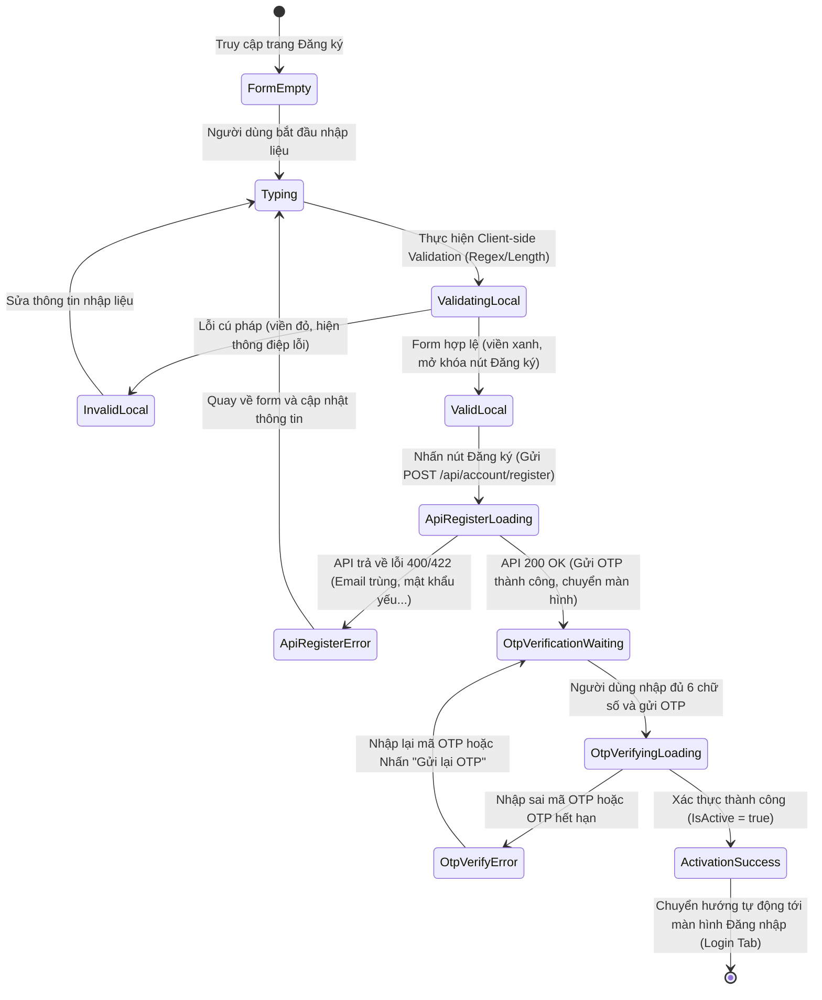

# 🎭 Behavioral Specification & State Machine - Register (Phase 1)

Tài liệu này đặc tả chi tiết máy trạng thái hữu hạn (Finite State Machine - FSM) của quá trình Đăng ký tài khoản và Xác thực OTP, đồng thời xác định các hành vi khi xảy ra lỗi biên hoặc sự cố mạng.

---

## 1. Biểu đồ Máy Trạng thái (Registration & OTP Activation FSM)

Luồng tương tác của Client đi qua các trạng thái tuần tự và xử lý phản hồi từ Web API:

---

## 2. Đặc tả các Sự kiện & Chuyển dịch Trạng thái (Transitions)

| Trạng thái Nguồn | Sự kiện Kích hoạt | Trạng thái Đích | Diễn giải Hành vi & Phản hồi UI |
| :--- | :--- | :--- | :--- |
| **FormEmpty** | Bắt đầu gõ vào input | **Typing** | Xóa sạch các thông báo lỗi cũ, hiển thị border mặc định. |
| **Typing** | Trình duyệt chạy debounce validation | **ValidatingLocal** | Kiểm tra Regex email, độ dài số điện thoại, độ mạnh mật khẩu sau 300ms dừng gõ. |
| **ValidatingLocal** | Phát hiện lỗi validation | **InvalidLocal** | Viền trường input chuyển màu đỏ hồng, hiển thị text mô tả lỗi, vô hiệu hóa nút submit. |
| **ValidatingLocal** | Đạt điều kiện hợp lệ | **ValidLocal** | Viền trường input chuyển xanh lục, ẩn thông báo lỗi, mở khóa nút submit. |
| **ValidLocal** | Nhấp nút "Đăng ký" | **ApiRegisterLoading** | Khóa tất cả các trường input (read-only), thay thế text nút đăng ký thành vòng xoay loading. |
| **ApiRegisterLoading** | API phản hồi 400/422 | **ApiRegisterError** | Mở khóa form, hiển thị thông báo lỗi từ server trả về qua toast hoặc label báo lỗi chính. |
| **ApiRegisterLoading** | API phản hồi 200 OK | **OtpVerificationWaiting** | Thực hiện hiệu ứng trượt màn hình sang form OTP, bắt đầu đếm ngược 60 giây cho nút Gửi lại. |
| **OtpVerificationWaiting** | Nhập OTP & click Submit | **OtpVerifyingLoading** | Khóa 6 ô nhập mã OTP, hiển thị trạng thái đang xử lý. |
| **OtpVerifyingLoading** | API xác thực thất bại | **OtpVerifyError** | Hiển thị thông báo lỗi (ví dụ: "Mã OTP không đúng"), dọn sạch các ô nhập liệu, mở khóa để nhập lại. |
| **OtpVerifyingLoading** | API xác thực thành công | **ActivationSuccess** | Hiển thị thông báo toast màu xanh lục thành công, kích hoạt hiệu ứng loading nhẹ và chuyển hướng. |

---

## 3. Quản lý Edge Cases và Phòng ngừa rủi ro bảo mật

### 3.1. Nhập sai OTP quá nhiều lần (Brute-force OTP Protection)
*   **Hành vi:** Hệ thống giới hạn mỗi lượt gửi OTP chỉ được phép nhập sai **tối đa 5 lần**.
*   **Xử lý:** Khi người dùng nhập sai đến lần thứ 5, Backend sẽ tự động hủy mã OTP hiện tại, vô hiệu hóa tài khoản tạm thời khỏi việc xác thực OTP đó và trả về mã lỗi yêu cầu: *"Mã OTP đã bị vô hiệu hóa do nhập sai quá nhiều lần. Vui lòng nhấn nút Gửi lại OTP để nhận mã mới."*

### 3.2. Sự cố mất kết nối mạng giữa chừng (Network Offline State)
*   **Hành vi:** Đang thực hiện đăng ký hoặc xác thực mà người dùng bị mất mạng internet.
*   **Xử lý:** Sử dụng window event listener `navigator.onLine` để phát hiện ngắt mạng cục bộ. Hiển thị banner cảnh báo: *"Mất kết nối mạng. Vui lòng kiểm tra lại đường truyền."* và khóa nút bấm trước khi gửi request lên API để tránh lỗi crash ứng dụng.

### 3.3. Spam nút "Gửi lại OTP" (Resend OTP Flood)
*   **Hành vi:** Người dùng liên tục click nút "Gửi lại OTP" khi email gửi chậm.
*   **Xử lý:** Nút "Gửi lại OTP" bị khóa ngay lập tức và đếm ngược 60 giây hiển thị trên màn hình (`[Gửi lại mã OTP sau 59s]`). API resend-otp cũng kiểm tra thuộc tính `OtpExpiry` của database, nếu khoảng cách giữa lần gửi trước và lần gửi yêu cầu nhỏ hơn 60 giây sẽ lập tức trả về lỗi `HTTP 429 Too Many Requests`.
