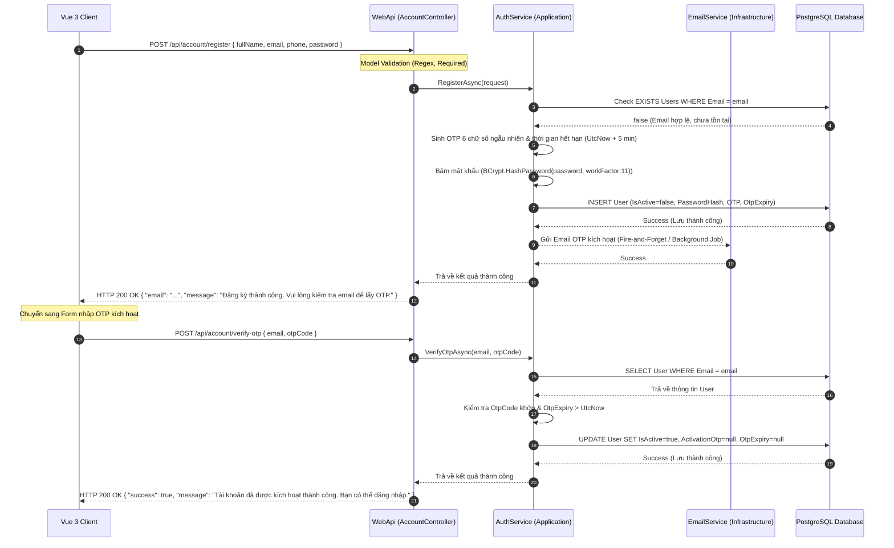

# 🛠️ Technical Specification - Register Account (Phase 1)

Tài liệu này đặc tả chi tiết kiến trúc kỹ thuật, luồng tuần tự (Sequence Diagram), cấu trúc cơ sở dữ liệu và các cấu phần hệ thống liên quan đến luồng đăng ký tài khoản khách hàng mới và xác thực kích hoạt qua OTP Email trong hệ thống **MyPetClinic**.

---

## 🔗 Skills & Nguyên tắc Kiến trúc Liên quan
*   **BE-C01 (ASP.NET Core Web API):** Xây dựng RESTful endpoint, áp dụng `[ApiController]`, routing phân cấp, và xử lý Model Validation tự động bằng `DataAnnotations` (`[Required]`, `[EmailAddress]`, `[Phone]`).
*   **BE-C02 (Entity Framework Core):** Ánh xạ Entity `User` xuống PostgreSQL, quản lý quan hệ 1-N (một Khách hàng có nhiều Thú cưng), thiết lập index duy nhất trên trường `Email`, xử lý transaction an toàn.
*   **BE-A03 (Cookie/JWT Auth & OTP Flow):** Cơ chế xác thực hai bước sử dụng OTP gửi qua email. Mật khẩu được mã hóa an toàn qua thư viện BCrypt.
*   **Clean Architecture Rules:** 
    *   **Domain Layer:** Chứa Entity `User` và các định nghĩa Business Exception.
    *   **Application Layer:** Định nghĩa các DTOs (`RegisterRequest`, `VerifyOtpRequest`), Interface (`IEmailService`), Validator, và `RegisterCommandHandler` / `VerifyOtpCommandHandler`.
    *   **Infrastructure Layer:** Triển khai `EmailService` qua SMTP Server, cấu hình Entity Framework Core DbContext.
    *   **WebApi Layer:** Lớp điều hướng và tiếp nhận HTTP Request (`AccountController`).

---

## 1. Luồng Xử lý Kỹ thuật (Sequence Diagram)

Sơ đồ dưới đây mô tả hành trình dữ liệu từ lúc Khách hàng nhập thông tin trên Vue 3 Client, qua các lớp nghiệp vụ của ASP.NET Core Web API, lưu trữ vào PostgreSQL và kích hoạt tài khoản thông qua OTP Email:



---

## 2. Đặc tả Entity `User` và Database Schema

### 2.1. Lớp Entity C# (Domain Layer)
Thực thể `User` định nghĩa cấu trúc dữ liệu cơ bản của một tài khoản người dùng trong hệ thống:

```csharp
namespace MyPetClinic.Domain.Entities
{
    public enum UserRole
    {
        KhachHang,      // Customer
        LeTan,          // Receptionist
        BacSi,          // Doctor
        ThuNgan,        // Cashier
        QuanTri         // Admin
    }

    public class User
    {
        public Guid Id { get; set; } = Guid.NewGuid();
        public string FullName { get; set; } = string.Empty;
        public string Email { get; set; } = string.Empty;
        public string PhoneNumber { get; set; } = string.Empty;
        public string PasswordHash { get; set; } = string.Empty;
        public bool IsActive { get; set; } = false;
        public UserRole Role { get; set; } = UserRole.KhachHang;

        // Quản lý thông tin OTP kích hoạt tài khoản
        public string? ActivationOtp { get; set; }
        public DateTime? OtpExpiry { get; set; }

        public DateTime CreatedAt { get; set; } = DateTime.UtcNow;
        public DateTime? UpdatedAt { get; set; }

        // Navigation Properties (Quan hệ 1-N với Pet)
        public ICollection<Pet> Pets { get; set; } = new List<Pet>();
    }
}
```

### 2.2. Thiết lập Schema Database (PostgreSQL)
Lược đồ SQL tương ứng được ánh xạ bởi EF Core Migration, tối ưu hóa các chỉ mục để truy vấn đăng nhập/đăng ký đạt hiệu năng tốt nhất:

```sql
-- Tạo bảng Users
CREATE TABLE "Users" (
    "Id"            UUID PRIMARY KEY DEFAULT gen_random_uuid(),
    "FullName"      VARCHAR(100) NOT NULL,
    "Email"         VARCHAR(200) NOT NULL,
    "PhoneNumber"   VARCHAR(15) NOT NULL,
    "PasswordHash"  VARCHAR(255) NOT NULL,
    "IsActive"      BOOLEAN NOT NULL DEFAULT FALSE,
    "Role"          INTEGER NOT NULL DEFAULT 0, -- 0 tương ứng với KhachHang
    "ActivationOtp" VARCHAR(6),
    "OtpExpiry"     TIMESTAMP WITH TIME ZONE,
    "CreatedAt"     TIMESTAMP WITH TIME ZONE NOT NULL DEFAULT CURRENT_TIMESTAMP,
    "UpdatedAt"     TIMESTAMP WITH TIME ZONE
);

-- Tạo Index duy nhất trên trường Email để tăng tốc truy vấn đăng nhập/kiểm tra trùng lặp
CREATE UNIQUE INDEX "IX_Users_Email" ON "Users" ("Email");

-- Tạo Index trên số điện thoại để hỗ trợ tìm kiếm khách hàng nhanh tại quầy lễ tân
CREATE INDEX "IX_Users_PhoneNumber" ON "Users" ("PhoneNumber");
```

---

## 3. Cấu hình Model Validation & DTOs (Data Transfer Objects)

Để bảo vệ API khỏi các payload lỗi định dạng, chúng ta áp dụng Model Validation chặt chẽ:

### 3.1. DTO Đăng ký (`RegisterRequest.cs`)
```csharp
using System.ComponentModel.DataAnnotations;

namespace MyPetClinic.Application.DTOs
{
    public class RegisterRequest
    {
        [Required(ErrorMessage = "Họ và tên không được để trống.")]
        [StringLength(100, MinimumLength = 3, ErrorMessage = "Họ và tên phải từ 3 đến 100 ký tự.")]
        public string FullName { get; set; } = string.Empty;

        [Required(ErrorMessage = "Email không được để trống.")]
        [EmailAddress(ErrorMessage = "Địa chỉ email không đúng định dạng.")]
        [StringLength(200, ErrorMessage = "Email không vượt quá 200 ký tự.")]
        public string Email { get; set; } = string.Empty;

        [Required(ErrorMessage = "Số điện thoại không được để trống.")]
        [RegularExpression(@"^(0[3|5|7|8|9])([0-9]{8})$", ErrorMessage = "Số điện thoại Việt Nam không hợp lệ (phải có 10 chữ số).")]
        public string PhoneNumber { get; set; } = string.Empty;

        [Required(ErrorMessage = "Mật khẩu không được để trống.")]
        [StringLength(100, MinimumLength = 8, ErrorMessage = "Mật khẩu phải dài tối thiểu 8 ký tự.")]
        [RegularExpression(@"^(?=.*[a-z])(?=.*[A-Z])(?=.*\d)(?=.*[@$!%*?&])[A-Za-z\d@$!%*?&]{8,}$", 
            ErrorMessage = "Mật khẩu phải chứa ít nhất 1 chữ hoa, 1 chữ thường, 1 chữ số và 1 ký tự đặc biệt.")]
        public string Password { get; set; } = string.Empty;
    }
}
```

### 3.2. DTO Xác thực OTP (`VerifyOtpRequest.cs`)
```csharp
using System.ComponentModel.DataAnnotations;

namespace MyPetClinic.Application.DTOs
{
    public class VerifyOtpRequest
    {
        [Required(ErrorMessage = "Email không được để trống.")]
        [EmailAddress(ErrorMessage = "Địa chỉ email không hợp lệ.")]
        public string Email { get; set; } = string.Empty;

        [Required(ErrorMessage = "Mã OTP không được để trống.")]
        [StringLength(6, MinimumLength = 6, ErrorMessage = "Mã OTP phải có độ dài đúng 6 ký tự.")]
        [RegularExpression(@"^\d{6}$", ErrorMessage = "Mã OTP chỉ bao gồm 6 chữ số.")]
        public string OtpCode { get; set; } = string.Empty;
    }
}
```
