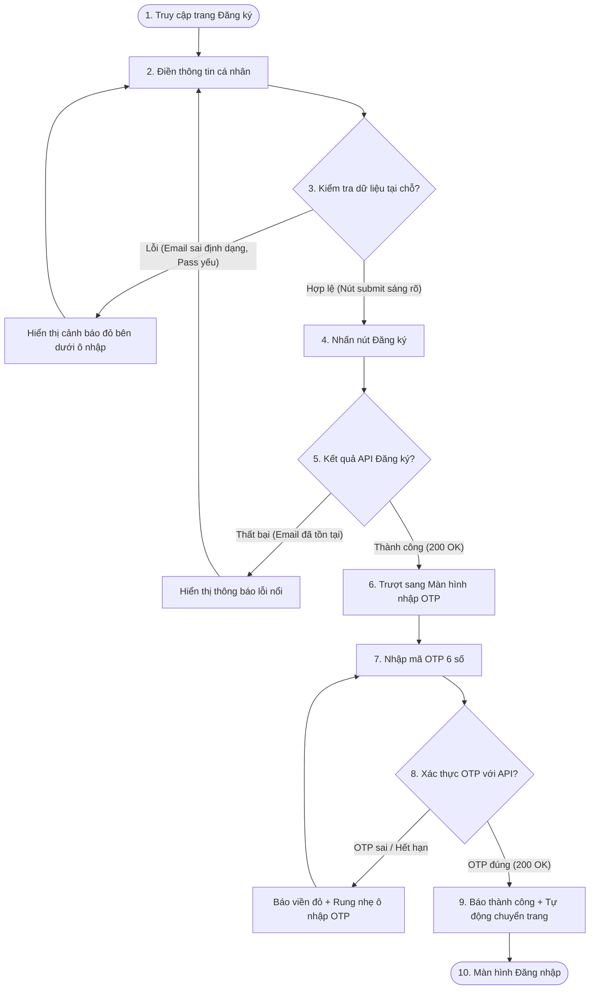

# 🎨 UX Flow & Interactive User Journey - Register (Phase 1)

Tài liệu này trình bày hành trình trải nghiệm người dùng (User Journey) từng bước qua biểu mẫu Đăng ký và Xác thực tài khoản khách hàng trên cổng thông tin trực tuyến **MyPetClinic**.

---

## 1. Bản đồ Hành trình Người dùng (User Journey Map)

---

## 2. Chi tiết các bước Trải nghiệm (Step-by-Step Experience)

### Bước 1: Tiếp cận Trang Đăng ký (Landing & Layout)
*   Khách hàng truy cập đường dẫn `/register` hoặc click tab "Đăng ký" trên trang chủ.
*   Giao diện tải mượt mà với hiệu ứng làm mờ nhẹ, biểu mẫu căn giữa màn hình. Con trỏ tự động focus (tự động nhấp chuột) vào ô đầu tiên: **Họ và tên**.

### Bước 2: Tương tác biểu mẫu & Phản hồi thời gian thực (Form Input Feedback)
*   **Khi nhập họ tên:** Gợi ý định dạng viết hoa các chữ cái đầu.
*   **Khi nhập Email:** Hiển thị icon tick xanh nhỏ ở cuối ô nếu đúng regex dạng `@`.
*   **Khi nhập mật khẩu:** 
    *   Hiển thị icon con mắt bên phải để bật/tắt hiển thị mật khẩu.
    *   Hiển thị thanh đo độ mạnh mật khẩu (Password Strength Bar) đổi màu linh hoạt từ Đỏ (Rất yếu) -> Cam (Trung bình) -> Xanh lá (Mạnh).
*   **Khi số điện thoại đúng 10 số:** Kiểm tra đầu số mạng Việt Nam hợp lệ. Nếu sai (ví dụ nhập 0123...) sẽ hiện cảnh báo đỏ.

### Bước 3: Gửi thông tin đăng ký (Submission & Loading)
*   Khi nhấn nút "Đăng ký", một màn hình overlay mờ nhẹ phủ lên biểu mẫu để người dùng không bấm đúp (double-click) gửi 2 lần.
*   Nút chuyển thành trạng thái **Loading Spinner**.

### Bước 4: Nhập mã OTP (OTP Screen UX)
*   Màn hình trượt sang bên trái mở ra giao diện nhập mã OTP gồm 6 ô vuông tương ứng 6 chữ số.
*   **UX Tối ưu:** 
    *   Khi người dùng gõ số vào ô đầu tiên, con trỏ tự động nhảy sang ô tiếp theo (auto-focus next input).
    *   Khi nhấn phím xóa `Backspace`, con trỏ tự động lùi về ô phía trước (auto-backspace focus).
    *   Khi gõ đủ 6 số, hệ thống tự động trigger submit gửi API xác thực mà không cần người dùng phải nhấn nút.
*   Bộ đếm ngược thời gian hiển thị: `Mã OTP hết hiệu lực sau: 04:59`.
*   Nút "Gửi lại OTP" hiển thị dạng liên kết mờ và đếm ngược: `Gửi lại mã OTP sau 59s`. Khi đếm về 0, nút này sáng lên cho phép click.

### Bước 5: Kích hoạt thành công & Chuyển hướng (Success & Redirect)
*   Khi nhập đúng OTP, hệ thống hiển thị thông báo toast góc trên bên phải màn hình: `"Tài khoản đã kích hoạt thành công!"` kèm âm thanh thông báo nhẹ.
*   Hệ thống hiển thị đếm ngược 3 giây trên màn hình: `"Đang chuyển hướng sang Đăng nhập trong 3s..."` trước khi tự động chuyển hướng sang tab Đăng nhập `/login`.
