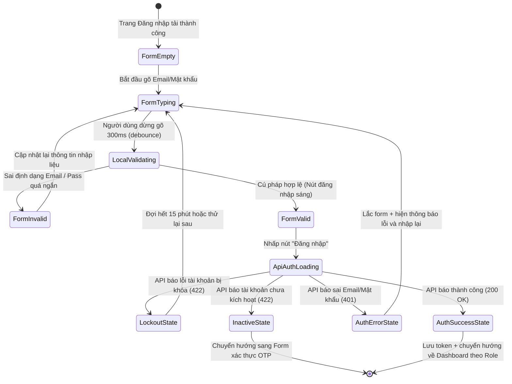

# 🎭 Behavioral Specification & State Machine - Login (Phase 1)

Tài liệu này đặc tả chi tiết máy trạng thái hữu hạn (FSM) và hành vi tương tác biểu mẫu Đăng nhập của người dùng cũng như các phản hồi UI từ phía Client.

---

## 1. Biểu đồ Máy Trạng thái (Login FSM)

Sơ đồ mô tả các trạng thái chuyển dịch của biểu mẫu đăng nhập dựa trên hành vi của người dùng và phản hồi từ Web API:

---

## 2. Đặc tả các Sự kiện & Chuyển dịch Trạng thái (Transitions)

| Trạng thái Nguồn | Sự kiện Kích hoạt | Trạng thái Đích | Diễn giải Hành vi & Phản hồi UI |
| :--- | :--- | :--- | :--- |
| **FormEmpty** | Người dùng nhập ký tự | **FormTyping** | Xóa sạch các thông báo lỗi cũ, trạng thái viền input trở lại mặc định. |
| **FormTyping** | Thực hiện validation | **LocalValidating** | Trình duyệt kiểm tra cú pháp email và độ dài mật khẩu. |
| **LocalValidating** | Phát hiện lỗi | **FormInvalid** | Viền đỏ xuất hiện quanh ô input bị lỗi, hiển thị text báo lỗi, nút Đăng nhập bị khóa. |
| **LocalValidating** | Hợp lệ cú pháp | **FormValid** | Viền chuyển sang xanh ngọc nhạt, mở khóa nút Đăng nhập. |
| **FormValid** | Click nút "Đăng nhập" | **ApiAuthLoading** | Khóa toàn bộ các input, nút đăng nhập chuyển sang trạng thái xoay vòng Shimmer Loading, không cho bấm đúp. |
| **ApiAuthLoading** | Nhận phản hồi HTTP 401 | **AuthErrorState** | Form thực hiện hiệu ứng rung lắc nhẹ (Shake animation). Hiển thị toast đỏ báo lỗi đăng nhập thất bại. |
| **ApiAuthLoading** | Nhận phản hồi HTTP 422 (Inactive) | **InactiveState** | Lưu trữ email tạm thời vào Store, tự động chuyển hướng sang tab nhập mã OTP kích hoạt tài khoản. |
| **ApiAuthLoading** | Nhận phản hồi HTTP 422 (Locked) | **LockoutState** | Mở khóa form, hiển thị thông báo tài khoản bị khóa 15 phút kèm bộ đếm ngược. Khóa nút đăng nhập. |
| **ApiAuthLoading** | Nhận phản hồi HTTP 200 | **AuthSuccessState** | Lưu JWT Token vào LocalStorage, thiết lập cấu hình Header cho Axios. Điều hướng người dùng về Dashboard nghiệp vụ riêng biệt. |

---

## 3. Quản lý Hành vi Biên và Edge Cases

### 3.1. Phân quyền và Chuyển hướng theo vai trò (Role Routing UX)
*   **Hành vi:** Hệ thống không đưa tất cả người dùng về một trang chung.
*   **Xử lý:** Khi đăng nhập thành công, Router Guard phân tích claim `role` của token:
    *   `BacSi` $\rightarrow$ `/portal/doctor` (Xem hàng đợi khám, danh sách chẩn đoán y khoa).
    *   `LeTan` $\rightarrow$ `/portal/receptionist` (Tiếp đón khách hàng, check-in lịch hẹn).
    *   `ThuNgan` $\rightarrow$ `/portal/cashier` (Thanh toán dịch vụ, in hóa đơn tài chính).
    *   `QuanTri` $\rightarrow$ `/admin` (Quản trị hệ thống, kho dược, doanh thu).
    *   `KhachHang` $\rightarrow$ `/dashboard` (Portal cá nhân, quản lý thú cưng, đặt lịch).

### 3.2. Đăng nhập khi không có kết nối Internet (Offline State)
*   **Hành vi:** Không có mạng nhưng bấm Đăng nhập.
*   **Xử lý:** Kiểm tra trạng thái mạng trước khi gửi API. Hiển thị thông báo: *"Không có kết nối mạng. Vui lòng kiểm tra lại thiết bị."* và ngăn chặn gửi request để tránh lãng phí tài nguyên và lỗi ứng dụng.
