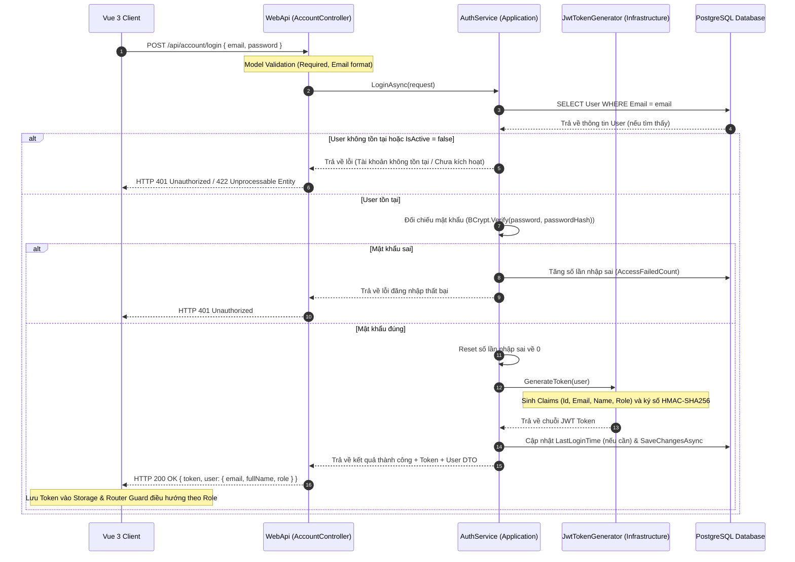

# 🛠️ Technical Specification - Login System (Phase 1)

Tài liệu này đặc tả chi tiết kiến trúc kỹ thuật, luồng xác thực, định cấu hình mã JWT Token và cơ chế phân quyền kiểm soát vai trò người dùng (RBAC) cho luồng Đăng nhập trong hệ thống **MyPetClinic**.

---

## 🔗 Skills & Nguyên tắc Kiến trúc Liên quan
*   **BE-C01 (ASP.NET Core Web API):** Xây dựng RESTful endpoint đăng nhập `/api/account/login`, xử lý Model Validation tự động qua DataAnnotations.
*   **BE-C02 (Entity Framework Core):** Truy vấn kiểm tra thông tin User theo Email bằng `FirstOrDefaultAsync()`.
*   **BE-A03 (JWT & RBAC Auth):** Cấu hình JWT Bearer Authentication Middleware, sinh token an toàn chứa các Claims định danh và vai trò (`Role`).
*   **Clean Architecture Layering:**
    *   **Domain Layer:** Chứa Enum `UserRole`.
    *   **Application Layer:** DTO `LoginRequest`, `LoginResponse`, Interface `IJwtTokenGenerator`, `AuthService`.
    *   **Infrastructure Layer:** Triển khai `JwtTokenGenerator` sử dụng thư viện `System.IdentityModel.Tokens.Jwt`.
    *   **WebApi Layer:** `AccountController` và cấu hình Middleware xác thực trong `Program.cs`.

---

## 1. Luồng Xử lý Kỹ thuật (Sequence Diagram)

Quy trình gửi thông tin đăng nhập, xác thực bằng BCrypt, tạo mã JWT chứa các quyền hạn (Claims) và phân phối vai trò người dùng:



---

## 2. Đặc tả JWT Token (Payload Claims Structure)

Hệ thống sử dụng tiêu chuẩn JSON Web Token (JWT) để làm chứng chỉ truy cập cho các request sau đó. Token trả về có cấu trúc gồm 3 phần phân tách bởi dấu chấm: `Header.Payload.Signature`.

### 2.1. Cấu hình JWT trong `appsettings.json`
```json
{
  "JwtSettings": {
    "Secret": "your-super-secret-key-that-is-at-least-256-bits-long",
    "Issuer": "MyPetClinicWebApi",
    "Audience": "MyPetClinicApp",
    "ExpiryInHours": 12
  }
}
```

### 2.2. Chi tiết cấu trúc Payload Claims
Khi giải mã JWT Token (ví dụ qua trang `jwt.io`), thông tin Payload chứa các trường định danh sau:

```json
{
  "http://schemas.xmlsoap.org/ws/2005/05/identity/claims/nameidentifier": "d3b07384-d113-4ec6-a5d6-c8c3e8a6a123", // User Guid
  "http://schemas.xmlsoap.org/ws/2005/05/identity/claims/name": "Nguyễn Văn A", // FullName
  "http://schemas.xmlsoap.org/ws/2005/05/identity/claims/emailaddress": "nguyenvana@example.com", // Email
  "http://schemas.microsoft.com/ws/2008/06/identity/claims/role": "BacSi", // Vai trò được phân quyền
  "nbf": 1781081600, // Thời gian token bắt đầu có hiệu lực (Epoch time)
  "exp": 1781124800, // Thời gian hết hạn (Epoch time = nbf + 12 giờ)
  "iss": "MyPetClinicWebApi",
  "aud": "MyPetClinicApp"
}
```

---

## 3. Cấu hình DTO Validation cho Đăng nhập

### 3.1. DTO Yêu cầu Đăng nhập (`LoginRequest.cs`)
```csharp
using System.ComponentModel.DataAnnotations;

namespace MyPetClinic.Application.DTOs
{
    public class LoginRequest
    {
        [Required(ErrorMessage = "Email đăng nhập không được để trống.")]
        [EmailAddress(ErrorMessage = "Địa chỉ email không đúng định dạng.")]
        public string Email { get; set; } = string.Empty;

        [Required(ErrorMessage = "Mật khẩu không được để trống.")]
        [StringLength(100, MinimumLength = 8, ErrorMessage = "Mật khẩu phải dài tối thiểu 8 ký tự.")]
        public string Password { get; set; } = string.Empty;
    }
}
```

### 3.2. DTO Phản hồi Đăng nhập (`LoginResponse.cs`)
```csharp
namespace MyPetClinic.Application.DTOs
{
    public class LoginResponse
    {
        public string Token { get; set; } = string.Empty;
        public string TokenType { get; set; } = "Bearer";
        public int ExpiresInSeconds { get; set; }
        public UserDto User { get; set; } = new();
    }

    public class UserDto
    {
        public Guid Id { get; set; }
        public string FullName { get; set; } = string.Empty;
        public string Email { get; set; } = string.Empty;
        public string Role { get; set; } = string.Empty;
    }
}
```
*Lập trình viên Frontend sẽ căn cứ vào DTO phản hồi này để lưu thông tin User vào Pinia Store và điều hướng các Router Guards.*
