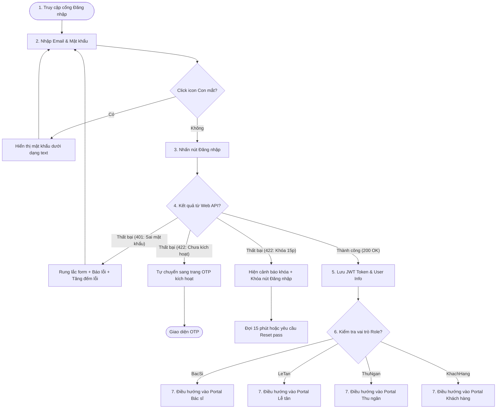

# 🎨 UX Flow & Interactive User Journey - Login System (Phase 1)

Tài liệu này trình bày hành trình trải nghiệm người dùng (User Journey) chi tiết từ lúc khách hàng hoặc nhân viên tiếp cận biểu mẫu Đăng nhập cho đến khi vào giao diện làm việc cá nhân hóa của mình.

---

## 1. Sơ đồ luồng Tương tác (UX Flow Map)

---

## 2. Chi tiết các bước Trải nghiệm (Interactive Steps)

### Bước 1: Tiếp cận Màn hình Đăng nhập (Initial State)
*   Khách hàng truy cập đường dẫn `/login` hoặc nhấp vào nút "Đăng nhập" trên trang chủ.
*   Trường nhập **Email** tự động được focus để người dùng có thể gõ ngay lập tức mà không cần click chuột. Nếu trước đó người dùng đã tích chọn "Ghi nhớ đăng nhập", email cũ sẽ được tự động điền sẵn (pre-filled).

### Bước 2: Nhập thông tin & Toggle ẩn/hiện mật khẩu
*   Người dùng điền Email. Hệ thống kiểm tra regex và hiển thị icon check xanh lục nếu đúng cấu trúc email.
*   Người dùng điền Mật khẩu. Các ký tự hiển thị dưới dạng dấu chấm tròn bảo mật. Người dùng có thể click vào icon **Con mắt** ở cuối ô mật khẩu để chuyển hiển thị sang dạng text thô, giúp kiểm tra mật khẩu gõ đúng hay chưa. Click lần nữa để ẩn lại.

### Bước 3: Gửi thông tin đăng nhập & Hiệu ứng Rung lắc (Error Shake)
*   Khi nhấn nút "Đăng nhập", form hiển thị hiệu ứng làm mờ nhẹ (loading overlay) để ngăn chặn việc bấm đúp.
*   **Kịch bản Lỗi đăng nhập (Sai mật khẩu):**
    *   Form đăng nhập thực hiện **hiệu ứng rung lắc nhẹ** theo chiều ngang để mô phỏng hành vi từ chối truy cập.
    *   Hộp thoại toast màu đỏ báo lỗi xuất hiện: *"Tài khoản hoặc mật khẩu không chính xác."*
    *   Trường mật khẩu tự động bị xóa sạch và tự động focus lại để người dùng nhập lại.

### Bước 4: Tự động phân loại và chuyển đổi Portal (Role Redirection)
*   Khi đăng nhập thành công, hệ thống thực hiện hiệu ứng chuyển cảnh mượt mà: Form đăng nhập mờ dần và thu nhỏ (fade-out & scale-down), sau đó chuyển trang Dashboard tương ứng.
*   **Trải nghiệm theo phân vai nhân sự:**
    *   *Bác sĩ:* Đi thẳng vào màn hình theo dõi hàng đợi thú cưng cần khám.
    *   *Lễ tân:* Vào màn hình tiếp đón và check-in nhanh bằng mã QR.
    *   *Khách hàng:* Vào màn hình danh sách thú cưng của mình để tiện theo dõi.
