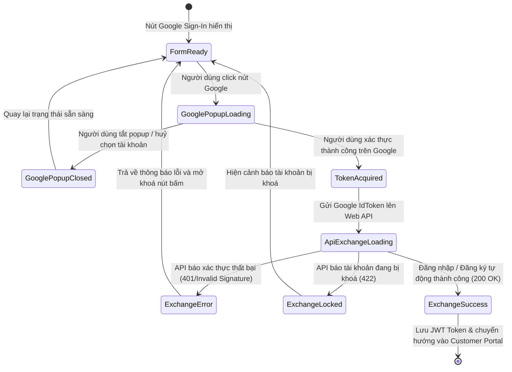

# 🎭 Behavioral Specification & State Machine - Google OAuth (Phase 1)

Tài liệu này đặc tả chi tiết máy trạng thái hữu hạn (FSM) và hành vi tương tác của chức năng Đăng nhập qua bên thứ ba (Google OAuth) và các xử lý tương tác lỗi biên.

---

## 1. Biểu đồ Máy Trạng thái (Google Login FSM)

Sơ đồ mô tả các trạng thái tương tác từ lúc người dùng click chọn nút đăng nhập Google đến khi nhận được JWT Token của hệ thống:

---

## 2. Đặc tả các Sự kiện & Chuyển dịch Trạng thái (Transitions)

| Trạng thái Nguồn | Sự kiện Kích hoạt | Trạng thái Đích | Diễn giải Hành vi & Phản hồi UI |
| :--- | :--- | :--- | :--- |
| **FormReady** | Click nút Google | **GooglePopupLoading** | Hiển thị Popup xác thực của Google Sign-In lồng lên trên trình duyệt. Khóa nút bấm Google. |
| **GooglePopupLoading** | Người dùng click vùng ngoài hoặc tắt popup | **GooglePopupClosed** | Nhận sự kiện đóng popup, hiển thị thông báo toast: *"Đăng nhập bị hủy bỏ."* và phục hồi nút bấm. |
| **GooglePopupLoading** | Chọn tài khoản & nhập mật khẩu Google đúng | **TokenAcquired** | Google cấp mã xác thực ID Token dạng JWT, tự động đóng popup. |
| **TokenAcquired** | Tự động gửi POST API | **ApiExchangeLoading** | Hiển thị màn hình mờ Shimmer Overlay trên toàn ứng dụng để biểu thị tiến trình trao đổi token. |
| **ApiExchangeLoading** | Nhận phản hồi HTTP 401 | **ExchangeError** | Hiển thị thông báo toast đỏ báo lỗi xác thực Google thất bại. Giải phóng màn hình overlay. |
| **ApiExchangeLoading** | Nhận phản hồi HTTP 422 (Locked) | **ExchangeLocked** | Hiển thị thông báo lỗi tài khoản bị khóa do vi phạm các chính sách khác của hệ thống. |
| **ApiExchangeLoading** | Nhận phản hồi HTTP 200 | **ExchangeSuccess** | Lưu token và thông tin người dùng vào Store Pinia. Tự động chuyển hướng khách hàng vào giao diện quản lý thú cưng. |

---

## 3. Quản lý Hành vi Biên và các Tình huống Đặc biệt (Edge Cases)

### 3.1. Hủy bỏ đăng nhập giữa chừng (Popup Cancellation)
*   **Hành vi:** Khách hàng click vào nút Google nhưng sau đó đóng cửa sổ popup hoặc click hủy.
*   **Xử lý:** Google GIS SDK trả về mã sự kiện hủy. Frontend cần lắng nghe sự kiện này để mở khóa nút bấm, tránh tình trạng nút Google bị khóa vô hạn (disabled forever).

### 3.2. Sự cố mất kết nối tới Google Server khi xác thực Backend (Network Timeout)
*   **Hành vi:** Backend gọi thư viện Google để xác thực chữ ký token nhưng mạng giữa server phòng khám và Google bị ngắt hoặc phản hồi chậm.
*   **Xử lý:** Thiết lập thời gian chờ tối đa (Timeout) là **3 giây** cho hàm kiểm tra token Google. Nếu quá 3 giây mà Google Server không phản hồi, Backend ném ra ngoại lệ và trả về lỗi `HTTP 504 Gateway Timeout` kèm thông báo: *"Không thể xác thực tài khoản Google của bạn do lỗi kết nối máy chủ. Vui lòng thử lại sau."*
