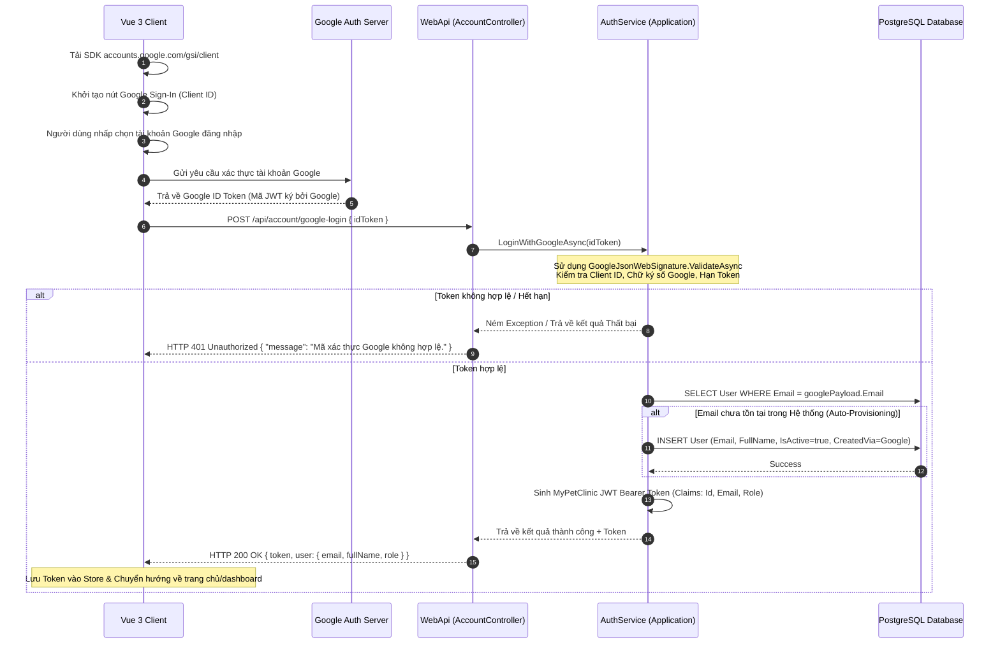

# 🛠️ Technical Specification - Google OAuth Login (Phase 1)

Tài liệu này đặc tả kiến trúc kỹ thuật, luồng tuần tự (Sequence Diagram), cấu trúc xác thực Token của bên thứ ba (Google Identity Services) và cơ chế tự động tạo tài khoản tại Backend trong hệ thống **MyPetClinic**.

---

## 🔗 Skills & Nguyên tắc Kiến trúc Liên quan
*   **BE-C01 (ASP.NET Core Web API):** Xây dựng RESTful endpoint `/api/account/google-login` tiếp nhận Google Id Token.
*   **BE-C02 (Entity Framework Core):** Tự động truy vấn email và chèn thực thể `User` mới nếu chưa tồn tại trong DB.
*   **BE-A03 (Security & Google Auth Library):** Sử dụng gói thư viện NuGet chính thức `Google.Apis.Auth` để giải mã và xác thực chữ ký của Google Token.
*   **Frontend Integration (Google SDK):** Nạp động Google SDK (`https://accounts.google.com/gsi/client`) và khởi dựng nút bấm Google Sign-In.

---

## 1. Luồng Xử lý Kỹ thuật (Sequence Diagram)

Quy trình người dùng click đăng nhập bằng Google, trình duyệt giao tiếp với Google Server lấy Id Token, sau đó Backend Web API thực hiện xác thực chéo:



---

## 2. Đặc tả Xác thực Google ID Token (Backend C#)

Backend không bao giờ tin tưởng ID Token mà không qua kiểm tra chữ ký số trực tiếp từ Google public keys:

### 2.1. Cấu hình Google Client ID (`appsettings.json`)
```json
{
  "GoogleAuthSettings": {
    "ClientId": "your-google-client-id-here.apps.googleusercontent.com"
  }
}
```

### 2.2. DTO Yêu cầu Đăng nhập Google (`GoogleLoginRequest.cs`)
```csharp
using System.ComponentModel.DataAnnotations;

namespace MyPetClinic.Application.DTOs
{
    public class GoogleLoginRequest
    {
        [Required(ErrorMessage = "Google ID Token không được để trống.")]
        public string IdToken { get; set; } = string.Empty;
    }
}
```

### 2.3. Cú pháp giải mã & xác thực của thư viện Google
Đoạn code Backend sử dụng lớp static `GoogleJsonWebSignature` để xác thực mã Token:

```csharp
using System;
using System.Collections.Generic;
using Google.Apis.Auth;

namespace MyPetClinic.Infrastructure.Authentication
{
    public class GoogleTokenValidator
    {
        private readonly string _googleClientId;

        public GoogleTokenValidator(string googleClientId)
        {
            _googleClientId = googleClientId;
        }

        public async Task<GoogleJsonWebSignature.Payload?> ValidateTokenAsync(string idToken)
        {
            try
            {
                var validationSettings = new GoogleJsonWebSignature.ValidationSettings
                {
                    // Đảm bảo Token được phát hành riêng cho Client ID của chúng ta
                    Audience = new List<string> { _googleClientId }
                };

                // Hàm tự động fetch public keys của Google và xác thực chữ ký, kiểm tra hạn hết hạn token
                var payload = await GoogleJsonWebSignature.ValidateAsync(idToken, validationSettings);
                return payload;
            }
            catch (InvalidJwtException ex)
            {
                // Token bị thay đổi chữ ký hoặc giả mạo
                Console.WriteLine($"[Google Verification Failed] Token không hợp lệ: {ex.Message}");
                return null;
            }
        }
    }
}
```
*Lưu ý: `GoogleJsonWebSignature.ValidateAsync` tự động quản lý việc tải và lưu đệm (cache) các khóa công khai của Google tại đường dẫn `https://www.googleapis.com/oauth2/v3/certs` để tăng tối đa hiệu năng xác thực mà không làm nghẽn API.*
