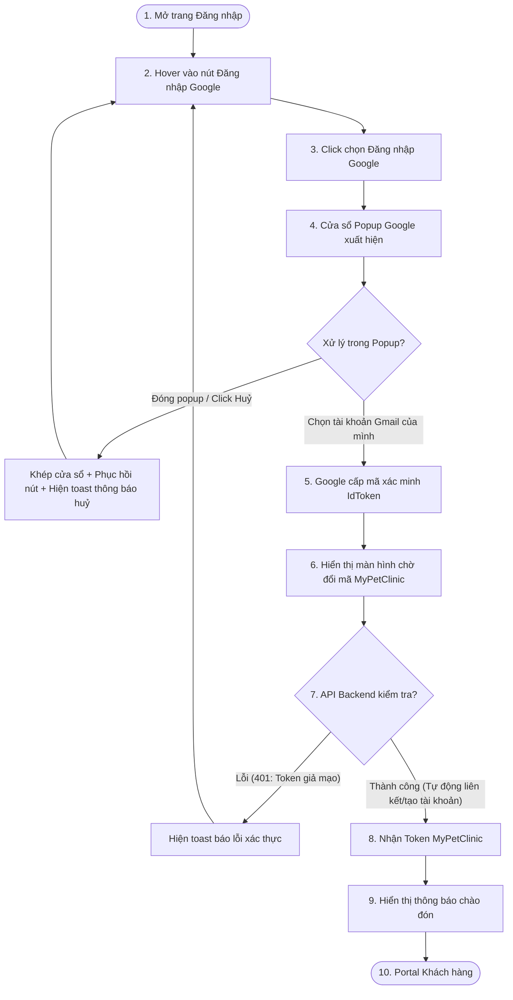

# 🎨 UX Flow & Interactive User Journey - Google OAuth (Phase 1)

Tài liệu này trình bày hành trình trải nghiệm người dùng (User Journey) chi tiết từng bước khi tương tác với nút Đăng nhập một chạm bằng tài khoản Google.

---

## 1. Bản đồ Hành trình Người dùng (UX Flow Map)

---

## 2. Chi tiết các bước Trải nghiệm (Interactive Steps)

### Bước 1: Khởi động lựa chọn Đăng nhập Google
*   Người dùng truy cập `/login`, nhìn xuống phía dưới nút Đăng nhập truyền thống sẽ thấy nút **Đăng nhập với Google** nổi bật với logo chữ G đa sắc và viền bo góc tinh tế.
*   *Hiệu ứng Hover:* Nút bấm tự động đổi sang màu nền xám cực nhạt, con trỏ chuột chuyển thành dạng bàn tay (`pointer`), và xuất hiện bóng đổ phát sáng mịn xung quanh viền.

### Bước 2: Kích hoạt Popup Google Sign-In
*   Khi người dùng click vào nút, một cửa sổ popup của Google được nạp đè lên giữa màn hình chính.
*   Ứng dụng Frontend ở tab cũ tự động mờ đi (opacity 0.6) và chuyển sang trạng thái chờ tương tác, ngăn chặn người dùng bấm lung tung các khu vực khác.

### Bước 3: Chọn tài khoản & Xác nhận Token
*   Người dùng thực hiện chọn tài khoản Gmail đang có sẵn trên trình duyệt hoặc nhập tài khoản mới và hoàn tất nhập mật khẩu Google (được xử lý hoàn toàn trên server bảo mật của Google).
*   Popup tự động đóng lại sau khi hoàn thành. Hệ thống Client nhận mã xác thực từ Google.

### Bước 4: Chờ đổi mã bảo mật và Chuyển hướng
*   Ứng dụng Frontend tự động gửi mã ID Token lên Backend Web API.
*   Màn hình hiển thị một hiệu ứng chuyển cảnh mượt mà: Toàn bộ form mờ dần, hiển thị một icon thú cưng dễ thương chuyển động xoay tròn cùng dòng chữ: *"Đang xác thực thông tin đăng nhập Google của bạn..."*
*   **Khi API trả về 200 OK:** Hệ thống hiển thị toast thông báo: `"Xin chào, Nguyễn Văn A! Đăng nhập thành công."` và đưa thẳng người dùng vào Dashboard quản lý thú cưng.
