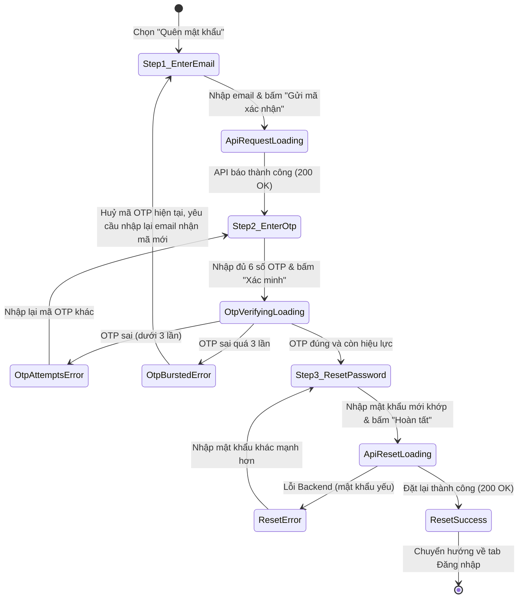

# 🎭 Behavioral Specification & State Machine - Forgot Password (Phase 1)

Tài liệu này đặc tả chi tiết máy trạng thái hữu hạn (FSM) và hành vi tương tác wizard 3 bước khôi phục mật khẩu cùng các xử lý tình huống lỗi biên.

---

## 1. Biểu đồ Máy Trạng thái (Forgot Password FSM)

Sơ đồ mô tả các trạng thái chuyển dịch của biểu mẫu quên mật khẩu dựa trên hành động của người dùng và phản hồi từ API:

---

## 2. Đặc tả các Sự kiện & Chuyển dịch Trạng thái (Transitions)

| Trạng thái Nguồn | Sự kiện Kích hoạt | Trạng thái Đích | Diễn giải Hành vi & Phản hồi UI |
| :--- | :--- | :--- | :--- |
| **Step1_EnterEmail** | Bấm nút "Gửi mã" | **ApiRequestLoading** | Khóa input email, nút chuyển xoay vòng loading. Gửi yêu cầu OTP. |
| **ApiRequestLoading** | API phản hồi 200 OK | **Step2_EnterOtp** | Thực hiện hiệu ứng trượt màn hình sang ô nhập OTP. Bắt đầu đếm ngược 60 giây gửi lại. |
| **Step2_EnterOtp** | Bấm nút "Xác minh" | **OtpVerifyingLoading** | Khóa các ô OTP, hiển thị trạng thái đang đối chiếu. |
| **OtpVerifyingLoading** | OTP sai (< 3 lần) | **OtpAttemptsError** | Rung lắc ô nhập OTP, hiển thị số lần còn lại (Ví dụ: *"Còn 2 lần thử"*). |
| **OtpVerifyingLoading** | OTP sai (lần thứ 3) | **OtpBurstedError** | Hủy mã OTP. Hiển thị thông báo đỏ và trượt ngược lại Bước 1 để yêu cầu mã mới. |
| **OtpVerifyingLoading** | OTP đúng | **Step3_ResetPassword** | Lưu trạng thái OTP hợp lệ, trượt sang Form nhập mật khẩu mới. |
| **Step3_ResetPassword** | Bấm nút "Hoàn tất" | **ApiResetLoading** | Khóa các ô nhập mật khẩu, gửi mật khẩu mới mã hóa lên API. |
| **ApiResetLoading** | Đặt lại thành công | **ResetSuccess** | Hiện toast thông báo đặt lại mật khẩu thành công. Điều hướng về trang Đăng nhập. |

---

## 3. Quản lý Hành vi Biên và các Góc cạnh nghiệp vụ (Edge Cases)

### 3.1. Nhập sai OTP quá 3 lần (Reset OTP Attempts Limit)
*   **Hành vi:** Ngăn chặn brute-force OTP của tin tặc.
*   **Xử lý:** Khi đếm số lần nhập sai `ResetOtpFailedAttempts >= 3`, Backend tự động hủy OTP đó trong DB. Frontend nhận mã lỗi `OTP_ATTEMPTS_EXCEEDED` và tự động trượt ngược lại Bước 1, yêu cầu người dùng gửi lại email để nhận mã mới.

### 3.2. Mật khẩu mới trùng mật khẩu cũ (Same Password Check)
*   **Hành vi:** Yêu cầu bảo mật tránh việc người dùng đặt lại mật khẩu giống hệt mật khẩu cũ.
*   **Xử lý:** Trong các phase tiếp theo, Backend có thể đối chiếu mật khẩu mới gửi lên với `PasswordHash` hiện tại bằng hàm `BCrypt.Verify(newPassword, oldHash)`. Nếu trùng khớp, trả về lỗi `400 Bad Request` yêu cầu: *"Mật khẩu mới không được trùng với mật khẩu đang sử dụng."*
