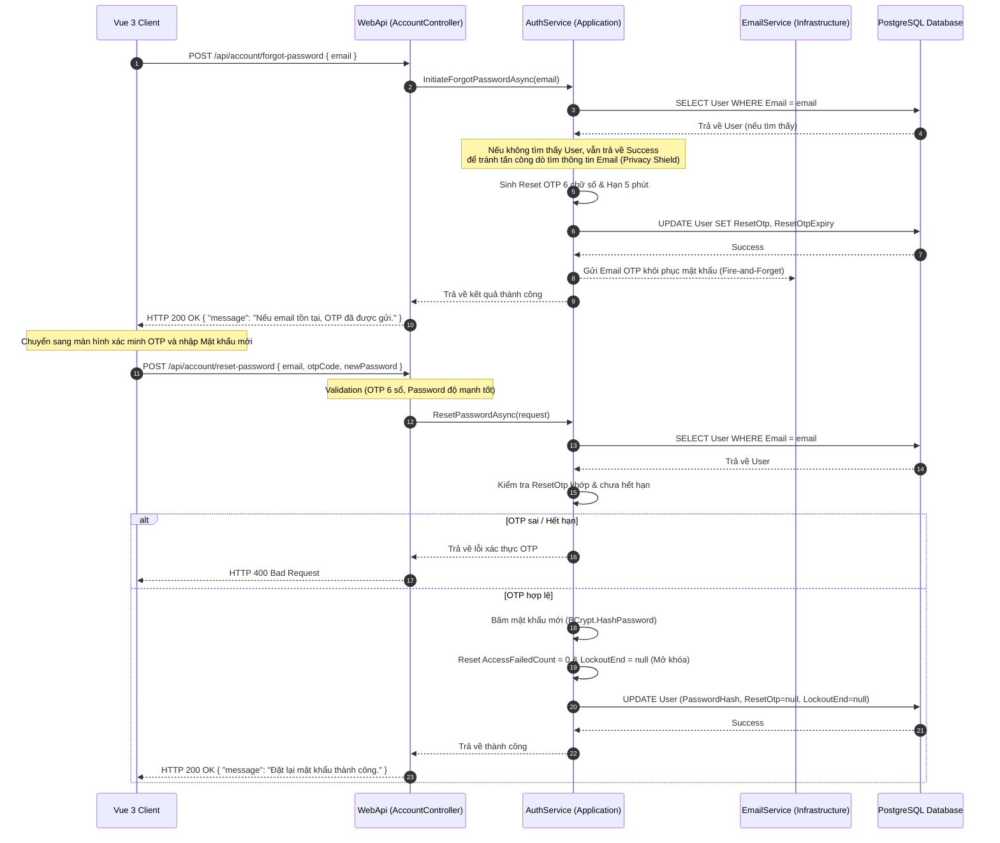

# 🛠️ Technical Specification - Forgot Password Recovery (Phase 1)

Tài liệu này đặc tả chi tiết kiến trúc kỹ thuật, luồng tuần tự (Sequence Diagram), cấu trúc cơ sở dữ liệu và Model Validation cho tính năng Khôi phục mật khẩu trong hệ thống **MyPetClinic**.

---

## 🔗 Skills & Nguyên tắc Kiến trúc Liên quan
*   **BE-C01 (ASP.NET Core Web API):** Xây dựng các endpoints: `/api/account/forgot-password` và `/api/account/reset-password`.
*   **BE-C02 (Entity Framework Core):** Truy vấn kiểm tra Email, cập nhật `PasswordHash`, reset bộ đếm `AccessFailedCount` và `LockoutEnd` an toàn.
*   **BE-A03 (Security & Password Reset OTP):** Cơ chế sinh mã OTP bảo mật cho mục đích reset mật khẩu. Băm mật khẩu mới bằng BCrypt với workFactor: 11.

---

## 1. Luồng Xử lý Kỹ thuật (Sequence Diagram)

Quy trình 3 bước khôi phục mật khẩu: Gửi yêu cầu -> Xác minh OTP -> Thiết lập mật khẩu mới và tự động mở khóa tài khoản:



---

## 2. Đặc tả các trường Dữ liệu & DTOs (Model Validation)

### 2.1. Cấu hình thực thể User bổ sung trường OTP Reset
Để tránh xung đột với OTP kích hoạt tài khoản ban đầu, chúng ta bổ sung các trường chuyên biệt cho việc Quên mật khẩu:

```csharp
namespace MyPetClinic.Domain.Entities
{
    public class User
    {
        // ... Các thuộc tính cơ bản khác ...
        
        // Trường lưu OTP phục vụ khôi phục mật khẩu
        public string? PasswordResetOtp { get; set; }
        public DateTime? PasswordResetOtpExpiry { get; set; }
        
        // Cấu hình quản trị khoá tài khoản
        public int AccessFailedCount { get; set; } = 0;
        public DateTime? LockoutEnd { get; set; }
        public DateTime? LastLoginAt { get; set; }
    }
}
```

### 2.2. DTO Đặt lại mật khẩu (`ResetPasswordRequest.cs`)
```csharp
using System.ComponentModel.DataAnnotations;

namespace MyPetClinic.Application.DTOs
{
    public class ResetPasswordRequest
    {
        [Required(ErrorMessage = "Email không được để trống.")]
        [EmailAddress(ErrorMessage = "Địa chỉ email không hợp lệ.")]
        public string Email { get; set; } = string.Empty;

        [Required(ErrorMessage = "Mã OTP không được để trống.")]
        [StringLength(6, MinimumLength = 6, ErrorMessage = "Mã OTP phải dài đúng 6 ký tự.")]
        [RegularExpression(@"^\d{6}$", ErrorMessage = "Mã OTP chỉ bao gồm 6 chữ số.")]
        public string OtpCode { get; set; } = string.Empty;

        [Required(ErrorMessage = "Mật khẩu mới không được để trống.")]
        [StringLength(100, MinimumLength = 8, ErrorMessage = "Mật khẩu mới phải dài tối thiểu 8 ký tự.")]
        [RegularExpression(@"^(?=.*[a-z])(?=.*[A-Z])(?=.*\d)(?=.*[@$!%*?&])[A-Za-z\d@$!%*?&]{8,}$", 
            ErrorMessage = "Mật khẩu mới phải chứa ít nhất 1 chữ hoa, 1 chữ thường, 1 chữ số và 1 ký tự đặc biệt.")]
        public string NewPassword { get; set; } = string.Empty;
    }
}
```
