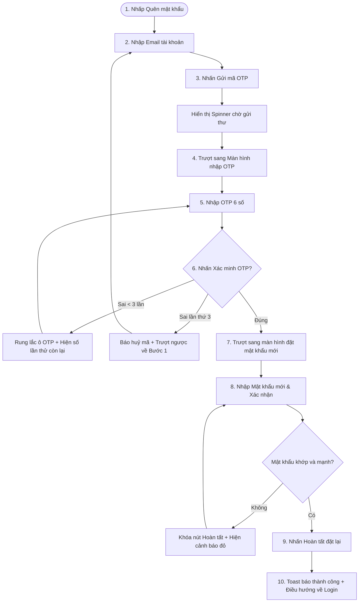

# 🎨 UX Flow & Interactive User Journey - Forgot Password (Phase 1)

Tài liệu này trình bày hành trình trải nghiệm người dùng (User Journey) chi tiết từng bước qua biểu mẫu 3 bước khôi phục mật khẩu.

---

## 1. Sơ đồ luồng Tương tác (UX Flow Map)

---

## 2. Chi tiết các bước Trải nghiệm (Interactive Steps)

### Bước 1: Yêu cầu khôi phục qua Email
*   Người dùng nhấp vào liên kết "Quên mật khẩu?" trên Form Đăng nhập.
*   Form Đăng nhập trượt ra bên trái, Form nhập Email khôi phục trượt vào từ bên phải.
*   Người dùng điền email và nhấn "Gửi mã xác nhận". Một vòng xoay loading spinner xuất hiện trên nút bấm thể hiện email đang được gửi đi.

### Bước 2: Nhập OTP và kiểm soát số lần thử
*   Khi có phản hồi thành công từ API, giao diện tự động trượt sang **Bước 2: Nhập mã OTP**.
*   Ô nhập OTP hỗ trợ auto-focus ô kế tiếp và tự động lùi ô khi xóa ký tự.
*   **Khi nhập sai:** Ô nhập OTP sẽ có viền đỏ hồng kèm hiệu ứng rung lắc nhẹ. Bên dưới ô hiển thị nhãn phụ: `"Mã OTP không đúng. Bạn còn 2 lần thử lại."`
*   **Khi nhập sai đến lần thứ 3:** Toàn bộ ô nhập bị khóa, hiển thị thông báo lỗi màu đỏ đậm: `"Mã OTP đã bị hủy do nhập sai quá nhiều lần. Vui lòng gửi yêu cầu mới."`, hệ thống tự động trượt ngược lại Bước 1 sau 2 giây để người dùng nhập lại email.

### Bước 3: Đặt mật khẩu mới và tự động mở khóa
*   Khi nhập đúng OTP, hệ thống trượt tiếp sang **Bước 3: Đặt mật khẩu mới**.
*   Giao diện gồm 2 trường: *Mật khẩu mới* và *Xác nhận mật khẩu*.
*   Hỗ trợ thanh đo độ mạnh mật khẩu thời gian thực (Password Strength Meter) đổi màu trực quan.
*   **Khi hoàn tất thành công:** Hiển thị toast thông báo xanh lục góc màn hình và tự động đưa người dùng trở lại tab đăng nhập chính thức.
