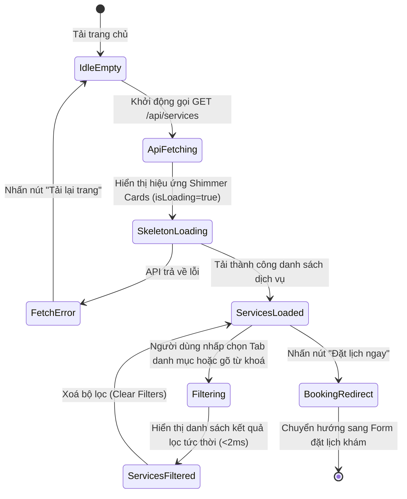

# 🎭 Behavioral Specification & State Machine - Services (Phase 1)

Tài liệu này đặc tả máy trạng thái hữu hạn (FSM) và hành vi xử lý hiển thị danh sách dịch vụ y tế, thay đổi bộ lọc, tìm kiếm và điều hướng đặt lịch khám.

---

## 1. Biểu đồ Máy Trạng thái (Services FSM)

Sơ đồ mô tả quy trình tải danh sách dịch vụ và tương tác bộ lọc của người dùng:

---

## 2. Đặc tả các Sự kiện & Chuyển dịch Trạng thái (Transitions)

| Trạng thái Nguồn | Sự kiện Kích hoạt | Trạng thái Đích | Diễn giải Hành vi & Phản hồi UI |
| :--- | :--- | :--- | :--- |
| **IdleEmpty** | Component `onMounted()` | **ApiFetching** | Khởi chạy gọi action `fetchServices` của store. |
| **ApiFetching** | Kích hoạt cờ loading | **SkeletonLoading** | Ẩn danh sách thật, kết xuất 4 khung Card xương (Skeletons) với hiệu ứng chạy sáng màu xám. |
| **SkeletonLoading** | API phản hồi lỗi | **FetchError** | Ẩn skeletons, hiển thị banner báo lỗi: *"Không thể kết nối máy chủ"* kèm nút **Thử lại**. |
| **SkeletonLoading** | API phản hồi 200 OK | **ServicesLoaded** | Ẩn skeletons, hiển thị lưới Grid hình ảnh các dịch vụ thật. |
| **ServicesLoaded** | Thay đổi input gõ phím / click tab | **Filtering** | Chạy hàm tính toán computed `filteredServices` tại RAM client. |
| **Filtering** | Tính toán kết thúc | **ServicesFiltered** | Cập nhật số lượng thẻ hiển thị. Nếu kết quả lọc bằng rỗng (0 kết quả), hiển thị hình minh họa dễ thương kèm text: *"Không tìm thấy dịch vụ tương ứng."* |
| **ServicesLoaded** | Click nút "Đặt lịch ngay" | **BookingRedirect** | Kiểm tra quyền đăng nhập. Nếu chưa đăng nhập, trượt chuyển hướng sang Login. Nếu đã đăng nhập, trượt mở Modal Đặt lịch. |

---

## 3. Quản lý Hành vi Biên và Edge Cases

### 3.1. Tìm kiếm không có kết quả phù hợp (No Results State)
*   **Hành vi:** Người dùng gõ từ khóa lạ (ví dụ: `xyz`) không khớp với bất kỳ tên hay mô tả dịch vụ nào.
*   **Xử lý:** Ẩn toàn bộ lưới Card. Hiển thị một Container căn giữa chứa hình ảnh minh họa chiếc kính lúp phóng to và thông điệp: *"Không tìm thấy dịch vụ nào khớp với từ khóa của bạn. Vui lòng thử từ khóa khác (ví dụ: Khám bệnh, Triêm phòng...)"*.

### 3.2. Chặn chuyển hướng đặt lịch (Booking Authentication Shield)
*   **Hành vi:** Khách hàng vãng lai (chưa đăng nhập) nhấn nút "Đặt lịch ngay" trên thẻ dịch vụ.
*   **Xử lý:** Hệ thống không mở form đặt lịch. Thay vào đó, lưu dịch vụ được chọn vào vùng nhớ tạm thời (`selectedServiceId`), hiển thị toast cảnh báo: *"Vui lòng đăng nhập để thực hiện đặt lịch khám."* và tự động chuyển hướng người dùng sang trang Đăng nhập sau 1.5 giây. Đăng nhập xong sẽ đưa thẳng người dùng trở lại Modal đặt lịch của dịch vụ đó.
