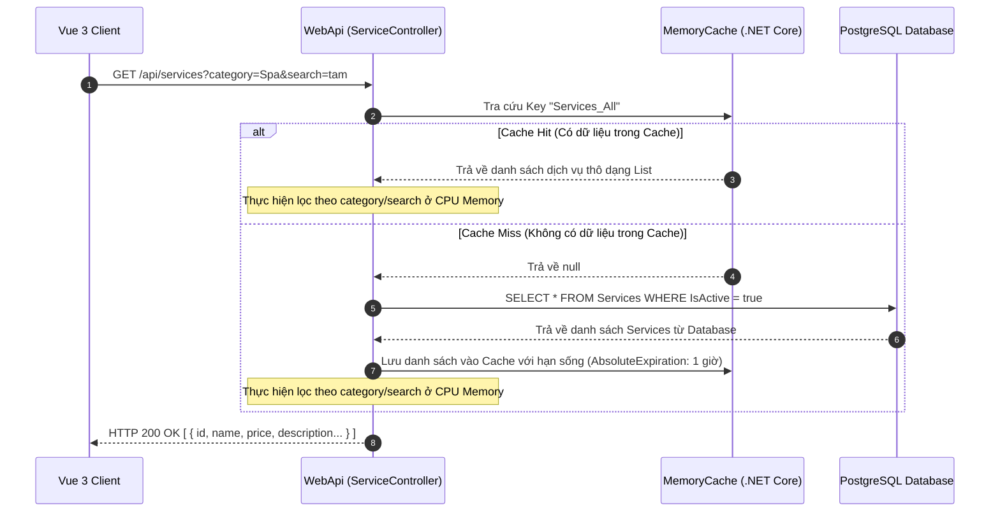

# 🛠️ Technical Specification - Homepage Services (Phase 1)

Tài liệu này đặc tả cấu trúc cơ sở dữ liệu, các lớp DTO, luồng phản hồi API tích hợp bộ đệm (Caching) và bộ lọc dịch vụ trong hệ thống **MyPetClinic**.

---

## 🔗 Skills & Nguyên tắc Kiến trúc Liên quan
*   **BE-C01 (ASP.NET Core Web API):** Endpoint công khai `/api/services` (không yêu cầu Authorization JWT Bearer).
*   **BE-C02 (Entity Framework Core):** Ánh xạ thực thể `Service` và `ServiceCategory` xuống PostgreSQL.
*   **BE-A03 (Performance Optimization):** Sử dụng `IMemoryCache` (In-Memory Cache) của .NET Core để lưu trữ danh sách dịch vụ tĩnh, giảm tải truy cập DB.

---

## 1. Luồng Xử lý Kỹ thuật (Sequence Diagram)

Quy trình truy vấn danh sách dịch vụ công khai tích hợp bộ đệm (Caching) tại Web API:



---

## 2. Đặc tả Cấu trúc Database & Model Entity

### 2.1. Lớp Entity C# (Domain Layer)
```csharp
namespace MyPetClinic.Domain.Entities
{
    public class ServiceCategory
    {
        public Guid Id { get; set; } = Guid.NewGuid();
        public string Name { get; set; } = string.Empty; // Khám bệnh, Tiêm phòng, Phẫu thuật, Spa
        public string Code { get; set; } = string.Empty; // kham-benh, tiem-phong, phau-thuat, spa
        
        public ICollection<Service> Services { get; set; } = new List<Service>();
    }

    public class Service
    {
        public Guid Id { get; set; } = Guid.NewGuid();
        public string Name { get; set; } = string.Empty;
        public string Description { get; set; } = string.Empty;
        public decimal BasePrice { get; set; }
        public string ImageUrl { get; set; } = string.Empty;
        public bool IsActive { get; set; } = true;
        
        // FK
        public Guid CategoryId { get; set; }
        public ServiceCategory Category { get; set; } = null!;
    }
}
```

### 2.2. Schema Database PostgreSQL
```sql
CREATE TABLE "ServiceCategories" (
    "Id"   UUID PRIMARY KEY DEFAULT gen_random_uuid(),
    "Name" VARCHAR(100) NOT NULL,
    "Code" VARCHAR(50) NOT NULL UNIQUE
);

CREATE TABLE "Services" (
    "Id"          UUID PRIMARY KEY DEFAULT gen_random_uuid(),
    "Name"        VARCHAR(150) NOT NULL,
    "Description" TEXT NOT NULL,
    "BasePrice"   NUMERIC(18,2) NOT NULL,
    "ImageUrl"    VARCHAR(255),
    "IsActive"    BOOLEAN NOT NULL DEFAULT TRUE,
    "CategoryId"  UUID NOT NULL REFERENCES "ServiceCategories"("Id") ON DELETE CASCADE
);

CREATE INDEX "IX_Services_CategoryId" ON "Services" ("CategoryId");
```

---

## 3. Cấu hình DTO Phản hồi (`ServiceResponseDto.cs`)
```csharp
namespace MyPetClinic.Application.DTOs
{
    public class ServiceResponseDto
    {
        public Guid Id { get; set; }
        public string Name { get; set; } = string.Empty;
        public string Description { get; set; } = string.Empty;
        public decimal Price { get; set; }
        public string ImageUrl { get; set; } = string.Empty;
        public string CategoryName { get; set; } = string.Empty;
        public string CategoryCode { get; set; } = string.Empty;
    }
}
```
