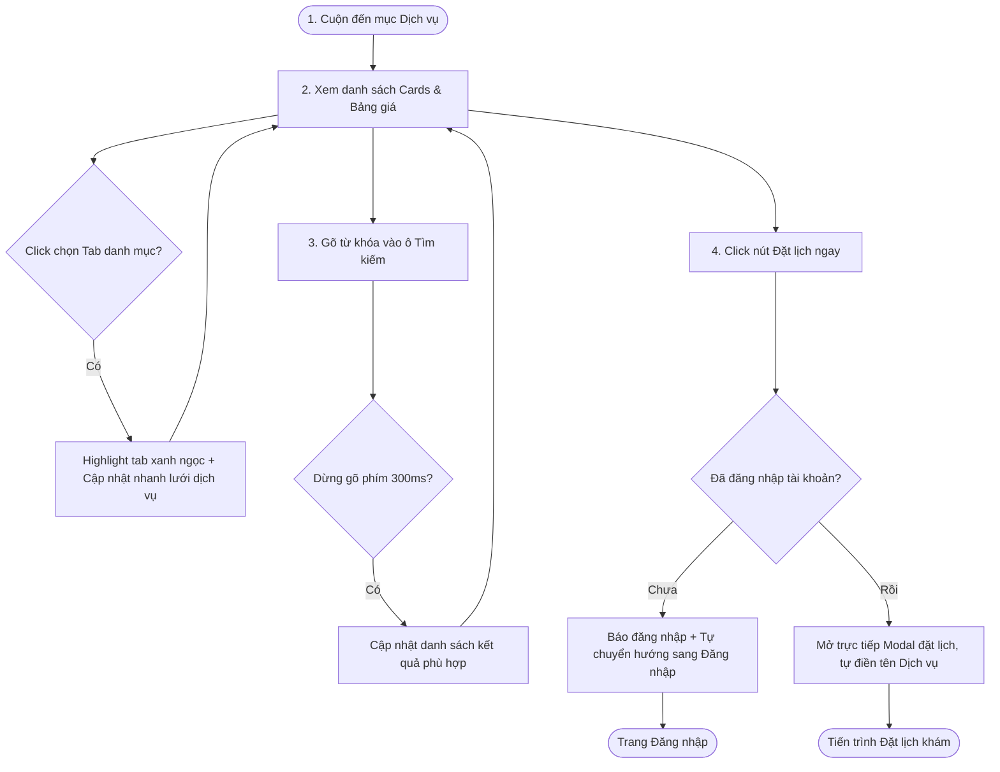

# 🎨 UX Flow & Interactive User Journey - Services Catalog (Phase 1)

Tài liệu này trình bày hành trình trải nghiệm người dùng (User Journey) chi tiết từng bước khi duyệt qua danh mục dịch vụ công khai trên trang chủ phòng khám **MyPetClinic**.

---

## 1. Sơ đồ luồng Tương tác (UX Flow Map)

---

## 2. Chi tiết các bước Trải nghiệm (Interactive Steps)

### Bước 1: Tiếp cận danh mục dịch vụ (Visual Entrance)
*   Khách hàng cuộn trang chủ xuống phân hệ Dịch vụ hoặc click liên kết "Dịch vụ" trên Header.
*   Danh sách 4-8 dịch vụ phổ biến hiển thị dưới dạng lưới Grid mượt mà.
*   **Hiệu ứng Hover trên ảnh Card:** Rê chuột vào ảnh dịch vụ, ảnh tự động zoom nhẹ phóng to 5% (`transform: scale(1.05)`) trong lớp khung bị cắt (`overflow: hidden`) để tạo chiều sâu visual.

### Bước 2: Tương tác bộ lọc danh mục và Thanh tìm kiếm
*   **Bộ lọc danh mục (Tabs Filter):** Nhấp chọn tab "Spa/Làm đẹp". Tab đó chuyển sang trạng thái active (nền xanh ngọc nhạt, chữ trắng). Lưới dịch vụ tự động ẩn các dịch vụ phẫu thuật/khám bệnh bằng hiệu ứng thu nhỏ mờ dần (fade-out & scale-down) và hiển thị các dịch vụ làm đẹp tương ứng.
*   **Tìm kiếm thông minh (Live Search):** Người dùng gõ chữ `Tắm`. Trình duyệt thực hiện lọc tức thời, giữ lại thẻ Card "Tắm Sấy Spa Trọn Gói". 

### Bước 3: Kích hoạt Đặt lịch khám nhanh
*   Khi người dùng click vào nút **Đặt lịch ngay** màu xanh ngọc trên thẻ dịch vụ:
    *   Nút bấm thực hiện hiệu ứng co giãn nhẹ (Scale down rồi nảy lại) để phản hồi cú click.
    *   Hệ thống kiểm tra phiên đăng nhập. Nếu khách hàng đã đăng nhập, Modal đặt lịch khám sẽ trượt xuống từ góc trên màn hình. Trường thông tin dịch vụ y tế đã được tự động chọn sẵn là dịch vụ khách hàng vừa click, giúp họ bỏ qua bước chọn dịch vụ trong form.
