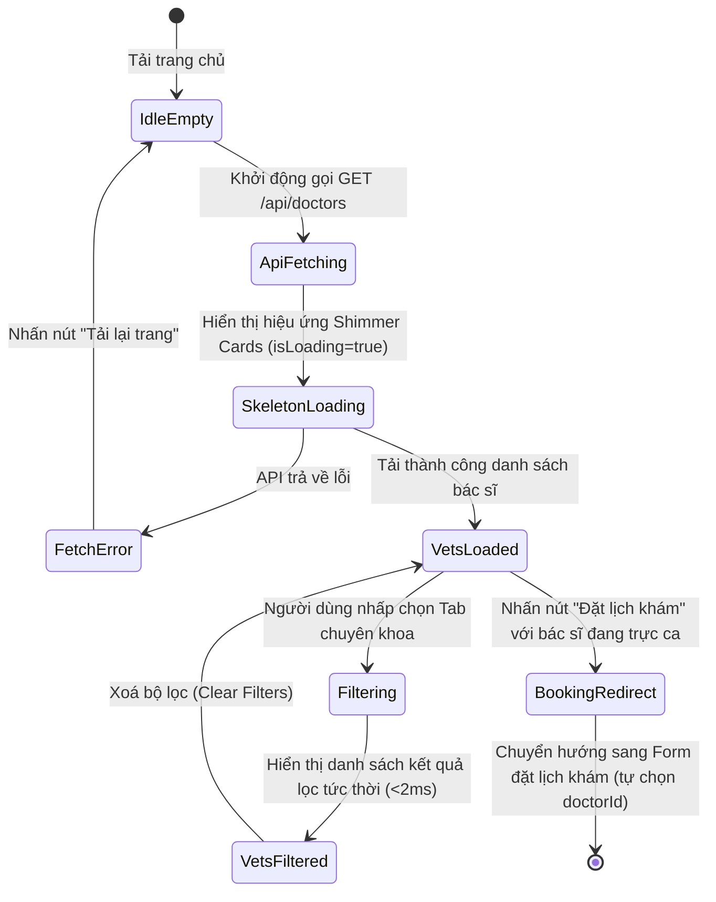

# 🎭 Behavioral Specification & State Machine - Vets Team (Phase 1)

Tài liệu này đặc tả máy trạng thái hữu hạn (FSM) và hành vi xử lý hiển thị danh sách bác sĩ thú y, thay đổi bộ lọc chuyên khoa và điều hướng đặt lịch hẹn khám.

---

## 1. Biểu đồ Máy Trạng thái (Vets Team FSM)

Sơ đồ mô tả quy trình tải danh sách bác sĩ và tương tác bộ lọc của người dùng:

---

## 2. Đặc tả các Sự kiện & Chuyển dịch Trạng thái (Transitions)

| Trạng thái Nguồn | Sự kiện Kích hoạt | Trạng thái Đích | Diễn giải Hành vi & Phản hồi UI |
| :--- | :--- | :--- | :--- |
| **IdleEmpty** | Component `onMounted()` | **ApiFetching** | Khởi chạy gọi action `fetchDoctors` của store. |
| **ApiFetching** | Kích hoạt cờ loading | **SkeletonLoading** | Ẩn danh sách thật, kết xuất 3 khung Card xương (Skeletons) với hiệu ứng chạy sáng màu xám. |
| **SkeletonLoading** | API phản hồi lỗi | **FetchError** | Ẩn skeletons, hiển thị banner báo lỗi: *"Không thể kết nối máy chủ"* kèm nút **Thử lại**. |
| **SkeletonLoading** | API phản hồi 200 OK | **VetsLoaded** | Ẩn skeletons, hiển thị lưới Grid hình ảnh các bác sĩ thật. |
| **VetsLoaded** | Thay đổi tab chuyên khoa | **Filtering** | Chạy hàm tính toán computed `filteredDoctors` tại RAM client. |
| **Filtering** | Tính toán kết thúc | **VetsFiltered** | Cập nhật số lượng thẻ hiển thị. Nếu kết quả lọc bằng rỗng (0 kết quả), hiển thị hình minh họa dễ thương kèm text: *"Không có bác sĩ trực thuộc chuyên khoa này hôm nay."* |
| **VetsLoaded** | Click nút "Đặt lịch khám" | **BookingRedirect** | Kiểm tra quyền đăng nhập. Nếu chưa đăng nhập, trượt chuyển hướng sang Login. Nếu đã đăng nhập, trượt mở Modal Đặt lịch với doctorId được chọn. |

---

## 3. Quản lý Hành vi Biên và Edge Cases

### 3.1. Trạng thái Bác sĩ Nghỉ phép (Off-Duty State)
*   **Hành vi:** Bác sĩ có `isOnDuty = false` (nghỉ phép, nghỉ ca).
*   **Xử lý:** 
    *   Chấm tròn màu đỏ hiển thị bên cạnh ảnh chân dung.
    *   Hiển thị nhãn: *"Nghỉ phép"*.
    *   Nút bấm **Đặt lịch** chuyển sang màu xám, hiển thị text *"Không khả dụng"* và bị khóa tương tác (`disabled = true`).

### 3.2. Chặn chuyển hướng đặt lịch (Booking Authentication Shield)
*   **Hành vi:** Khách hàng vãng lai (chưa đăng nhập) nhấn nút "Đặt lịch khám" trên thẻ bác sĩ.
*   **Xử lý:** Hệ thống không mở form đặt lịch. Thay vào đó, lưu bác sĩ được chọn vào vùng nhớ tạm thời (`selectedDoctorId`), hiển thị toast cảnh báo: *"Vui lòng đăng nhập để thực hiện đặt lịch khám với bác sĩ."* và tự động chuyển hướng người dùng sang trang Đăng nhập sau 1.5 giây. Đăng nhập xong sẽ đưa thẳng người dùng trở lại Modal đặt lịch của bác sĩ đó.
