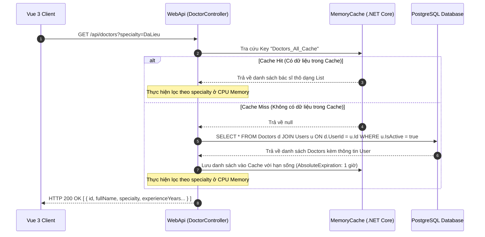

# 🛠️ Technical Specification - Homepage Vets Team (Phase 1)

Tài liệu này đặc tả cấu trúc cơ sở dữ liệu, các lớp DTO, luồng phản hồi API tích hợp bộ đệm (Caching) và bộ lọc chuyên khoa bác sĩ trong hệ thống **MyPetClinic**.

---

## 🔗 Skills & Nguyên tắc Kiến trúc Liên quan
*   **BE-C01 (ASP.NET Core Web API):** Endpoint công khai `/api/doctors` (AllowAnonymous).
*   **BE-C02 (Entity Framework Core):** Ánh xạ thực thể `Doctor` liên kết 1-1 với thực thể `User` (để thừa hưởng Id, FullName, Email từ bảng Users).
*   **BE-A03 (Performance Optimization):** Sử dụng `IMemoryCache` lưu đệm thông tin bác sĩ, tự động evict cache khi admin cập nhật thông tin nhân viên.

---

## 1. Luồng Xử lý Kỹ thuật (Sequence Diagram)

Quy trình truy vấn danh sách bác sĩ công khai tích hợp bộ đệm (Caching) tại Web API:



---

## 2. Đặc tả Cấu trúc Database & Model Entity

### 2.1. Lớp Entity C# (Domain Layer)
```csharp
using MyPetClinic.Domain.Entities;

namespace MyPetClinic.Domain.Entities
{
    public enum Specialty
    {
        NoiKhoa,        // Internal Medicine
        NgoaiKhoa,      // Surgery
        DaLieu,         // Dermatology
        TiemChung,      // Vaccination
        ChanDoanHinhAnh // Radiology
    }

    public class Doctor
    {
        public Guid Id { get; set; } = Guid.NewGuid();
        
        // FK liên kết 1-1 với bảng Users (chứa Họ tên, Email, SĐT)
        public Guid UserId { get; set; }
        public User User { get; set; } = null!;

        public Specialty Specialty { get; set; }
        public int ExperienceYears { get; set; }
        public string Qualifications { get; set; } = string.Empty; // Bằng cấp (Ví dụ: Thạc sĩ thú y)
        public string Biography { get; set; } = string.Empty; // Mô tả tiểu sử ngắn
        public bool IsOnDuty { get; set; } = true; // Trạng thái trực ca hôm nay
    }
}
```

### 2.2. Schema Database PostgreSQL
```sql
CREATE TABLE "Doctors" (
    "Id"              UUID PRIMARY KEY DEFAULT gen_random_uuid(),
    "UserId"          UUID NOT NULL UNIQUE REFERENCES "Users"("Id") ON DELETE CASCADE,
    "Specialty"       INTEGER NOT NULL DEFAULT 0, -- 0: NoiKhoa
    "ExperienceYears" INTEGER NOT NULL DEFAULT 0,
    "Qualifications"  VARCHAR(150) NOT NULL,
    "Biography"       TEXT,
    "IsOnDuty"        BOOLEAN NOT NULL DEFAULT TRUE
);

CREATE INDEX "IX_Doctors_Specialty" ON "Doctors" ("Specialty");
```

---

## 3. Cấu hình DTO Phản hồi (`DoctorResponseDto.cs`)
```csharp
namespace MyPetClinic.Application.DTOs
{
    public class DoctorResponseDto
    {
        public Guid Id { get; set; } // DoctorId
        public Guid UserId { get; set; }
        public string FullName { get; set; } = string.Empty;
        public string Email { get; set; } = string.Empty;
        public string Specialty { get; set; } = string.Empty; // Text đại diện cho Enum
        public string SpecialtyCode { get; set; } = string.Empty; // noi-khoa, da-lieu...
        public int ExperienceYears { get; set; }
        public string Qualifications { get; set; } = string.Empty;
        public string Biography { get; set; } = string.Empty;
        public string AvatarUrl { get; set; } = string.Empty;
        public bool IsOnDuty { get; set; }
    }
}
```
*Giao diện Vue 3 sẽ map các thuộc tính này để hiển thị thẻ Doctor Card và truyền dữ liệu khi đặt lịch.*
