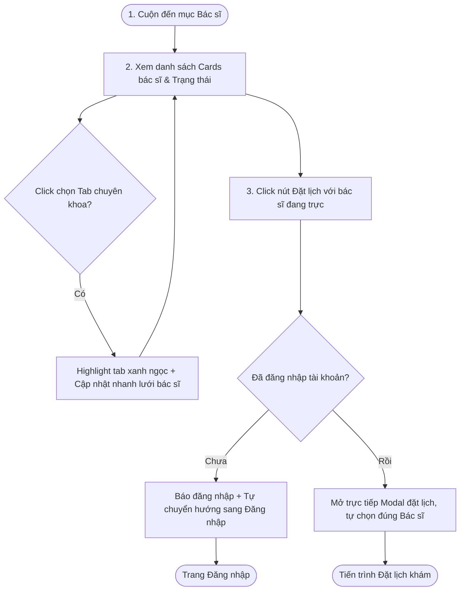

# 🎨 UX Flow & Interactive User Journey - Vets Team (Phase 1)

Tài liệu này trình bày hành trình trải nghiệm người dùng (User Journey) chi tiết từng bước khi duyệt qua danh sách đội ngũ bác sĩ thú y công khai trên trang chủ phòng khám **MyPetClinic**.

---

## 1. Sơ đồ luồng Tương tác (UX Flow Map)

---

## 2. Chi tiết các bước Trải nghiệm (Interactive Steps)

### Bước 1: Tiếp cận danh mục bác sĩ (Visual Entrance)
*   Khách hàng cuộn trang chủ xuống phân hệ Bác sĩ hoặc click liên kết "Bác sĩ" trên Header.
*   Danh sách 3-4 bác sĩ hiển thị dưới dạng lưới Grid mượt mà.
*   **Hiệu ứng Hover trên ảnh Card:** Rê chuột vào ảnh bác sĩ, ảnh chân dung tự động chuyển từ thang độ xám (grayscale) sang màu sắc rực rỡ, đồng thời phóng to nhẹ 3% (`transform: scale(1.03)`) trong lớp khung để tạo chiều sâu visual.

### Bước 2: Tương tác bộ lọc chuyên khoa
*   **Bộ lọc chuyên khoa (Tabs Filter):** Nhấp chọn tab "Da liễu". Tab đó chuyển sang trạng thái active (nền xanh ngọc nhạt, chữ trắng). Lưới bác sĩ tự động ẩn các bác sĩ chuyên khoa khác bằng hiệu ứng thu nhỏ mờ dần (fade-out & scale-down) và hiển thị các bác sĩ da liễu tương ứng.

### Bước 3: Kích hoạt Đặt lịch khám nhanh với bác sĩ
*   Khi người dùng click vào nút **Đặt lịch khám** màu xanh ngọc trên thẻ bác sĩ đang trực ca (`IsOnDuty = true`):
    *   Nút bấm thực hiện hiệu ứng co giãn nhẹ (Scale down rồi nảy lại) để phản hồi cú click.
    *   Hệ thống kiểm tra phiên đăng nhập. Nếu khách hàng đã đăng nhập, Modal đặt lịch khám sẽ trượt xuống từ góc trên màn hình. Trường thông tin bác sĩ khám đã được tự động chọn sẵn là bác sĩ khách hàng vừa click, giúp họ bỏ qua bước chọn bác sĩ trong form.
