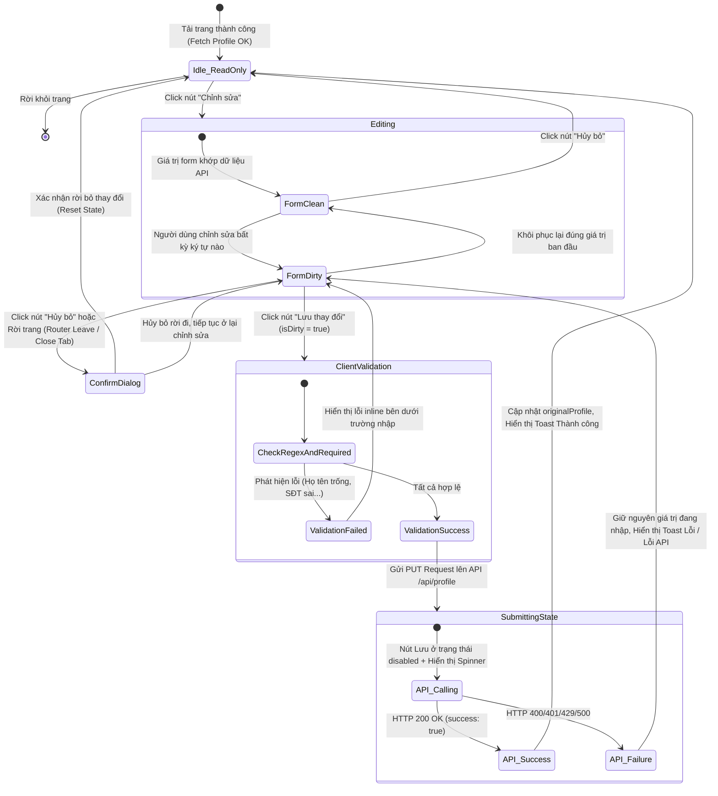

# 🎭 Behavioral Specification - Profile Details Update

## 1. Máy trạng thái giao diện hồ sơ (Finite State Machine - FSM)

Giao diện hồ sơ cá nhân trên Frontend (Vue 3 Client) vận hành dựa trên một mô hình máy trạng thái có kỷ luật để quản lý các tương tác người dùng, xử lý lỗi và cảnh báo khi chuyển trang.



---

## 2. Diễn giải các trạng thái và Luồng dịch chuyển (Transitions)

### Trạng thái 1: `Idle_ReadOnly` (Xem thông tin)
*   **Hành vi:** Tất cả các ô nhập liệu (`input`) đều bị thiết lập thuộc tính `readonly` hoặc `disabled`. Nền input phẳng mịn mờ kính không có viền nổi bật. Nút "Lưu" và "Hủy" được ẩn đi, chỉ hiển thị duy nhất nút "Chỉnh sửa".
*   **Trigger chuyển:** Khi click "Chỉnh sửa" -> Chuyển sang trạng thái `Editing`.

### Trạng thái 2: `Editing` (Chỉnh sửa)
Trong trạng thái này, form có hai nhánh con:
*   **`FormClean` (Chưa thay đổi):** Các input được mở khóa chỉnh sửa, có viền phát sáng nhẹ khi focus. Nút "Lưu" hiển thị nhưng bị disable vì chưa phát hiện sự thay đổi so với dữ liệu gốc.
*   **`FormDirty` (Đã thay đổi):** Nút "Lưu" được kích hoạt (enabled) sẵn sàng gửi đi. Nút "Hủy bỏ" lúc này đóng vai trò kích hoạt popup cảnh báo nếu người dùng click vào.

### Trạng thái 3: `ConfirmDialog` (Xác nhận hủy bỏ)
*   **Hành vi:** Xuất hiện một modal trung tâm xác nhận việc hủy bỏ thay đổi. Nếu người dùng chọn "Đồng ý", hệ thống gọi action `resetForm()` của Pinia store để khôi phục dữ liệu ban đầu và đưa form về `Idle_ReadOnly`. Nếu chọn "Không", modal đóng và giữ nguyên dữ liệu đang sửa ở `FormDirty`.

### Trạng thái 4: `SubmittingState` (Đang gửi dữ liệu)
*   **Hành vi:** Kích hoạt cờ `updating = true`. Vô hiệu hóa toàn bộ form (disable all inputs) để tránh người dùng sửa dữ liệu trong lúc API đang xử lý. Hiển thị thanh tiến trình hoặc spinner xoay tròn.

---

## 3. Ràng buộc Điều hướng Frontend (Vue Router Guards)

Để tránh trường hợp người dùng vô tình làm mất thông tin đang sửa khi click nhầm vào Menu điều hướng (Sidebar/Header) của ứng dụng SPA, ta sử dụng Router Guard của Vue:

```javascript
import { onBeforeRouteLeave } from 'vue-router';
import { useProfileStore } from '@/stores/profile';

// Trong Component Profile.vue
const profileStore = useProfileStore();

onBeforeRouteLeave((to, from, next) => {
  // Nếu form đang ở trạng thái Dirty (có thay đổi chưa lưu)
  if (profileStore.isDirty) {
    const answer = window.confirm(
      'Bạn có các thay đổi chưa được lưu trong hồ sơ cá nhân. Bạn có chắc chắn muốn rời đi mà không lưu?'
    );
    if (answer) {
      profileStore.resetForm(); // Khôi phục trạng thái
      next(); // Cho phép đi tiếp
    } else {
      next(false); // Chặn chuyển trang, ở lại form sửa
    }
  } else {
    next(); // Form sạch, cho phép chuyển trang bình thường
  }
});
```
> [!WARNING]
> Tương tự, sự kiện đóng trình duyệt hoặc F5 (`beforeunload`) cần được đăng ký để cảnh báo người dùng thông qua hộp thoại hệ thống của trình duyệt web.
