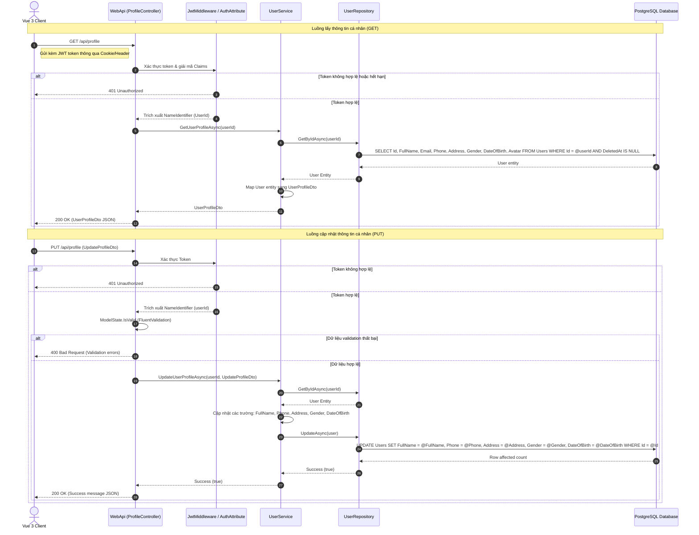

# 🛠️ Technical Specification - Profile Details Update

## 1. Luồng xử lý kỹ thuật (Sequence Diagram)
Dưới đây là sơ đồ chi tiết mô tả luồng giao tiếp giữa client (Vue 3 SPA) và hệ thống Backend (.NET Web API) để lấy thông tin hồ sơ và thực hiện cập nhật an toàn tuyệt đối chống tấn công IDOR:



---

## 2. Đặc tả cơ sở dữ liệu (Database Schema Specification)
Tính năng cập nhật hồ sơ cá nhân tác động trực tiếp lên bảng `Users` trong cơ sở dữ liệu PostgreSQL. Dưới đây là cấu trúc chi tiết của bảng:

| Tên trường (Column) | Kiểu dữ liệu (Data Type) | Ràng buộc (Constraints) | Diễn giải (Description) |
| :--- | :--- | :--- | :--- |
| `Id` | `uuid` | `PRIMARY KEY`, `DEFAULT gen_random_uuid()` | Khóa chính định danh người dùng duy nhất |
| `RoleId` | `bigint` | `FOREIGN KEY REFERENCES Roles(Id)` | Khóa ngoại liên kết bảng Roles |
| `FullName` | `varchar(100)` | `NOT NULL` | Họ tên đầy đủ của người dùng |
| `Email` | `varchar(150)` | `NOT NULL`, `UNIQUE` | Địa chỉ email (Định danh đăng nhập, cấm sửa đổi tại form này) |
| `Phone` | `varchar(15)` | `NULL` | Số điện thoại liên hệ (Định dạng chuẩn Việt Nam) |
| `Address` | `varchar(255)` | `NULL` | Địa chỉ thường trú hoặc nơi ở của chủ thú cưng |
| `Gender` | `smallint` | `NULL` | Giới tính: `0` (Nữ), `1` (Nam), `2` (Khác) |
| `DateOfBirth` | `timestamp` | `NULL` | Ngày sinh của người dùng (Không múi giờ hoặc UTC) |
| `Avatar` | `varchar(255)` | `NULL` | Đường dẫn tương đối đến tệp ảnh đại diện được lưu trữ trên server |
| `IsActive` | `boolean` | `DEFAULT true` | Trạng thái tài khoản |
| `CreatedAt` | `timestamp` | `DEFAULT timezone('utc', now())` | Thời gian tạo tài khoản |
| `DeletedAt` | `timestamp` | `NULL` | Đánh dấu xóa mềm tài khoản |

*   **Tối ưu hóa Index:** Cột `Id` tự động có clustered index do là khóa chính. Cột `Email` có unique index để tối ưu hóa quá trình đăng nhập.

---

## 3. Đặc tả dữ liệu đầu vào & Validation (Data Transfer Objects & Validation)

### A. UserProfileDto (Trả về cho Client)
```csharp
namespace MyPetClinic.Application.DTOs
{
    public class UserProfileDto
    {
        public Guid Id { get; set; }
        public long RoleId { get; set; }
        public string? FullName { get; set; }
        public string? Email { get; set; }
        public string? Phone { get; set; }
        public string? Address { get; set; }
        public short? Gender { get; set; }
        public DateTime? DateOfBirth { get; set; }
        public string? Avatar { get; set; }
    }
}
```

### B. UpdateProfileDto (Nhận từ Client)
```csharp
namespace MyPetClinic.Application.DTOs
{
    public class UpdateProfileDto
    {
        public string? FullName { get; set; }
        public string? Phone { get; set; }
        public string? Address { get; set; }
        public short? Gender { get; set; }
        public DateTime? DateOfBirth { get; set; }
    }
}
```

### C. FluentValidation (Backend Validation Rules)
Đoạn mã cấu hình bộ kiểm tra dữ liệu đầu vào bằng FluentValidation để đảm bảo tính toàn vẹn dữ liệu:
```csharp
using FluentValidation;
using MyPetClinic.Application.DTOs;
using System;

namespace MyPetClinic.Application.Validators
{
    public class UpdateProfileDtoValidator : AbstractValidator<UpdateProfileDto>
    {
        public UpdateProfileDtoValidator()
        {
            RuleFor(x => x.FullName)
                .NotEmpty().WithMessage("Họ tên không được để trống.")
                .Length(2, 100).WithMessage("Họ tên phải từ 2 đến 100 ký tự.")
                .Matches(@"^[a-zA-ZÀÁÂÃÈÉÊÌÍÒÓÔÕÙÚĂĐĨŨƠàáâãèéêìíòóôõùúăđĩũơƯĂÂÊÔƠỨỨỬỮỰẤẤẨẪẬẮẮẲẴẶẸẸẺẼỀỀỂỄỆỈỈỊỌỌỎÕỐỐỔỖỘỚỚỞỠỢỤỤỦŨỨỨỬỮỰỲỲỶỸỹỳỷỹ\s]+$")
                .WithMessage("Họ tên không được chứa chữ số hoặc ký tự đặc biệt.");

            RuleFor(x => x.Phone)
                .NotEmpty().WithMessage("Số điện thoại không được để trống.")
                .Matches(@"^(03|05|07|08|09)\d{8}$")
                .WithMessage("Số điện thoại không đúng định dạng Việt Nam (10 chữ số, bắt đầu bằng 03, 05, 07, 08 hoặc 09).");

            RuleFor(x => x.Address)
                .MaximumLength(255).WithMessage("Địa chỉ không được vượt quá 255 ký tự.");

            RuleFor(x => x.Gender)
                .Must(g => g == null || g == 0 || g == 1 || g == 2)
                .WithMessage("Giới tính không hợp lệ (Chỉ chấp nhận 0: Nữ, 1: Nam, 2: Khác).");

            RuleFor(x => x.DateOfBirth)
                .Must(dob => dob == null || dob < DateTime.Today)
                .WithMessage("Ngày sinh phải là một ngày trong quá khứ.")
                .Must(dob => dob == null || dob > DateTime.Today.AddYears(-100))
                .WithMessage("Ngày sinh không hợp lệ (không vượt quá 100 tuổi).");
        }
    }
}
```
> [!IMPORTANT]
> Toàn bộ logic validation được áp dụng trực tiếp qua Middleware Validation Filter trong Web API để tự động chặn các payload không hợp lệ trước khi đi vào Controller.
