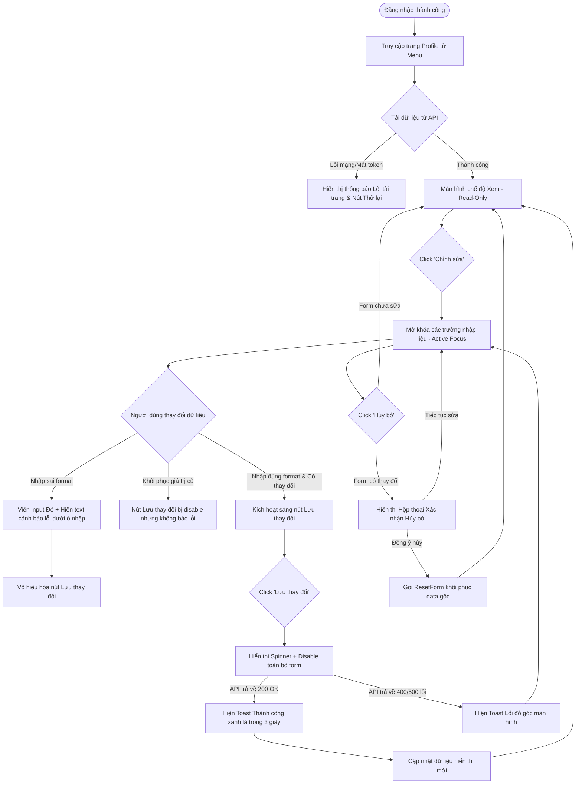

# 📐 UX Flow & State Transitions - Profile Details Update

Tài liệu này đặc tả chi tiết dòng trải nghiệm của người dùng (User Experience Flow) và cách giao diện ứng dụng **MyPetClinic** phản hồi tương ứng qua từng thao tác của khách hàng từ chế độ xem tĩnh đến lưu trữ dữ liệu.

---

## 1. Bản đồ Trải nghiệm người dùng (UX Step-by-Step Flow)

---

## 2. Đặc tả Chi tiết các Điểm chạm Giao diện (UI Elements Specification)

### Bước A: Đọc hồ sơ cá nhân
*   **Trải nghiệm ban đầu:** Giao diện tải ra một bộ khung xương lung linh (Skeleton Loader) mờ kính trước khi hiển thị dữ liệu thật để tránh cảm giác giật cục (Layout shift).
*   **Trực quan hóa Email:** Cột Email hiển thị kèm một chiếc khóa nhỏ màu vàng neon nhạt bên cạnh. Khi rê chuột (hover) vào, hiển thị tooltip: *"Địa chỉ email là định danh tài khoản, vui lòng liên hệ lễ tân hoặc gửi yêu cầu OTP để thay đổi."*
*   **Định dạng giới tính:** Giới tính hiển thị bằng text tĩnh (Nam, Nữ hoặc Khác) đi kèm các biểu tượng tương ứng để tăng tính sinh động.

### Bước B: Chế độ Chỉnh sửa (Form Fields Activation)
*   Khi nhấn "Chỉnh sửa", các thẻ text tĩnh lập tức biến đổi thành các ô nhập liệu (`input`) có đường viền bo góc mượt mà `border-radius: 8px`.
*   Tiêu đề trang xuất hiện thêm dòng ghi chú nhỏ: *"Mục có dấu (*) là thông tin liên lạc bắt buộc."*
*   Tự động di chuyển con trỏ chuột (Auto-focus) vào trường đầu tiên là **Họ và tên** để tối ưu thao tác gõ phím của người dùng.

### Bước C: Phản hồi lỗi thời gian thực (Real-time Inline Validation)
*   Hệ thống không đợi đến khi nhấn nút "Lưu" mới kiểm tra lỗi. Ngay khi người dùng rời khỏi một ô nhập liệu (sự kiện `blur` hoặc `input` sau 300ms debounce):
    *   Hệ thống chạy bộ kiểm tra Regex.
    *   Nếu phát hiện lỗi (Ví dụ: Số điện thoại nhập thành `0987`), ô nhập lập tức chuyển viền đỏ và hiển thị text lỗi: *"Số điện thoại phải chứa đúng 10 số di động."*
    *   Nút **Lưu thay đổi** sẽ bị disable, chuyển sang màu xám mờ đục để người dùng biết họ không thể gửi form này đi.

### Bước D: Xử lý Hủy bỏ thông minh (Confirm Exit Safety Net)
*   Nếu người dùng lỡ tay click nút "Hủy bỏ" hoặc nhấp chuột ra ngoài vùng Form, hệ thống xuất hiện một hộp thoại nhỏ từ trên trượt xuống (Slide-in Modal) với hai lựa chọn:
    1.  **"Hủy thay đổi":** Đồng ý xóa sạch các chỉnh sửa vừa nhập, khôi phục lại hồ sơ ban đầu.
    2.  **"Tiếp tục sửa":** Đóng modal và giữ nguyên con trỏ tại vị trí nhập trước đó.
*   Điều này giúp tối ưu hóa UX, tránh trường hợp người dùng bực bội vì mất dữ liệu do thao tác nhầm.
