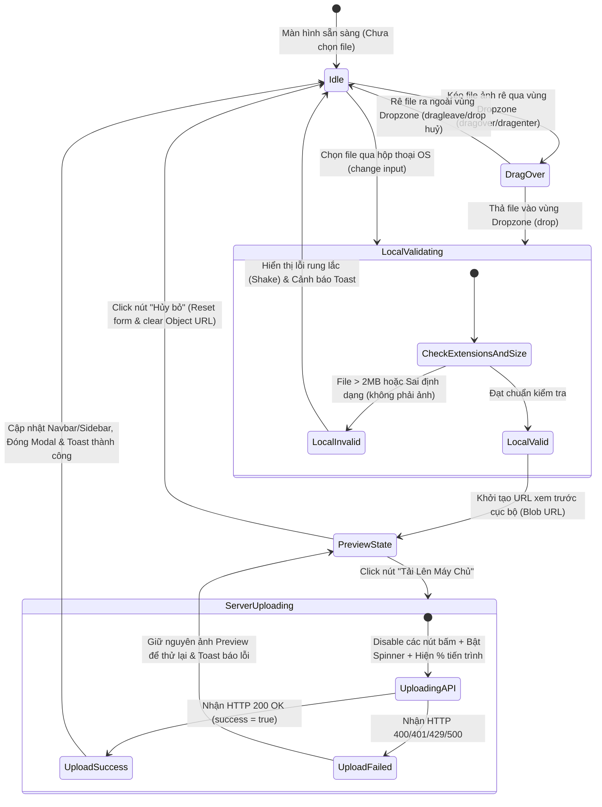

# 🎭 Behavioral Specification - Profile Avatar Upload

## 1. Máy trạng thái giao diện kéo thả ảnh (Finite State Machine - FSM)

Giao diện vùng kéo thả ảnh (Drag-and-Drop Dropzone) được xây dựng dựa trên một máy trạng thái hữu hạn kiểm soát phản hồi trực quan cực kỳ mượt mà.

---

## 2. Diễn giải các chuyển dịch trạng thái tương tác (State Transitions)

### A. Sự kiện Drag & Drop (Kéo thả)
Để tạo hiệu ứng thay đổi viền nét đứt phát sáng neon khi rê file vào, component Vue bắt buộc phải nghe và chặn các sự kiện mặc định của trình duyệt:
*   **`dragenter` & `dragover`:** Gọi `event.preventDefault()` để ngăn trình duyệt tự động mở tệp tin. Đồng thời đặt biến `isDragOver = true` để áp dụng class CSS `.is-dragover`.
*   **`dragleave`:** Đặt lại `isDragOver = false` để gỡ bỏ hiệu ứng phát sáng khi người dùng đưa chuột ra ngoài.
*   **`drop`:** Gọi `event.preventDefault()` để thu giữ mảng tệp tin `event.dataTransfer.files`. Gửi file đầu tiên vào luồng kiểm tra `LocalValidating`. Đặt lại `isDragOver = false`.

### B. Cơ chế Xem trước (Local Preview)
*   Để tối ưu hóa trải nghiệm người dùng, ta không gửi file lên server ngay lập tức. Sau khi vượt qua vòng kiểm tra kích thước (<2MB), tệp tin được chuyển thành Blob URL bằng API `URL.createObjectURL(file)`.
*   Điều này giúp người dùng nhìn thấy ảnh đại diện mới của mình hiển thị tròn trịa ngay lập tức trên màn hình xem trước.
*   **Giải phóng bộ nhớ:** Ngay khi tải lên thành công hoặc người dùng nhấn "Hủy bỏ", bắt buộc gọi `URL.revokeObjectURL(tempPreviewUrl)` để tránh rò rỉ RAM trên trình duyệt (đặc biệt hữu dụng trên các thiết bị di động cấu hình yếu).

### C. Khóa Trạng thái Tải lên (Form Lockout during Upload)
Khi chuyển sang trạng thái `ServerUploading`:
*   Toàn bộ biểu mẫu chuyển sang lớp phủ trong suốt `pointer-events: none;` để người dùng không thể tương tác.
*   Nút "Hủy bỏ" và nút "Tải Lên Máy Chủ" đều nhận thuộc tính `disabled`.
*   Thanh tiến trình sẽ chạy từ `0%` đến `100%` dựa trên dữ liệu thực gửi đi, tránh trường hợp người dùng tưởng ứng dụng bị đơ (freeze).
