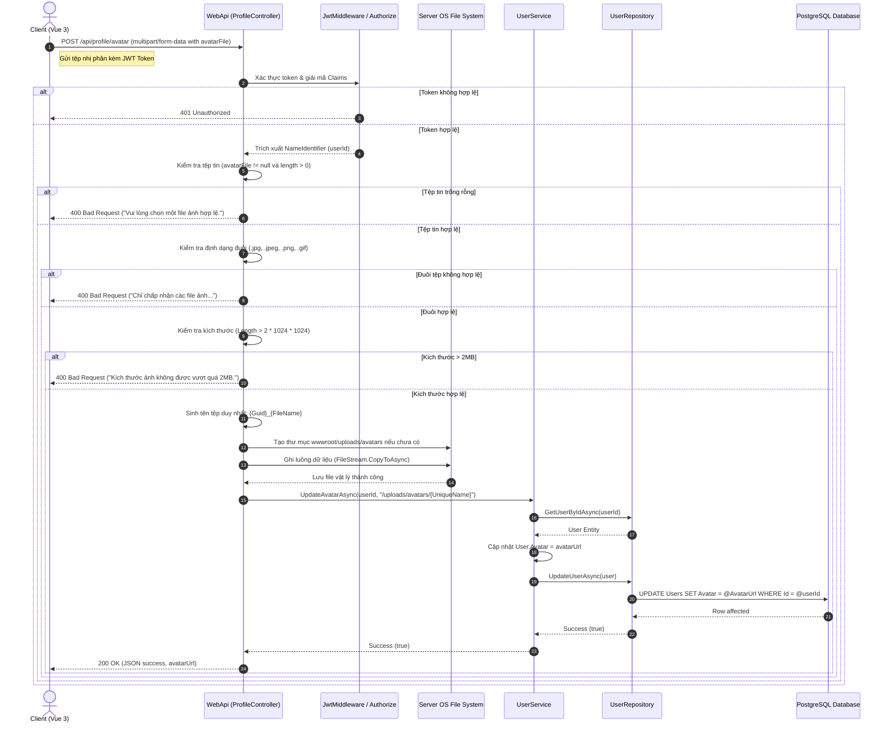

# 🛠️ Technical Specification - Profile Avatar Upload

## 1. Cơ chế tải tệp nhị phân (Upload Sequence Diagram)

Sơ đồ dưới đây đặc tả luồng gửi tệp nhị phân định dạng `multipart/form-data` từ Vue 3 Client lên .NET Web API, lưu trữ vật lý trên Server và cập nhật cơ sở dữ liệu:



---

## 2. Đặc tả Cấu trúc Lưu trữ & Hệ thống Tệp tin (Filesystem Structure)

*   **Đường dẫn thư mục gốc (Root path):** `wwwroot/uploads/avatars/`. Thư mục này nằm trong thư mục gốc của Web API để IIS/Kestrel có thể trực tiếp phục vụ tệp tĩnh (Static Files Serving).
*   **Quy tắc đặt tên tệp tin:**
    *   Tên tệp tin tải lên từ máy người dùng có thể trùng lặp hoặc chứa các ký tự đặc biệt gây lỗi đường dẫn URL. Do đó, hệ thống bắt buộc đặt lại tên theo công thức:
        `string uniqueFileName = $"{Guid.NewGuid()}_{avatarFile.FileName}";`
    *   Ví dụ: `a3b2c4d5-e6f7-8a9b-0c1d-2e3f4a5b6c7d_my-cat.png`
*   **Xử lý thư mục chưa tồn tại:** Đoạn mã bắt buộc kiểm tra sự tồn tại của thư mục lưu trữ trước khi ghi file nhằm tránh lỗi thư mục ảo:
    ```csharp
    string uploadsFolder = Path.Combine(_webHostEnvironment.WebRootPath, "uploads", "avatars");
    if (!Directory.Exists(uploadsFolder))
    {
        Directory.CreateDirectory(uploadsFolder);
    }
    ```

---

## 3. Đặc tả Cổng API & Ràng buộc Input (API Contract & Inputs Validation)

### A. Phương thức giao tiếp (HTTP Method & Route)
*   **HTTP Method:** `POST`
*   **Endpoint Route:** `/api/profile/avatar`
*   **Content-Type:** `multipart/form-data`
*   **Request Parameter:**
    *   `avatarFile` (Kiểu dữ liệu: `IFormFile`, bắt buộc gửi dạng Binary).

### B. Validation tại API Controller
Đoạn mã xử lý kiểm tra đầu vào nghiêm ngặt trước khi tương tác hệ thống:
```csharp
// Kiểm tra đuôi file mở rộng (White-list Extension)
var allowedExtensions = new[] { ".jpg", ".jpeg", ".png", ".gif" };
var extension = Path.GetExtension(avatarFile.FileName).ToLowerInvariant();
if (!allowedExtensions.Contains(extension))
{
    return BadRequest(new { message = "Chỉ chấp nhận các file ảnh định dạng: .jpg, .jpeg, .png, .gif" });
}

// Giới hạn kích thước tối đa 2MB
if (avatarFile.Length > 2 * 1024 * 1024)
{
    return BadRequest(new { message = "Kích thước ảnh không được vượt quá 2MB." });
}
```
> [!IMPORTANT]
> Toàn bộ quá trình ghi tệp tin phải được đặt trong khối `try-catch` và sử dụng lệnh `using` đối với `FileStream` để giải phóng con trỏ tệp tin ngay sau khi ghi xong, tránh gây khóa tệp (file lock) hoặc rò rỉ tài nguyên bộ nhớ hệ thống.
