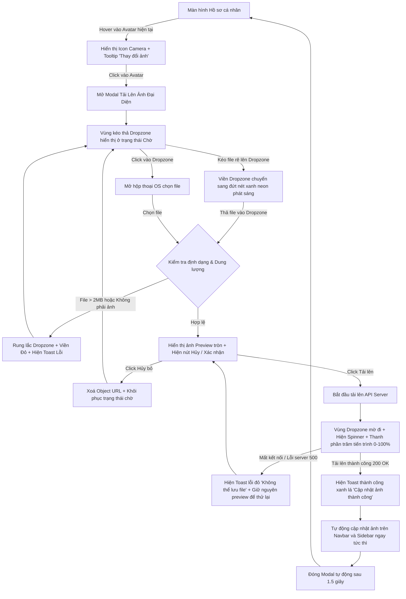

# 📐 UX Flow & State Transitions - Profile Avatar Upload

Tài liệu này đặc tả chi tiết dòng chảy trải nghiệm (User Experience Flow) của người dùng từ lúc chọn tệp ảnh đại diện đến khi nhận phản hồi kết quả trực quan trên ứng dụng phòng khám **MyPetClinic**.

---

## 1. Sơ đồ Luồng Trải nghiệm Người dùng (UX Interaction Flow Diagram)

---

## 2. Đặc tả Chi tiết các Điểm chạm Giao diện (UX Touchpoints Details)

### Bước A: Kích hoạt tải ảnh (Trigger Avatar Upload)
*   Tại trang Hồ sơ cá nhân, ảnh đại diện hiện tại được hiển thị trong một khung tròn mờ kính với đường viền mỏng tinh tế.
*   Khi người dùng di chuột (hover) vào khung tròn ảnh đại diện:
    *   Một lớp phủ trong suốt màu tối (`opacity: 0.4`) sẽ trượt lên mượt mà che phủ ảnh hiện tại.
    *   Biểu tượng máy ảnh (Camera Icon) màu trắng sáng xuất hiện ở trung tâm kèm tooltip: *"Thay đổi ảnh đại diện của bạn"*.
*   Khi người dùng click vào ảnh đại diện, Modal tải ảnh sẽ trượt nhẹ từ trên xuống (Slide-in) đi kèm hiệu ứng mờ nền xung quanh (Backdrop Blur: 8px).

### Bước B: Trải nghiệm kéo thả (Drag and Drop Interaction)
*   **Vùng kéo thả (Dropzone):** Có diện tích đủ lớn, viền đứt nét màu xám nhạt tinh tế.
*   **Trạng thái Kéo tệp qua:** Ngay khi phát hiện con trỏ chuột kéo tệp tin chạm vào biên của Dropzone, giao diện phản hồi lập tức:
    *   Đổi viền nét đứt sang màu xanh Indigo neon sáng bóng.
    *   Nền Dropzone chuyển sang màu xanh dương nhạt mờ kính.
    *   Xuất hiện dòng chữ khích lệ: *"Thả ảnh của bạn ra để xem trước!"*.
*   Nếu người dùng kéo tệp ra ngoài mà không thả, viền lập tức trả về trạng thái mặc định mà không giật màn hình.

### Bước C: Xem trước và Tiến trình Tải ảnh (Preview & Progress UX)
*   **Preview:** Sau khi thả file ảnh hợp lệ, Dropzone tạm thời ẩn nội dung hướng dẫn đi và hiển thị một khung tròn lớn chứa ảnh xem trước giúp khách hàng biết ảnh có bị méo hay vỡ hình không.
*   **Upload Progress:** Khi nhấn nút "Tải Lên Máy Chủ", thanh tiến trình (Progress Bar) chạy mịn màng theo thời gian thực (tỷ lệ truyền tải file nhị phân thực tế) thay vì chạy giả lập.
*   **Đóng Modal thông minh:** Sau khi API báo thành công, modal không đóng sập ngay lập tức mà đợi 1.5 giây để người dùng kịp đọc dòng chữ *"Cập nhật thành công!"* màu xanh lá cây, giúp củng cố trải nghiệm an tâm.
