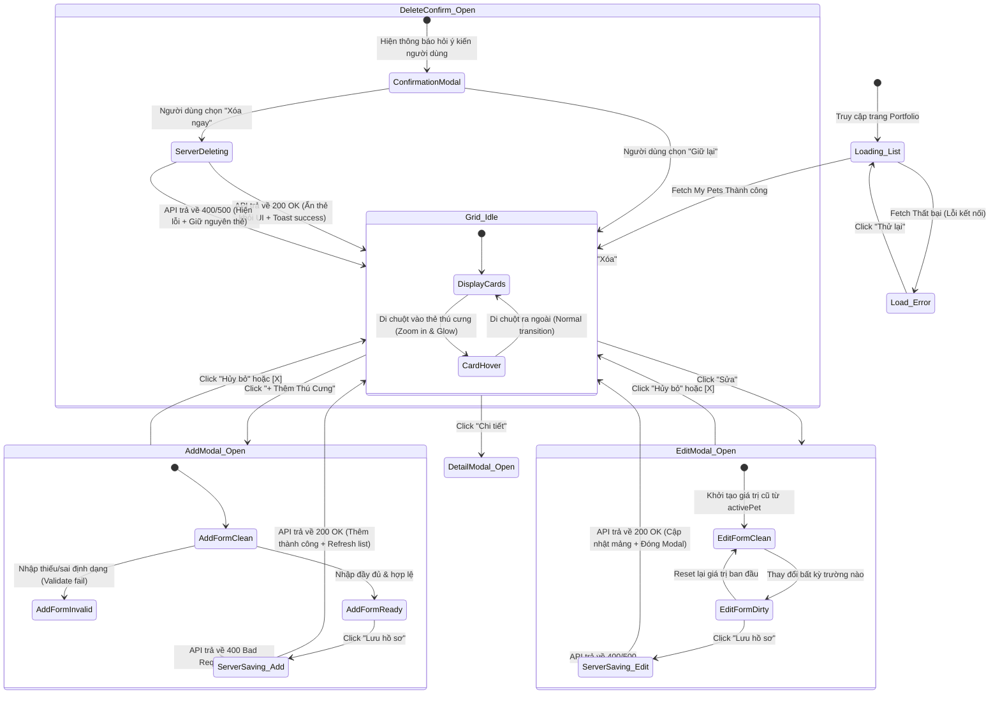

# 🎭 Behavioral Specification - Pet Portfolio Management

## 1. Máy trạng thái giao diện quản lý Thú Cưng (Finite State Machine - FSM)

Giao diện Quản lý hồ sơ thú cưng (Pet Portfolio) được điều phối thông qua mô hình máy trạng thái sau để bảo đảm tính nhất quán trong các thao tác CRUD và Pop-up cảnh báo xóa:

---

## 2. Diễn giải các chuyển dịch trạng thái chi tiết (State Transitions)

### A. Quản lý Modal thêm mới & Chỉnh sửa (Form Modal State)
*   **Kích hoạt `activePet`:**
    *   Khi click "Thêm mới", `petsStore.setActivePet(null)` được gọi để làm sạch toàn bộ biểu mẫu.
    *   Khi click "Sửa", `petsStore.setActivePet(pet)` được gọi để nạp sâu (Deep Copy) dữ liệu của thú cưng đó vào store, làm nguồn liên kết dữ liệu hai chiều (`v-model`) cho form.
*   **Trạng thái Form "Bẩn" (Dirty Check):**
    *   Nút "Lưu hồ sơ" ở modal Chỉnh sửa chỉ được bật khi phát hiện sự thay đổi so với dữ liệu gốc của `activePet` nhằm giảm thiểu request rác gửi lên máy chủ.

### B. Hộp thoại Xác nhận Xóa mềm (Safety Delete Confirm Behavior)
*   Thao tác xóa hồ sơ thú cưng là không thể hoàn tác trực tiếp từ phía người dùng (mặc dù database chỉ xóa mềm). Để tránh trường hợp khách hàng click nhầm:
    1.  Click nút "Xóa" lập tức đưa giao diện vào trạng thái `DeleteConfirm_Open`.
    2.  Hộp thoại cảnh báo hiển thị tên của bé thú cưng nổi bật: *"Bạn có chắc chắn muốn xóa hồ sơ của bé Leo không?"*.
    3.  Chỉ khi người dùng chọn nút xác nhận màu đỏ cảnh báo, API `DELETE` mới được kích hoạt, đồng thời biểu tượng Loading xoay tròn xuất hiện trên nút bấm.

### C. Khóa Tương tác Đồng bộ (State Lockout during Mutation)
*   Trong lúc gửi dữ liệu lên API (`ServerSaving_Add`, `ServerSaving_Edit`, `ServerDeleting`), toàn bộ các nút bấm tương tác (Lưu, Hủy, Xóa, Đóng) đều bị thiết lập thuộc tính `disabled` hoặc `pointer-events: none` để ngăn chặn người dùng bấm nhiều lần do đường truyền mạng chậm, gây hiện tượng trùng lặp bản ghi trong DB.
*   Màn hình grid phía sau hiển thị một lớp overlay mờ nhẹ.
