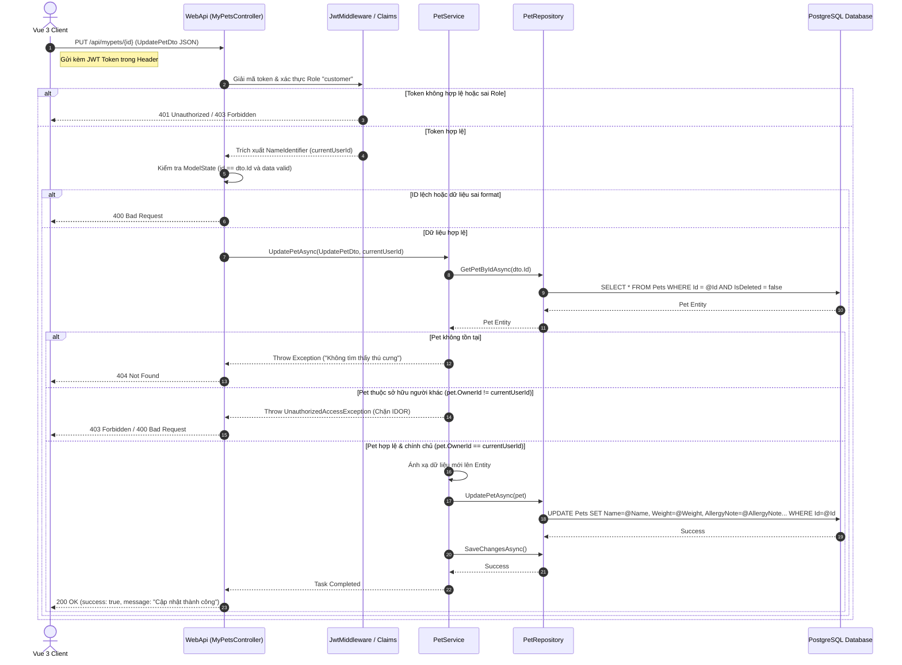

# 🛠️ Technical Specification - Pet Portfolio Management

## 1. Luồng xử lý kỹ thuật (Sequence Diagram)

Sơ đồ dưới đây đặc tả luồng xử lý cập nhật thông tin thú cưng và cơ chế chặn đứng IDOR tại tầng nghiệp vụ (Service Layer):



---

## 2. Đặc tả Cơ sở dữ liệu (Database Schema - `Pets` Table)

Dữ liệu hồ sơ thú cưng được lưu trữ trong bảng `Pets` của cơ sở dữ liệu PostgreSQL:

| Tên cột (Column) | Kiểu dữ liệu (Data Type) | Ràng buộc (Constraints) | Diễn giải |
| :--- | :--- | :--- | :--- |
| `Id` | `bigint` | `PRIMARY KEY`, `GENERATED ALWAYS AS IDENTITY` | Khóa chính tự tăng |
| `OwnerId` | `uuid` | `NOT NULL`, `FOREIGN KEY REFERENCES Users(Id)` | Khóa ngoại liên kết chủ nuôi |
| `Name` | `varchar(100)` | `NOT NULL` | Tên gọi của thú cưng |
| `Species` | `varchar(30)` | `NOT NULL` | Loài: `dog`, `cat`, `other` |
| `Breed` | `varchar(100)` | `NULL` | Giống loài (Ví dụ: Golden Retriever) |
| `Gender` | `varchar(10)` | `NOT NULL` | Giới tính: `Male`, `Female` |
| `BirthDate` | `timestamp` | `NULL` | Ngày sinh (không múi giờ / UTC) |
| `Weight` | `real` | `NULL` | Trọng lượng cơ thể (Kg) |
| `Color` | `varchar(50)` | `NULL` | Màu sắc lông |
| `BloodType` | `varchar(10)` | `NULL` | Nhóm máu thú y (Ví dụ: DEA 1.1, A, B) |
| `Sterilized` | `boolean` | `DEFAULT false` | Đã triệt sản hay chưa |
| `MicrochipCode`| `varchar(50)` | `NULL` | Mã số chip định danh y tế |
| `AllergyNote` | `text` | `NULL` | Ghi chú tiền sử dị ứng thuốc/thức ăn |
| `CreatedAt` | `timestamp` | `DEFAULT timezone('utc', now())` | Thời gian tạo hồ sơ |
| `IsDeleted` | `boolean` | `DEFAULT false` | Cờ xóa mềm hồ sơ |

*   **Tối ưu hóa Index:** Thiết lập Index trên cột `OwnerId` (`CREATE INDEX IX_Pets_OwnerId ON Pets(OwnerId)`) để tăng tốc độ truy vấn danh sách thú cưng của khách hàng khi họ mở Dashboard.

---

## 3. Đặc tả DTOs & FluentValidation (Backend Models)

### A. CreatePetDto (Đầu vào khi Thêm mới)
```csharp
namespace MyPetClinic.Application.DTOs
{
    public class CreatePetDto
    {
        public string Name { get; set; } = null!;
        public string Species { get; set; } = null!;
        public string Breed { get; set; } = null!;
        public string Gender { get; set; } = null!;
        public DateTime? BirthDate { get; set; }
        public float? Weight { get; set; }
        public string? Color { get; set; }
        public string? BloodType { get; set; }
        public bool Sterilized { get; set; }
        public string? MicrochipCode { get; set; }
        public string? AllergyNote { get; set; }
    }
}
```

### B. FluentValidation Cấu hình
```csharp
using FluentValidation;
using MyPetClinic.Application.DTOs;
using System;

namespace MyPetClinic.Application.Validators
{
    public class CreatePetDtoValidator : AbstractValidator<CreatePetDto>
    {
        public CreatePetDtoValidator()
        {
            RuleFor(x => x.Name)
                .NotEmpty().WithMessage("Tên thú cưng không được để trống.")
                .Length(2, 50).WithMessage("Tên thú cưng phải từ 2 đến 50 ký tự.");

            RuleFor(x => x.Species)
                .NotEmpty().WithMessage("Vui lòng chọn loài thú cưng.")
                .Must(s => s == "dog" || s == "cat" || s == "other")
                .WithMessage("Loài thú cưng chỉ chấp nhận: dog (chó), cat (mèo) hoặc other (khác).");

            RuleFor(x => x.Gender)
                .NotEmpty().WithMessage("Vui lòng chọn giới tính.")
                .Must(g => g == "Male" || g == "Female")
                .WithMessage("Giới tính chỉ chấp nhận 'Male' hoặc 'Female'.");

            RuleFor(x => x.BirthDate)
                .Must(dob => dob == null || dob < DateTime.Today)
                .WithMessage("Ngày sinh phải là một ngày trong quá khứ.")
                .Must(dob => dob == null || dob > DateTime.Today.AddYears(-30))
                .WithMessage("Ngày sinh không được vượt quá 30 năm trước.");

            RuleFor(x => x.Weight)
                .GreaterThan(0).WithMessage("Cân nặng phải lớn hơn 0 kg.")
                .LessThan(150).WithMessage("Cân nặng không vượt quá 150 kg.");
        }
    }
}
```
