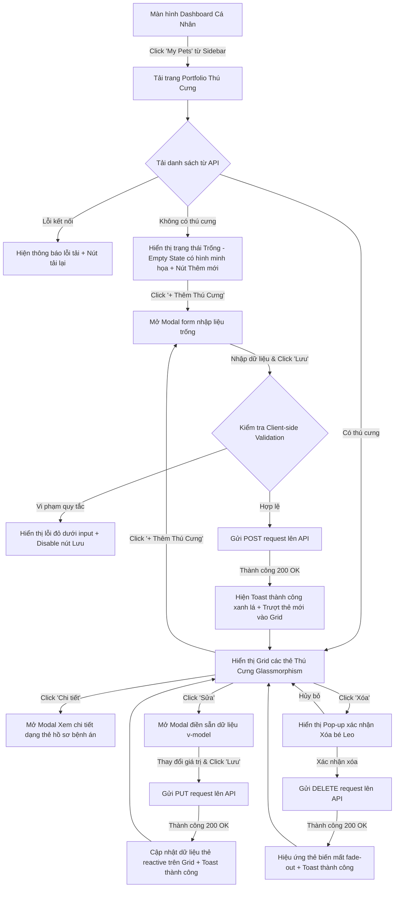

# 📐 UX Flow & State Transitions - Pet Portfolio Management

Tài liệu này đặc tả chi tiết dòng chảy trải nghiệm của người dùng (User Experience Flow) và cách giao diện ứng dụng **MyPetClinic** phản hồi qua từng thao tác CRUD hồ sơ thú cưng cá nhân.

---

## 1. Sơ đồ Luồng Trải nghiệm Người dùng (UX Interaction Flow Diagram)

---

## 2. Đặc tả Chi tiết các Điểm chạm Giao diện (UX Touchpoints Details)

### Bước A: Giao diện Trạng thái Trống (Empty State Experience)
*   Nếu khách hàng mới đăng ký tài khoản và chưa thêm bất kỳ thú cưng nào:
    *   Hệ thống không hiển thị màn hình trắng trơn nhàm chán.
    *   Hiển thị một bức ảnh minh họa chú chó và chú mèo dễ thương (Glassmorphic vector illustration) vẽ bởi AI.
    *   Dòng tiêu đề cổ vũ: *"Chào mừng bạn đến với MyPetClinic! Hãy đăng ký bé thú cưng đầu tiên của bạn để bắt đầu sử dụng các dịch vụ chăm sóc y tế."*
    *   Nút bấm màu neon Indigo kích hoạt nổi bật: **[+ Thêm Thú Cưng Ngay]**.

### Bước B: Trực quan hóa hình ảnh theo Loài (Species Smart Avatar)
*   Do ở giai đoạn MVP chưa hỗ trợ tải ảnh đại diện cho từng thú cưng, hệ thống tự động gán avatar mặc định dựa vào giá trị trường `Species` (Loài):
    *   Nếu `Species === 'dog'`: Hiển thị hình vẽ chú chó mặt cười dễ thương.
    *   Nếu `Species === 'cat'`: Hiển thị hình vẽ chú mèo đang ngủ dễ thương.
    *   Nếu `Species === 'other'`: Hiển thị hình vẽ dấu chân thú cưng (Paw print) chung.
*   Điều này giúp khách hàng dễ dàng phân biệt các bé trong danh sách khi nhìn lướt qua.

### Bước C: Trải nghiệm Xem chi tiết (Detail View Slide-out)
*   Khi người dùng click nút **"Chi tiết"** trên một thẻ thú cưng:
    *   Một Modal chi tiết xuất hiện, cung cấp thông tin chuyên sâu y tế như: nhóm máu, cân nặng theo dòng thời gian, các lưu ý dị ứng khẩn cấp (hiển thị viền vàng cảnh báo nếu có dị ứng).
    *   Các trường thông tin được trình bày khoa học bằng các biểu tượng icon (ví dụ: giọt máu cho nhóm máu, chiếc cân cho cân nặng, biểu tượng kim tiêm cho trạng thái triệt sản).
*   Khách hàng có thể đóng nhanh modal bằng cách nhấp chuột ra ngoài vùng phủ (Click outside backdrop) hoặc nhấn phím **Esc** trên bàn phím.
