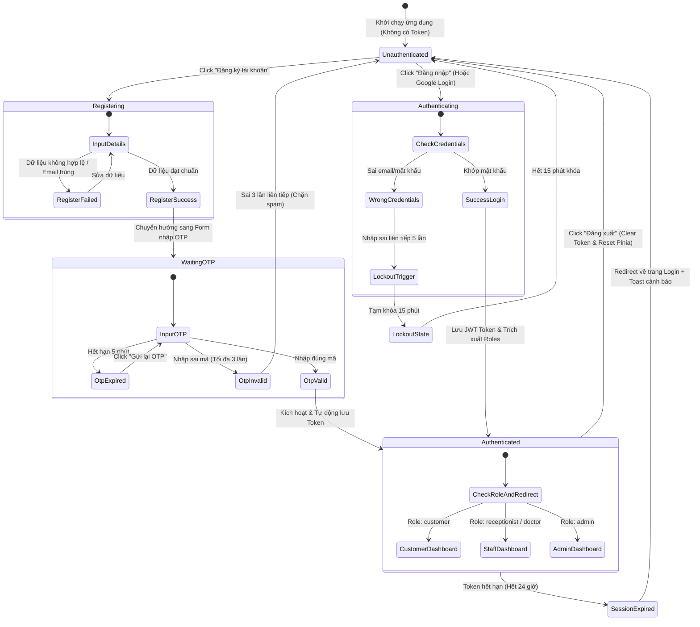

# 🎭 Behavioral Specification - Authentication & Authorization

## 1. Máy trạng thái phiên làm việc (Finite State Machine - FSM)

Toàn bộ quá trình định danh và phiên làm việc (Session) của người dùng chạy trên ứng dụng SPA Client được kiểm soát chặt chẽ thông qua mô hình trạng thái sau:

---

## 2. Diễn giải các chuyển dịch trạng thái chính (Transitions)

### A. Đăng ký & Chờ kích hoạt OTP
*   Khi người dùng đăng ký hợp lệ ở trạng thái `RegisterSuccess`, Client SPA tự động chuyển hướng màn hình sang Form OTP, lưu địa chỉ Email gửi OTP vào state `otpEmailTarget`.
*   Cờ `requiresOtpVerification` được đặt thành `true`.
*   Bộ đếm ngược (Timer) 5 phút được kích hoạt trên giao diện. Khi đếm ngược về `00:00`, nút "Gửi lại mã" sẽ sáng lên để cho phép yêu cầu một OTP mới.

### B. Cơ chế Khóa tài khoản tạm thời (Lockout Transition)
*   Khi trạng thái `WrongCredentials` lặp lại lần thứ 5 trên cùng một Email:
    *   Hệ thống khóa tài khoản trong CSDL và phản hồi HTTP `400 Bad Request` kèm cờ khóa.
    *   Client SPA chuyển giao diện sang `LockoutState` hiển thị đồng hồ đếm ngược 15 phút.
    *   Vô hiệu hóa toàn bộ nút Đăng nhập và ô nhập liệu của tài khoản bị khóa trong suốt 15 phút này để bảo vệ chống Brute-force.

### C. Hết hạn phiên làm việc (Session Expiry Behavior)
*   Token JWT của hệ thống có thời hạn cứng 24 giờ.
*   **Token Expiry Check:** Hệ thống sử dụng Axios Interceptor để kiểm tra mọi request gửi đi.
*   Nếu API trả về mã lỗi HTTP `401 Unauthorized` (do Token hết hạn), Interceptor lập tức bắt được lỗi, tự động gọi action `authStore.logout()`, xóa token cũ, chuyển hướng người dùng về trang `/login` và hiển thị Toast thông báo: *"Phiên làm việc của bạn đã hết hạn. Vui lòng đăng nhập lại."*.
*   Điều này giúp bảo đảm an toàn dữ liệu, ngăn việc trình duyệt lưu lại token cũ quá hạn.
