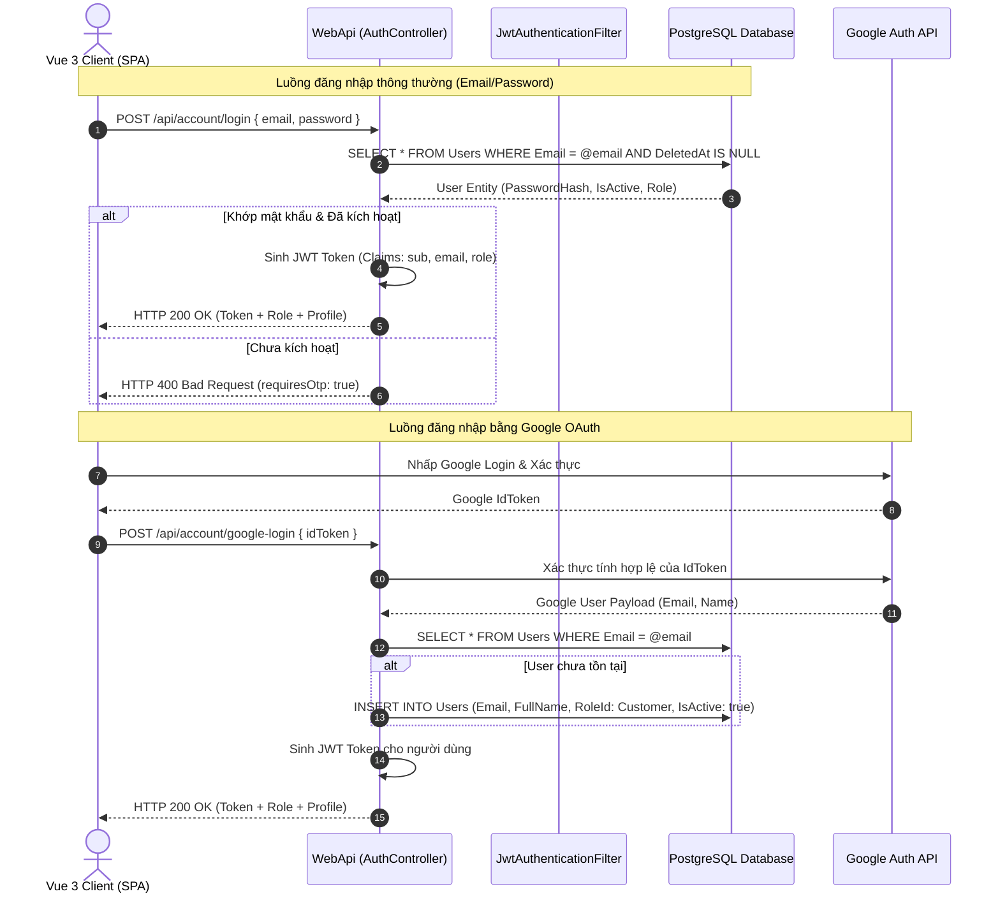
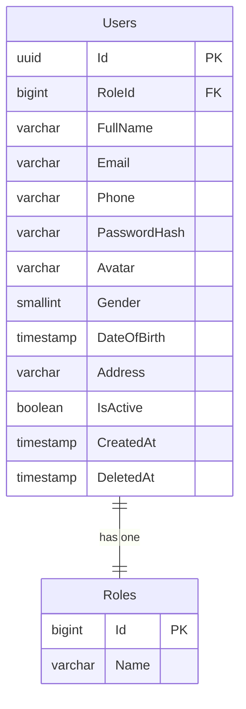

# 🛠️ Technical Specification - Authentication & Authorization

## 1. Kiến trúc Hệ thống & Luồng Dữ liệu (Architecture & Data Flow)

Hệ thống xác thực được triển khai theo cơ chế Token JWT (JSON Web Token) kết hợp giữa .NET Web API Backend và Vue 3 Frontend SPA.



---

## 2. Đặc tả JWT Token Claims Schema
Mỗi Token JWT được sinh ra sau khi đăng nhập thành công chứa các Claims định danh và phân quyền sau:

```json
{
  "http://schemas.xmlsoap.org/ws/2005/05/identity/claims/nameidentifier": "a3b2c4d5-e6f7-8a9b-0c1d-2e3f4a5b6c7d",
  "http://schemas.xmlsoap.org/ws/2005/05/identity/claims/emailaddress": "customer@gmail.com",
  "http://schemas.microsoft.com/ws/2008/06/identity/claims/role": "customer",
  "nbf": 1781172800,
  "exp": 1781259200,
  "iss": "MyPetClinicIssuer",
  "aud": "MyPetClinicAudience"
}
```

*   **Thời hạn hết hạn (Expiration):** Token mặc định có hiệu lực trong **24 giờ** kể từ thời điểm phát hành.
*   **Signature (Chữ ký):** Được ký bằng thuật toán mã hóa đối xứng `HMACSHA256` sử dụng mã khóa bí mật `JwtOptions:SecurityKey` có độ dài tối thiểu 256 bits lưu trong môi trường bảo mật của máy chủ Web API.

---

## 3. Cấu trúc Database liên quan (PostgreSQL Schema)

Mối quan hệ giữa bảng `Users` và bảng `Roles` kiểm soát toàn bộ cơ chế RBAC (Role-Based Access Control) của hệ thống:



### Script khởi tạo Roles chuẩn của hệ thống:
```sql
CREATE TABLE "Roles" (
    "Id" bigint GENERATED BY DEFAULT AS IDENTITY PRIMARY KEY,
    "Name" varchar(50) NOT NULL UNIQUE
);

-- Khởi tạo 4 nhóm quyền hạt nhân
INSERT INTO "Roles" ("Id", "Name") VALUES 
(1, 'admin'),
(2, 'doctor'),
(3, 'receptionist'),
(4, 'customer')
ON CONFLICT ("Id") DO NOTHING;
```

---

## 4. API Endpoints Contract Specifications

| HTTP Method | Route Endpoint | Xác thực | Payload DTO nhận vào | Mã HTTP Phản hồi |
| :--- | :--- | :--- | :--- | :--- |
| `POST` | `/api/account/register` | Không | `RegisterDto` (Email, Password, FullName, Phone) | `200 OK` / `400 Bad Request` |
| `POST` | `/api/account/login` | Không | `LoginDto` (Email, Password, RememberMe) | `200 OK` / `400 Bad Request` / `401 Unauthorized` |
| `POST` | `/api/account/google-login` | Không | `GoogleLoginDto` (IdToken) | `200 OK` / `400 Bad Request` |
| `POST` | `/api/account/verify-otp` | Không | `VerifyOtpDto` (Email, OtpCode, Purpose) | `200 OK` / `400 Bad Request` |
| `POST` | `/api/account/resend-otp` | Không | `ResendOtpDto` (Email, Purpose) | `200 OK` / `400 Bad Request` |
| `POST` | `/api/account/forgot-password` | Không | `ForgotPasswordDto` (Email) | `200 OK` / `400 Bad Request` |
| `POST` | `/api/account/reset-password` | Không | `ResetPasswordDto` (Email, OtpCode, NewPassword) | `200 OK` / `400 Bad Request` |

> [!IMPORTANT]
> Toàn bộ các API trong `ProfileController` và các API quản lý nghiệp vụ phòng khám (Lịch hẹn, Bệnh án, Hóa đơn) đều được kiểm soát bằng Middleware của ASP.NET Core để lọc claims tự động và từ chối các request không có JWT hợp lệ.
