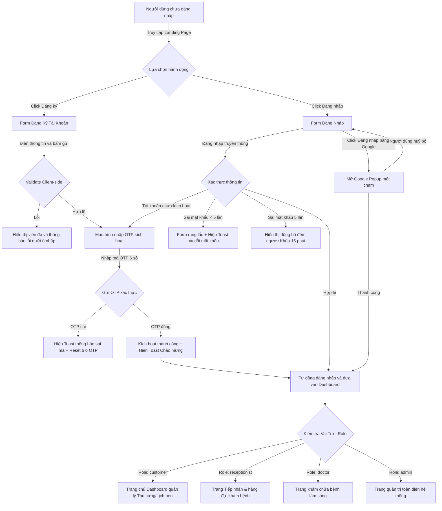

# 📐 UX Flow & State Transitions - Authentication & Authorization

Tài liệu này đặc tả chi tiết dòng chảy trải nghiệm của người dùng (User Experience Flow) và cách hệ thống giao diện **MyPetClinic** phản hồi tương ứng qua từng thao tác đăng ký, đăng nhập và phân quyền route.

---

## 1. Sơ đồ Luồng Trải nghiệm Người dùng (UX Interaction Flow Diagram)

---

## 2. Đặc tả Chi tiết các Điểm chạm Giao diện (UX Touchpoints Details)

### Bước A: Giao diện Form Đăng nhập & Đăng ký (Premium UI)
*   **Thiết kế Glassmorphism:** Biểu mẫu sử dụng một khung mờ kính cong góc tinh tế `border-radius: 24px` nổi bật trên hình nền tối có chuyển màu gradient huyền ảo.
*   **Trực quan hóa Mật khẩu:** Ô nhập mật khẩu có biểu tượng hình con mắt nhỏ (Eye Icon). Người dùng có thể click vào để bật/tắt hiển thị mật khẩu thô giúp kiểm tra gõ phím chính xác.
*   **Trạng thái nút Đăng nhập:** Nút đăng nhập sử dụng dải gradient Indigo sang trọng. Khi click chuột, nút chuyển trạng thái disabled, dòng chữ chuyển thành Spinner xoay tròn và hiển thị *"Đang xác thực..."* để báo hiệu hệ thống đang xử lý.

### Bước B: Trải nghiệm Xác thực OTP (Smart OTP Inputs)
*   Màn hình nhập OTP gồm 6 ô vuông nhỏ mờ kính, căn giữa cân đối.
*   **AutoFocus:** Khi trang vừa tải ra, con trỏ lập tức nhảy vào ô số 1.
*   **AutoSubmit:** Khi người dùng nhập đủ 6 số, hệ thống lập tức khóa 6 ô này và gửi dữ liệu đi, loại bỏ bước click nút bấm dư thừa giúp rút ngắn thời gian.

### Bước C: Trải nghiệm Phân quyền Route (Dynamic Dashboard Redirect)
*   Để tăng tính bảo mật và tối ưu trải nghiệm:
    1.  Khách hàng không bao giờ được nhìn thấy giao diện hàng đợi của Lễ tân hay trang kê đơn thuốc của Bác sĩ.
    2.  Ngay khi giải mã được Token, hệ thống kiểm tra Role claim và chuyển hướng chính xác đến trang Dashboard của vai trò đó.
    3.  Sidebar của từng vai trò được hiển thị động chỉ chứa các tính năng được phép truy cập.
*   Nếu người dùng cố tình gõ đường dẫn URL trái phép (Ví dụ: Khách hàng gõ `https://mypetclinic.com/admin/dashboard`):
    *   Vue Router Guard lập tức chặn lại và chuyển hướng về trang `/403-forbidden` mờ kính đẹp mắt hiển thị: *"Bạn không có quyền truy cập trang này. Vui lòng quay lại."*.
    *   Hoặc chuyển hướng về trang đăng nhập nếu chưa xác thực.
