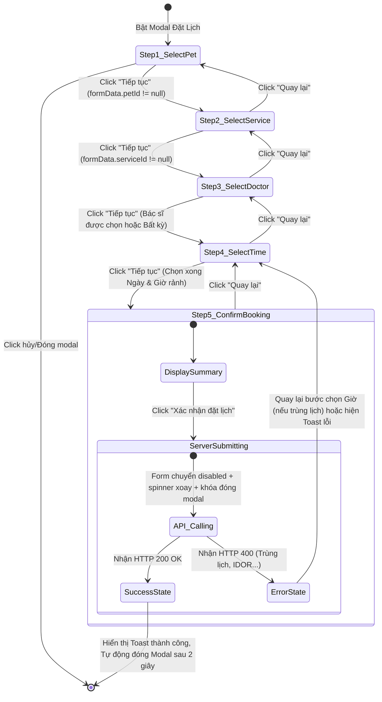

# 🎭 Behavioral Specification - Online Examination Booking

## 1. Máy trạng thái Biểu mẫu đặt lịch (Finite State Machine - FSM)

Biểu mẫu đặt lịch đa bước (Multi-step Booking Wizard) trên Frontend hoạt động dựa trên một máy trạng thái chặt chẽ nhằm bảo đảm khách hàng không bỏ sót dữ liệu bắt buộc và tránh gửi request rác lên server:

---

## 2. Diễn giải các chuyển dịch trạng thái tương tác (State Transitions)

### A. Ràng buộc điều kiện chuyển bước (Wizard Guard Logic)
*   **Chuyển từ Bước 1 sang Bước 2:** Nút "Tiếp tục" ở trạng thái `disabled` cho đến khi người dùng click chọn một chú thú cưng từ Grid danh sách.
*   **Chuyển từ Bước 2 sang Bước 3:** Yêu cầu mô tả triệu chứng tối thiểu 10 ký tự để bác sĩ nắm được bệnh lý sơ bộ. Nếu người dùng gõ trống hoặc quá ngắn, viền ô nhập triệu chứng sẽ nhấp nháy đỏ kèm cảnh báo.
*   **Chuyển từ Bước 4 sang Bước 5:** Hệ thống kiểm tra khung giờ được chọn. Nếu người dùng click vào khung giờ đã bị khóa (Blocked slot do bác sĩ đã có lịch), hệ thống chặn sự kiện click và không thay đổi trạng thái, bắt buộc người dùng chọn khung giờ trống (Free slot).

### B. Khóa tương tác trong lúc tạo giao dịch (Submit Lockout)
*   Khi người dùng nhấn "Xác nhận đặt lịch" ở Bước 5, giao diện chuyển sang trạng thái `ServerSubmitting`:
    *   Cờ `booking = true` được kích hoạt trong store Pinia.
    *   Thiết lập thuộc tính `disabled` cho tất cả các nút: "Quay lại", "Xác nhận", nút đóng [X] ở góc modal.
    *   Ngăn chặn hoàn toàn sự kiện nhấp chuột ra ngoài vùng phủ (Backdrop Click Disable) nhằm tránh trường hợp khách hàng vô tình đóng modal trong lúc API đang ghi nhận dữ liệu dưới DB, có thể gây mất đồng bộ hoặc lỗi tạo 2 bản ghi trùng lặp (Double Submit).

### C. Reset trạng thái biểu mẫu (Form Cleanup)
*   Sau khi chuyển sang `SuccessState`, store tự động gọi hàm `resetBookingForm()` để đưa chỉ số bước `step` về lại 1 và dọn sạch các trường thông tin trong `formData` chuẩn bị cho lượt đặt lịch tiếp theo.
*   Giải phóng cache của các bác sĩ và khung giờ để tránh hiển thị thông tin cũ ở lần mở modal sau.
