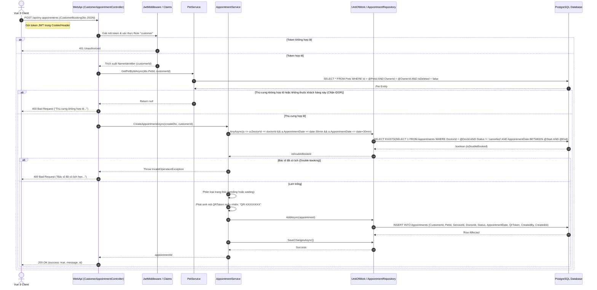

# 🛠️ Technical Specification - Online Examination Booking

## 1. Kiến trúc luồng xử lý (Sequence Diagram)

Sơ đồ dưới đây đặc tả luồng xử lý chi tiết từ khi khách hàng nhấn nút gửi biểu mẫu đặt lịch khám y tế trên Vue 3 Client đến khi lưu trữ thành công trong CSDL PostgreSQL:



---

## 2. Đặc tả Dữ liệu Thực thể (Database Entity & Schema)

Thực thể `Appointment` được lưu trữ trong bảng `Appointments` của cơ sở dữ liệu PostgreSQL để liên kết các bên liên quan:

```csharp
namespace MyPetClinic.Domain.Entities
{
    public class Appointment
    {
        public long Id { get; set; }
        public Guid CustomerId { get; set; }
        public long PetId { get; set; }
        public long ServiceId { get; set; }
        public Guid DoctorId { get; set; }
        public DateTime AppointmentDate { get; set; }
        
        // Trạng thái: "pending", "confirmed", "waiting" (Khám ngay), "in_progress", "ready_to_pay", "completed", "cancelled"
        public string Status { get; set; } = "pending"; 
        
        public string? Symptom { get; set; }
        public string? Note { get; set; }
        public string? QrToken { get; set; }      // Dùng check-in nhanh tại quầy lễ tân
        public int QueueNumber { get; set; }      // Số thứ tự khám trong ngày (nếu trạng thái là waiting)
        public DateTime? CheckInTime { get; set; }
        public Guid CreatedBy { get; set; }
        public DateTime CreatedAt { get; set; } = DateTime.UtcNow;

        // Navigation Properties
        public User? Customer { get; set; }
        public Pet? Pet { get; set; }
        public ClinicService? Service { get; set; }
        public User? Doctor { get; set; }
    }
}
```

*   **Tối ưu hóa Database Index:**
    *   Tạo chỉ mục phức hợp để tăng tốc độ kiểm tra trùng lịch khám của Bác sĩ:
        `CREATE INDEX IX_Appointments_Doctor_Date ON "Appointments" ("DoctorId", "AppointmentDate") WHERE "Status" != 'cancelled';`
    *   Tạo chỉ mục tìm kiếm nhanh lịch theo Khách hàng:
        `CREATE INDEX IX_Appointments_Customer ON "Appointments" ("CustomerId", "AppointmentDate" DESC);`

---

## 3. Đặc tả DTOs & Validation Rules

### A. CustomerBookingDto (Nhận từ Client)
```csharp
namespace MyPetClinic.Application.DTOs
{
    public class CustomerBookingDto
    {
        public long PetId { get; set; }
        public Guid? DoctorId { get; set; } // Nếu null, hệ thống tự động chỉ định bác sĩ trực
        public long ServiceId { get; set; }
        public DateTime? AppointmentDate { get; set; }
        public string? Symptom { get; set; }
        public string? Note { get; set; }
    }
}
```

### B. Validation Filter (FluentValidation C#)
```csharp
using FluentValidation;
using MyPetClinic.Application.DTOs;
using System;

namespace MyPetClinic.Application.Validators
{
    public class CustomerBookingDtoValidator : AbstractValidator<CustomerBookingDto>
    {
        public CustomerBookingDtoValidator()
        {
            RuleFor(x => x.PetId)
                .NotEmpty().WithMessage("Vui lòng chọn thú cưng cần khám.");

            RuleFor(x => x.ServiceId)
                .NotEmpty().WithMessage("Vui lòng chọn dịch vụ y tế.");

            RuleFor(x => x.AppointmentDate)
                .NotEmpty().WithMessage("Vui lòng chọn ngày và giờ hẹn khám.")
                .Must(date => date == null || date > DateTime.UtcNow.AddMinutes(5))
                .WithMessage("Thời gian hẹn khám phải lớn hơn thời gian hiện tại.");

            RuleFor(x => x.Symptom)
                .NotEmpty().WithMessage("Vui lòng mô tả triệu chứng hoặc lý do khám bệnh.")
                .MaximumLength(500).WithMessage("Triệu chứng không viết quá 500 ký tự.");

            RuleFor(x => x.Note)
                .MaximumLength(500).WithMessage("Ghi chú không viết quá 500 ký tự.");
        }
    }
}
```
