# 📐 UX Flow & State Transitions - Online Examination Booking

Tài liệu này đặc tả chi tiết luồng trải nghiệm người dùng (User Experience Flow) xuyên suốt biểu mẫu đa bước đặt lịch khám y tế trực tuyến tại phòng khám **MyPetClinic**.

---

## 1. Dòng Trải nghiệm người dùng từng bước (UX Walkthrough Flow)

```mermaid
graph TD
    %% Mở đầu
    A[Màn hình Dashboard Khách hàng] -->|Click nút 'Đặt lịch khám'| B[Mở Modal Wizard Bước 1]
    
    %% Bước 1: Chọn Pet
    B --> C[Hiển thị danh sách Thú cưng dạng tròn có ảnh đại diện thông minh]
    C -->|Click chọn Bé Leo| D[Thẻ Bé Leo nổi bật viền sáng xanh + Hiện nút Tiếp tục]
    D -->|Click Tiếp tục| E[Wizard Bước 2: Chọn Dịch Vụ]
    
    %% Bước 2: Dịch Vụ & Triệu Chứng
    E --> F[Hiển thị Dropdown dịch vụ y tế và ô nhập Triệu chứng]
    F -->|Chọn Khám tổng quát & Nhập triệu chứng| G[Nút Tiếp tục sáng lên]
    G -->|Click Tiếp tục| H[Wizard Bước 3: Chọn Bác Sĩ]
    
    %% Bước 3: Chọn Bác Sĩ
    H --> I[Hiển thị danh sách thẻ Bác sĩ kèm chuyên khoa + Tùy chọn Bất kỳ]
    I -->|Click chọn Bác sĩ Trần Quốc Anh| J[Thẻ Bác sĩ Anh sáng lên]
    J -->|Click Tiếp tục| K[Wizard Bước 4: Chọn Ngày & Giờ]
    
    %% Bước 4: Ngày & Giờ
    K --> L[Hiển thị Lịch chọn ngày + Grid các ô giờ rảnh]
    L -->|Chọn ngày mai + Khung giờ 10:00| M[Nút Tiếp tục sáng lên]
    M -->|Click Tiếp tục| N[Wizard Bước 5: Xác Nhận]
    
    %% Bước 5: Xác nhận & Gửi
    N --> O[Hiển thị bảng tóm tắt: Bé Leo - Khám tổng quát - BS Anh - 10:00 Ngày mai]
    O -->|Click 'Xác nhận đặt lịch'| P[Lớp phủ mờ kính + Spinner quay + Khóa modal]
    
    %% Kết quả API
    P -->|API trả về 200 OK| Q[Hiển thị Toast thành công xanh lá 'Đặt lịch thành công']
    Q --> R[Hiện mã QR code check-in + Tự động đóng modal sau 2 giây]
    R --> S[Chuyển hướng về trang Danh sách lịch hẹn để theo dõi]
```

---

## 2. Đặc tả các Điểm chạm Giao diện y tế chuyên biệt (UI Touchpoints Details)

### Bước 1: Chọn Thú Cưng (Pet Selection)
*   Thú cưng được trình bày dưới dạng thẻ tròn sinh động.
*   Hiển thị rõ ràng trạng thái y tế khẩn cấp: Nếu thú cưng đang có ghi chú dị ứng thuốc nguy hiểm (Allergy Note), thẻ thú cưng sẽ hiển thị một biểu tượng dấu chấm than màu vàng nhấp nháy kèm tooltip nhắc nhở: *"Chú ý: Bé có dị ứng y tế"*.

### Bước 2: Chọn Dịch Vụ & Mô tả Triệu chứng
*   Hộp nhập liệu triệu chứng cung cấp bộ đếm ký tự thời gian thực ở góc dưới bên phải (Ví dụ: `150 / 500 ký tự`).
*   Bên dưới hộp nhập liệu có các nút gợi ý triệu chứng nhanh (Quick Tags) giúp khách hàng click chọn nhanh không cần gõ (Ví dụ: `[Nôn mửa]`, `[Tiêu chảy]`, `[Bỏ ăn]`, `[Mệt mỏi]`, `[Mẩn ngứa]`). Khi click vào tag, text tự động append vào ô triệu chứng.

### Bước 3: Chọn Bác Sĩ thú y (Veterinarian Selection)
*   Mỗi thẻ bác sĩ hiển thị avatar tròn mờ kính, tên bác sĩ, chuyên khoa điều trị, và một chấm trạng thái hoạt động:
    *   **Màu xanh lá cây:** Bác sĩ đang trực ban và có nhiều khung giờ trống.
    *   **Màu vàng:** Bác sĩ sắp kín lịch trong ngày.
*   Mục chọn "Bác sĩ bất kỳ" hiển thị kèm biểu tượng dấu hỏi chấm mờ ảo cá tính, giải thích: *"Hệ thống sẽ tự động phân bổ bác sĩ có chuyên môn phù hợp nhất đang rảnh ca khám để tiếp đón bé sớm nhất."*.

### Bước 4: Khung giờ trống (Dynamic Time Slot Grid)
*   Khi người dùng click chọn ngày khám trên lịch:
    *   Hệ thống gọi API tải danh sách khung giờ của ngày đó.
    *   Các ô giờ bận (đã trùng lịch hoặc ngoài giờ làm việc) hiển thị màu xám tối `--slot-bg-blocked` và bị vô hiệu hóa click.
    *   Các ô giờ trống hiển thị viền mỏng sáng, khi hover có hiệu ứng phồng nhẹ và sáng viền xanh neon.
