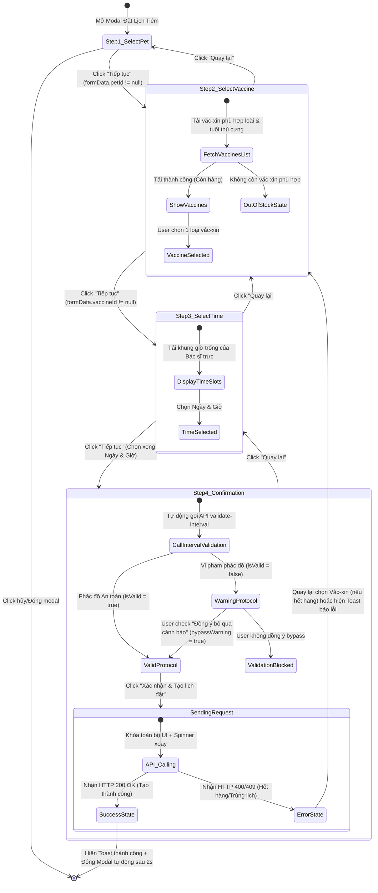

# 🎭 Behavioral Specification - Online Vaccination Booking

## 1. Máy trạng thái Biểu mẫu đặt lịch tiêm phòng (Finite State Machine - FSM)

Giao diện đặt lịch tiêm phòng trực tuyến đa bước (Multi-step Vaccination Wizard) hoạt động dựa trên một máy trạng thái chặt chẽ. Nó kiểm soát luồng di chuyển giữa các bước, thực thi các kiểm tra y tế về phác đồ và đồng bộ hóa tồn kho dược:

---

## 2. Diễn giải các chuyển dịch trạng thái tương tác (State Transitions)

### A. Ràng buộc điều kiện chuyển bước (Wizard Guard Logic)
* **Khóa bước 1 (Chọn Thú cưng):** Nút "Tiếp tục" bị vô hiệu hóa cho đến khi khách hàng chọn một con thú cưng trong danh mục. Khi chọn, hệ thống lập tức lưu `petId` và lấy thông tin `species` (chó/mèo) cùng `age` của thú cưng để phục vụ bước tiếp theo.
* **Khóa bước 2 (Chọn Vắc-xin):** Hệ thống chỉ cho phép bấm "Tiếp tục" khi `vaccineId` được gán giá trị hợp lệ. Trong lúc tải dữ liệu vắc-xin (`FetchVaccinesList`), một skeleton loader sẽ hiển thị. Nếu không có loại vắc-xin nào phù hợp với loài của thú cưng còn hàng, UI sẽ hiển thị trạng thái `OutOfStockState` kèm thông báo hướng dẫn liên hệ trực tiếp số hotline phòng khám để nhập thuốc.
* **Khóa bước 3 (Chọn Giờ):** Người dùng phải chọn một thời điểm cụ thể (`appointmentDate`) lớn hơn thời gian hiện tại tối thiểu 2 giờ và nằm trong khung giờ làm việc của phòng khám (08:00 - 20:00).

### B. Luồng Xử lý Cảnh báo Phác đồ Y tế tại Bước Xác nhận
* Khi chuyển sang bước 4, hệ thống tự động kích hoạt API kiểm tra khoảng cách tái chủng an toàn (`/validate-interval`).
* Nếu kết quả trả về `isValid: false`, UI sẽ kích hoạt chế độ **WarningProtocol**:
  * Hiện hộp cảnh báo (Alert Card) viền màu vàng/cam, nền mờ kính mờ, chứa chi tiết y khoa: ngày tiêm gần nhất của bé, thời gian đề xuất tiêm mũi nhắc lại.
  * Hiện nút checkbox: *"Tôi đã hiểu cảnh báo và đồng ý tiếp tục đặt lịch dưới sự tư vấn của Bác sĩ."*
  * Nút "Xác nhận & Tạo lịch đặt" sẽ bị vô hiệu hóa (`disabled`) cho đến khi người dùng đánh dấu tick vào checkbox này (`bypassWarning = true`).

### C. Khóa tương tác trong lúc gửi đơn đặt lịch (Submit Lockout)
* Khi nhấn nút "Xác nhận & Tạo lịch đặt", trạng thái `SendingRequest` được bật:
  * Biến `submitting = true` được kích hoạt trong store.
  * Vô hiệu hóa nút "Quay lại", nút đóng [X] của modal, và chặn click ngoài modal (backdrop click).
  * Điều này triệt tiêu hoàn toàn khả năng người dùng nhấn đúp (double-submit) hoặc đóng tab/modal giữa chừng khi API đang ghi nhận dữ liệu trong cơ sở dữ liệu.

---

## 3. Phân tích các Edge Cases và Giải pháp xử lý (Edge Cases & Error Handling)

| Tình huống Edge Case | Kịch bản / Hành vi của Hệ thống | Giải pháp Giao diện & Trải nghiệm (UI/UX) |
| :--- | :--- | :--- |
| **Vắc-xin sắp hết hàng tại phòng khám (Stock < 5)** | Vắc-xin vẫn hiển thị trong danh mục lựa chọn ở bước 2 nhưng kèm theo cờ cảnh báo nhỏ màu cam. | Hiển thị tag badge `[Sắp hết thuốc]` cạnh tên vắc-xin để chủ nuôi chuẩn bị trước tinh thần nếu hết đột xuất. |
| **Hết hàng thực tế trong lúc đang đặt lịch (Race Condition)** | Khách hàng mở form thấy còn 1 liều vắc-xin. Khi họ đang điền thông tin thì người khác đã đặt xong liều đó. Khi bấm submit, API trả về lỗi 400 (Hết hàng). | Chuyển biểu mẫu quay lại Bước 2, hiện Toast thông báo đỏ: *"Vắc-xin vừa hết hàng, vui lòng chọn loại khác hoặc liên hệ hotline."*, đồng thời tải lại danh sách tồn kho khả dụng mới. |
| **Thú cưng chưa đủ tuổi tối thiểu tiêm chủng** | Bé mèo mới 5 tuần tuổi trong khi vắc-xin 4 bệnh yêu cầu tối thiểu 8 tuần tuổi (`minAgeWeeks = 8`). | Ẩn hoàn toàn vắc-xin đó khỏi danh sách chọn hoặc hiển thị ở dạng disabled kèm chú thích màu đỏ: *"Chưa đủ tuổi tiêm (Tối thiểu 8 tuần)"*. |
| **Thú cưng chưa từng có lịch sử tiêm chủng** | Hệ thống gọi `/pet-history/{petId}` nhưng kết quả trả về mảng rỗng `[]`. | Giao diện hiển thị ghi chú nhẹ: *"Hệ thống chưa ghi nhận lịch sử tiêm của bé. Mũi tiêm này sẽ được đăng ký là Mũi khởi đầu."* |
| **Lỗi mất kết nối mạng giữa chừng** | Khách hàng nhấn Submit nhưng kết nối mạng bị ngắt. | Hiển thị thông báo lỗi thân thiện: *"Không thể kết nối tới máy chủ. Vui lòng kiểm tra mạng và thử lại."*, khôi phục trạng thái nút bấm (không khóa cứng UI vĩnh viễn) để người dùng có thể submit lại khi có mạng. |
| **Khách hàng thay đổi thú cưng ở Bước 1** | Khách hàng quay lại bước 1 đổi từ Pet A (Chó) sang Pet B (Mèo). | Reset toàn bộ các dữ liệu đã chọn ở bước sau: xóa `vaccineId`, xóa `appointmentDate`, xóa kết quả validate phác đồ cũ để tránh gửi dữ liệu không nhất quán. |
