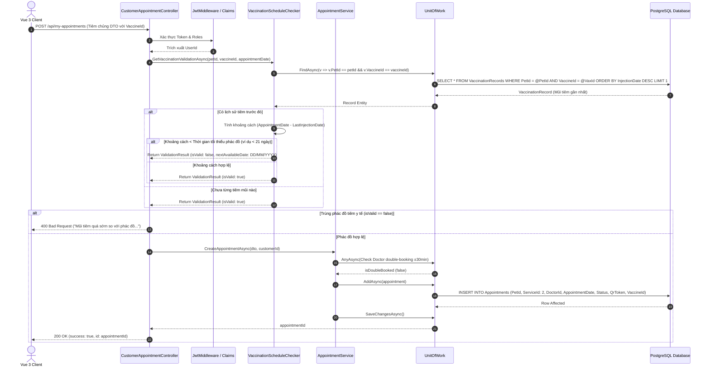
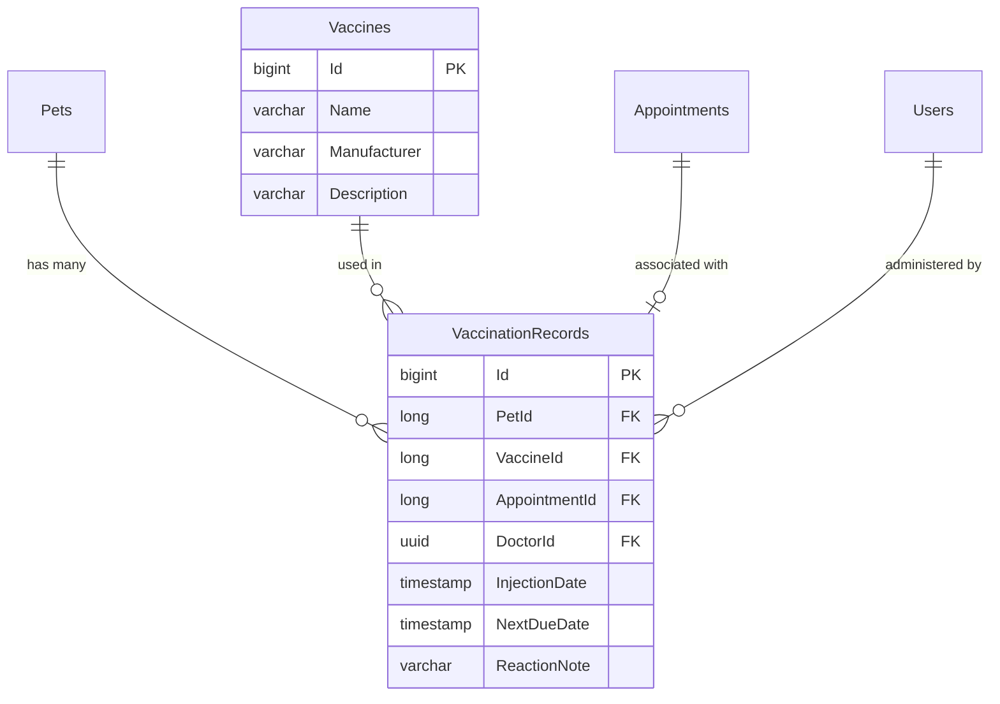

# 🛠️ Technical Specification - Online Vaccination Booking

## 1. Luồng xử lý Kỹ thuật (Sequence Diagram)

Dưới đây là sơ đồ Sequence chi tiết thể hiện cách hệ thống đối chiếu lịch sử tiêm chủng của thú cưng, đưa ra cảnh báo khoảng cách tiêm an toàn và đặt lịch:



---

## 2. Đặc tả Mô hình Cơ sở dữ liệu (Database Schemas)

Sơ đồ quan hệ CSDL kiểm soát thông tin vắc-xin và lịch sử tiêm chủng của thú cưng:



### Script khởi tạo CSDL:
```sql
CREATE TABLE "Vaccines" (
    "Id" bigint GENERATED BY DEFAULT AS IDENTITY PRIMARY KEY,
    "Name" varchar(100) NOT NULL,
    "Manufacturer" varchar(150) NULL,
    "Description" text NULL
);

CREATE TABLE "VaccinationRecords" (
    "Id" bigint GENERATED BY DEFAULT AS IDENTITY PRIMARY KEY,
    "PetId" bigint NOT NULL REFERENCES "Pets"("Id") ON DELETE CASCADE,
    "VaccineId" bigint NOT NULL REFERENCES "Vaccines"("Id") ON DELETE RESTRICT,
    "AppointmentId" bigint NULL REFERENCES "Appointments"("Id") ON DELETE SET NULL,
    "DoctorId" uuid NOT NULL REFERENCES "Users"("Id") ON DELETE RESTRICT,
    "InjectionDate" timestamp NOT NULL,
    "NextDueDate" timestamp NULL,
    "ReactionNote" varchar(255) NULL
);
```

---

## 3. Đặc tả DTOs & Validation Rules

### A. CustomerVaccinationBookingDto (Đặt lịch Tiêm chủng)
```csharp
namespace MyPetClinic.Application.DTOs
{
    public class CustomerVaccinationBookingDto
    {
        public long PetId { get; set; }
        public long ServiceId { get; set; } // Phải là ID của dịch vụ Tiêm Chủng (ví dụ: 2)
        public long VaccineId { get; set; } // ID của Vaccine cần tiêm
        public Guid? DoctorId { get; set; }
        public DateTime? AppointmentDate { get; set; }
        public string? Symptom { get; set; } // Ghi nhận trạng thái sức khoẻ hiện tại
        public string? Note { get; set; }
    }
}
```

### B. FluentValidation C# Rules
```csharp
using FluentValidation;
using MyPetClinic.Application.DTOs;
using System;

namespace MyPetClinic.Application.Validators
{
    public class CustomerVaccinationBookingDtoValidator : AbstractValidator<CustomerVaccinationBookingDto>
    {
        public CustomerVaccinationBookingDtoValidator()
        {
            RuleFor(x => x.PetId)
                .NotEmpty().WithMessage("Vui lòng chọn thú cưng.");

            RuleFor(x => x.VaccineId)
                .NotEmpty().WithMessage("Vui lòng chọn loại vắc-xin cần tiêm.");

            RuleFor(x => x.AppointmentDate)
                .NotEmpty().WithMessage("Vui lòng chọn ngày và giờ tiêm chủng.")
                .Must(date => date == null || date > DateTime.UtcNow.AddMinutes(5))
                .WithMessage("Thời gian hẹn tiêm phải lớn hơn thời gian hiện tại.");
        }
    }
}
```
