# 📐 UX Flow & State Transitions - Online Vaccination Booking

Tài liệu này đặc tả chi tiết luồng trải nghiệm người dùng (User Experience Flow) và giao diện trực quan cho biểu mẫu đa bước đặt lịch tiêm phòng trực tuyến tại phòng khám **MyPetClinic**.

---

## 1. Dòng Trải nghiệm Người dùng từng bước (UX Walkthrough Flow)

```mermaid
graph TD
    %% Mở đầu
    A[Màn hình Dashboard Khách hàng] -->|Click nút 'Đặt lịch tiêm phòng'| B[Mở Modal Wizard Bước 1]
    
    %% Bước 1: Chọn Pet
    B --> C[Hiển thị danh sách Thú cưng của khách hàng]
    C -->|Click chọn Bé Miu| D[Thẻ Bé Miu nổi bật viền sáng xanh + Lưu loài Cat + Hiện nút Tiếp tục]
    D -->|Click Tiếp tục| E[Wizard Bước 2: Chọn Loại Vắc-xin]
    
    %% Bước 2: Chọn Vắc-xin & Lịch sử
    E --> F[Tải danh sách vắc-xin phù hợp cho Mèo + Lịch sử tiêm phòng của Miu]
    F -->|Chọn Vắc-xin 4 Bệnh Mèo Nobivac| G[Hiển thị thông tin vắc-xin & Số lượng tồn kho khả dụng]
    G -->|Click Tiếp tục| H[Wizard Bước 3: Chọn Ngày/Giờ & Bác Sĩ]
    
    %% Bước 3: Chọn Ngày/Giờ & Bác Sĩ
    H --> I[Hiển thị Lịch chọn ngày + Grid giờ rảnh + Chọn bác sĩ hoặc Bất kỳ]
    I -->|Chọn Ngày mai + Khung giờ 14:00| J[Nút Tiếp tục sáng lên]
    J -->|Click Tiếp tục| K[Wizard Bước 4: Xác Nhận & Đánh Giá Phác Đồ]
    
    %% Bước 4: Xác nhận & Đánh giá Phác Đồ
    K --> L[Tự động gọi API Validate Phác Đồ]
    L -->|Kiểm tra: Khoảng cách y khoa quá ngắn| M[Hiển thị Alert Card màu vàng cảnh báo tiêm sớm]
    M -->|Khách tích chọn 'Đồng ý bỏ qua cảnh báo y khoa'| N[Nút 'Xác nhận đặt lịch' chuyển từ disabled sang hoạt động]
    N -->|Click Xác nhận| O[Lớp phủ mờ kính + Spinner quay + Khóa modal]
    
    %% Kết quả API
    O -->|API trả về 200 OK| P[Hiển thị Toast thành công màu xanh lá]
    P --> Q[Hiển thị mã QR code check-in + Tự động đóng modal sau 2s]
    Q --> R[Chuyển hướng về trang Danh sách lịch hẹn để theo dõi]
```

---

## 2. Đặc tả các Điểm chạm Giao diện tiêm phòng chuyên biệt (UI Touchpoints Details)

### Bước 1: Chọn Thú cưng & Nhận diện loài tự động
* Thú cưng được thiết kế dưới dạng thẻ tròn mờ kính (Glassmorphic Card). 
* Khi click chọn thú cưng, hệ thống tự động nhận diện loài (`Dog` hoặc `Cat`) và độ tuổi. Thông tin này sẽ được truyền làm tham số ẩn để lọc dữ liệu vắc-xin ở bước tiếp theo, tránh việc hiển thị nhầm vắc-xin dành riêng cho chó cho vật nuôi là mèo.

### Bước 2: Chọn Vắc-xin thông minh & Tồn kho
* **Giao diện lưới lựa chọn vắc-xin (Vaccine Selector Grid):**
  * Các loại vắc-xin được hiển thị dưới dạng thẻ thông tin nhỏ gọn (Vaccine Cards) bao gồm: Tên vắc-xin, nguồn gốc sản xuất, giá cả, tuổi tối thiểu bắt đầu tiêm và số lượng còn lại trong kho.
  * Hiệu ứng mờ kính nâng cấp với `backdrop-filter: blur(10px)` và viền sáng mỏng.
* **Lịch sử tiêm phòng nhanh (Quick History Timeline):**
  * Ngay cạnh danh sách vắc-xin, hiển thị một timeline lịch sử tiêm phòng của thú cưng được chọn.
  * Giúp chủ nuôi nhìn thấy rõ ràng bé đã tiêm những mũi gì, ngày nào, từ đó đưa ra quyết định chọn loại vắc-xin chuẩn xác nhất mà không cần mở tab bệnh án riêng.

### Bước 3: Đặt lịch và Bác sĩ trực ca
* Khách hàng chọn ngày và giờ tiêm chủng thuận tiện.
* Tích hợp tùy chọn "Bác sĩ bất kỳ" hoặc lựa chọn đích danh bác sĩ y tá thực hiện.

### Bước 4: Màn hình Cảnh báo Phác Đồ Y tế (Medical Alert Card UI)
* Thiết kế hộp cảnh báo cực kỳ trực quan và nổi bật:
  * Nền mờ kính màu vàng nhạt HSL (`hsl(45, 100%, 96%)` với độ mờ 80%).
  * Viền màu vàng hổ phách HSL (`hsl(45, 100%, 45%)`).
  * Icon cảnh báo hình tam giác chấm than nhấp nháy thu hút sự chú ý.
  * Hiển thị văn bản lớn rõ ràng: **"CẢNH BÁO Y TẾ: KHOẢNG CÁCH TIÊM CHỦNG QUÁ SỚM"** cùng thông tin khuyên dùng cụ thể: *"Bé đã tiêm mũi gần nhất vào ngày 10/05/2026. Lịch tiêm nhắc lại an toàn của vắc-xin này phải cách tối thiểu 21 ngày (tức là sau ngày 31/05/2026)."*.
  * Checkbox đồng ý: `[ ] Tôi xác nhận muốn đặt lịch tiêm sớm dưới sự tư vấn trực tiếp của bác sĩ khi đến khám.`

---

## 3. So sánh Điểm chạm UX/UI với Đặt lịch Khám bệnh thường (Phase 2 - 10)

| Điểm chạm giao diện | Đặt lịch khám bệnh thường (Phase 2 - 10) | Đặt lịch tiêm phòng vắc-xin (Phase 2 - 11) |
| :--- | :--- | :--- |
| **Dữ liệu lựa chọn bước 2** | Danh sách các Dịch vụ khám (Khám tổng quát, nội khoa, ngoại khoa) + Ô nhập Triệu chứng bệnh. | Danh sách các Vắc-xin khả dụng còn hàng + Trình diễn Timeline lịch sử tiêm phòng của thú cưng. |
| **Lọc dữ liệu thông minh** | Hiển thị tất cả dịch vụ y tế. | Lọc nghiêm ngặt vắc-xin theo loài thú cưng (Chó chỉ hiện vắc-xin cho chó, mèo chỉ hiện vắc-xin cho mèo). |
| **Cảnh báo an toàn y tế** | Chống trùng lịch trực ban của Bác sĩ ($\pm30$ phút). | Chống trùng lịch Bác sĩ + Kiểm tra khoảng cách an toàn phác đồ y khoa giữa các mũi tiêm. |
| **Xác nhận giao diện** | Tóm tắt dịch vụ, bác sĩ và giờ khám. | Tóm tắt vắc-xin, giá tiền, bác sĩ, giờ tiêm + Hộp cảnh báo khoảng cách y khoa nếu vi phạm phác đồ. |
