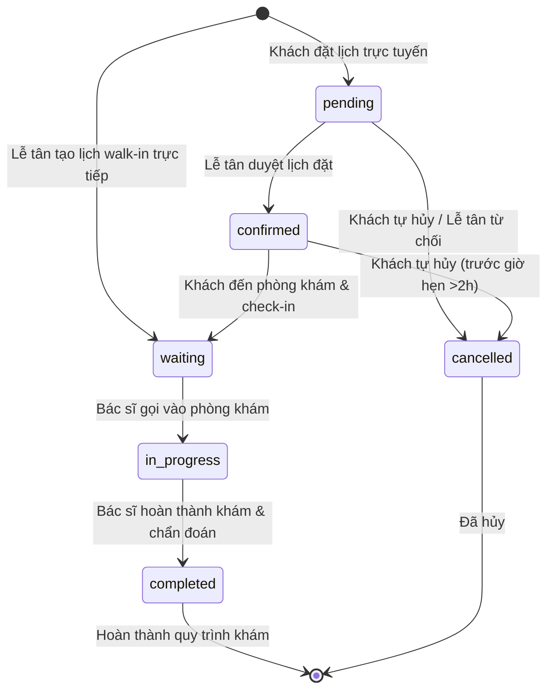

# 🧠 Core Business Logic - Customer Appointment Management

## 1. Cơ chế Chuyển đổi Trạng thái Lịch hẹn (Appointment State Engine)

Lịch hẹn y tế trong hệ thống **MyPetClinic** tuân thủ một vòng đời trạng thái nghiêm ngặt để đảm bảo tính toàn vẹn dữ liệu y tế và phối hợp hoạt động nhịp nhàng giữa các phòng ban:



*   **pending (Chờ duyệt):** Trạng thái ban đầu khi khách đặt lịch trực tuyến. Khách hàng được toàn quyền hủy lịch.
*   **confirmed (Đã xác nhận):** Lễ tân đã duyệt lịch hẹn và bố trí bác sĩ trực. Khách hàng được quyền hủy lịch trực tuyến nếu thời gian hủy cách giờ hẹn **tối thiểu 2 tiếng**.
*   **waiting (Xếp hàng chờ):** Khách hàng đã đến phòng khám và check-in bằng quét mã QR Token. **Khóa quyền hủy trực tuyến của khách hàng**. Mọi thay đổi phải qua quầy lễ tân.
*   **in_progress (Đang khám):** Bác sĩ đang thực hiện chẩn đoán lâm sàng cho thú cưng. Khóa hoàn toàn quyền hủy lịch.
*   **completed (Hoàn thành):** Ca khám kết thúc, bác sĩ kê đơn thuốc và chuyển thông tin sang quầy thu ngân.
*   **cancelled (Đã hủy):** Lịch hẹn đã bị hủy (bởi khách hàng hoặc phòng khám). Ghi rõ lý do hủy (`CancelledReason`).

---

## 2. Mã nguồn Logic Nghiệp vụ C# - Quản lý Lịch hẹn & Hủy lịch an toàn

Dưới đây là đặc tả logic nghiệp vụ xử lý tại Application Layer, thực thi các kiểm tra ràng buộc nghiệp vụ y tế và bảo mật IDOR trước khi cập nhật cơ sở dữ liệu:

```csharp
using System;
using System.Linq;
using System.Threading.Tasks;
using Microsoft.EntityFrameworkCore;
using MyPetClinic.Application.DTOs;
using MyPetClinic.Domain.Entities;
using MyPetClinic.Domain.Exceptions;

namespace MyPetClinic.Application.Services
{
    public class AppointmentService : IAppointmentService
    {
        private readonly IApplicationDbContext _context;
        private readonly IEmailService _emailService;

        public AppointmentService(IApplicationDbContext context, IEmailService emailService)
        {
            _context = context;
            _emailService = emailService;
        }

        /// <summary>
        /// Lấy danh sách lịch hẹn phân trang của khách hàng có lọc trạng thái
        /// </summary>
        public async Task<PagedList<AppointmentDetailDto>> GetCustomerAppointmentsAsync(
            Guid customerId, 
            string? status, 
            int page, 
            int pageSize)
        {
            var query = _context.Appointments
                .Include(a => a.Pet)
                .Include(a => a.Doctor)
                .Include(a => a.Service)
                .Include(a => a.Vaccine)
                .Where(a => a.Pet.OwnerId == customerId); // Bảo mật IDOR: Chỉ lấy pet thuộc sở hữu của khách hàng

            // Áp dụng bộ lọc trạng thái nếu có
            if (!string.IsNullOrEmpty(status))
            {
                var statusLower = status.ToLower();
                query = query.Where(a => a.Status.ToLower() == statusLower);
            }

            var totalCount = await query.CountAsync();
            
            var items = await query
                .OrderByDescending(a => a.AppointmentDate)
                .Skip((page - 1) * pageSize)
                .Take(pageSize)
                .Select(a => new AppointmentDetailDto
                {
                    Id = a.Id,
                    PetId = a.PetId,
                    PetName = a.Pet.Name,
                    PetSpecies = a.Pet.Species,
                    DoctorId = a.DoctorId,
                    DoctorName = a.Doctor.FullName,
                    ServiceId = a.ServiceId,
                    ServiceName = a.Service != null ? a.Service.Name : "Tiêm phòng vắc-xin",
                    VaccineId = a.VaccineId,
                    VaccineName = a.Vaccine != null ? a.Vaccine.Name : null,
                    AppointmentDate = a.AppointmentDate,
                    Status = a.Status,
                    Symptom = a.Symptom,
                    Note = a.Note,
                    CancelledReason = a.CancelledReason,
                    CancelledAt = a.CancelledAt,
                    QrToken = a.QrToken
                })
                .ToListAsync();

            return new PagedList<AppointmentDetailDto>(items, totalCount, page, pageSize);
        }

        /// <summary>
        /// Khách hàng thực hiện hủy lịch hẹn trực tuyến an toàn
        /// </summary>
        public async Task<bool> CancelAppointmentAsync(Guid appointmentId, Guid customerId, string reason)
        {
            // Thực hiện Lock bi quan (Pessimistic Lock) để chống Race Condition khi lễ tân đang check-in cùng lúc
            var appointment = await _context.Appointments
                .Include(a => a.Pet)
                .Include(a => a.Doctor)
                .Include(a => a.Service)
                .FirstOrDefaultAsync(a => a.Id == appointmentId);

            if (appointment == null)
            {
                throw new KeyNotFoundException("Lịch hẹn không tồn tại.");
            }

            // Chặn IDOR: Đảm bảo lịch hẹn thuộc về thú cưng của khách hàng đang yêu cầu
            if (appointment.Pet.OwnerId != customerId)
            {
                throw new UnauthorizedAccessException("Bạn không có quyền thực hiện thao tác trên lịch hẹn này.");
            }

            // Ràng buộc trạng thái y tế: Chỉ cho phép hủy khi đang chờ duyệt hoặc đã xác nhận
            var status = appointment.Status.ToLower();
            if (status != "pending" && status != "confirmed")
            {
                throw new InvalidOperationException($"Không thể hủy lịch hẹn ở trạng thái hiện tại: '{appointment.Status}'.");
            }

            // Ràng buộc thời gian: Nếu trạng thái đã CONFIRMED, chỉ cho hủy trước giờ hẹn tối thiểu 2 tiếng
            if (status == "confirmed")
            {
                var timeDifference = appointment.AppointmentDate - DateTime.UtcNow;
                if (timeDifference.TotalHours < 2)
                {
                    throw new InvalidOperationException("Lịch hẹn đã được xác nhận chỉ có thể hủy trực tuyến trước giờ hẹn tối thiểu 2 tiếng. Vui lòng liên hệ hotline phòng khám để được xử lý trực tiếp.");
                }
            }

            // Tiến hành cập nhật trạng thái hủy
            appointment.Status = "cancelled";
            appointment.CancelledReason = reason;
            appointment.CancelledAt = DateTime.UtcNow;

            await _context.SaveChangesAsync();

            // Gửi email xác nhận hủy lịch tự động (Bất đồng bộ không chặn luồng chính)
            _ = Task.Run(async () =>
            {
                try
                {
                    var customer = await _context.Users.FindAsync(customerId);
                    if (customer != null && !string.IsNullOrEmpty(customer.Email))
                    {
                        await _emailService.SendEmailAsync(
                            customer.Email, 
                            "Xác nhận hủy lịch hẹn khám tại MyPetClinic", 
                            $"Xin chào {customer.FullName}, lịch hẹn cho bé {appointment.Pet.Name} vào lúc {appointment.AppointmentDate:dd/MM/yyyy HH:mm} đã được hủy thành công. Lý do: {reason}."
                        );
                    }
                }
                catch
                {
                    // Ghi log lỗi gửi mail nhưng không làm crash request hủy lịch chính
                }
            });

            return true;
        }
    }
}
```
