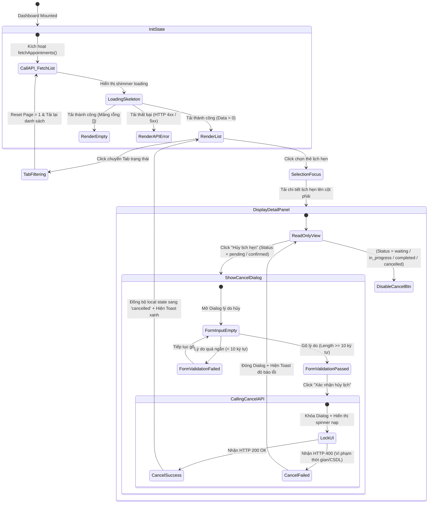

# 🎭 Behavioral Specification - Customer Appointment Management

## 1. Máy trạng thái Tương tác Dashboard (Finite State Machine - FSM)

Bảng điều khiển lịch hẹn của khách hàng quản lý nhiều hoạt động tương tác bất tuần tự bao gồm chuyển tab bộ lọc, xem chi tiết, và kích hoạt tiến trình hủy lịch y tế:

---

## 2. Diễn giải các chuyển dịch trạng thái tương tác (State Transitions)

### A. Ràng buộc Điều kiện Lọc & Phân trang (Pagination Guard Logic)
* **Tab Filtering:** Khi khách hàng click chọn tab bộ lọc (Ví dụ: tab "Đã hủy"), hệ thống sẽ thực hiện:
  1. Gán `selectedStatusFilter = 'cancelled'`.
  2. Đưa `currentPage` về `1`.
  3. Xóa cache danh sách cũ, hiển thị Skeleton Loader.
  4. Thực thi API `fetchAppointments` tải danh sách mới.
* **Pagination Block:** Nếu `currentPage` đang ở trang cuối cùng, nút "Trang sau" (Next page) sẽ tự động bị vô hiệu hóa (`disabled`) và ngược lại cho nút "Trang trước" (Prev page) khi ở trang đầu tiên.

### B. Khóa tương tác trong lúc gửi lệnh hủy lịch (Cancellation Lockout)
* Khi người dùng nhấn nút "Xác nhận hủy lịch" trong Dialog:
  * Trạng thái `cancelling` trong store chuyển sang `true`.
  * Hộp thoại lý do hủy và nút bấm chuyển sang trạng thái read-only / disabled.
  * Nút đóng hộp thoại [X] và nút "Bỏ qua" bị vô hiệu hóa click để ngăn người dùng đóng form giữa chừng khi API chưa ghi nhận xong.

---

## 3. Phân tích các Edge Cases và Giải pháp xử lý (Edge Cases & Error Handling)

| Tình huống Edge Case | Kịch bản / Hành vi của Hệ thống | Giải pháp Giao diện & Trải nghiệm (UI/UX) |
| :--- | :--- | :--- |
| **Hủy lịch sát giờ hẹn (dưới 2 tiếng)** | Lịch hẹn đã được xác nhận (`confirmed`), khách hàng cố bấm hủy sát giờ. | Backend trả về lỗi 400. Frontend hiển thị Toast thông báo đỏ nổi bật: *"Lịch hẹn đã được xác nhận chỉ có thể hủy trực tuyến trước giờ hẹn tối thiểu 2 tiếng. Vui lòng gọi điện trực tiếp cho phòng khám để giải quyết."*. |
| **Race Condition: Lễ tân vừa check-in lúc khách bấm hủy** | Khách hàng mở trình duyệt thấy lịch ở dạng `confirmed`, nhưng khi họ đang gõ lý do hủy thì lễ tân đã quét mã QR tiếp nhận bé tại quầy (chuyển sang `waiting`). Khách bấm xác nhận hủy. | Backend áp dụng khoá bi quan (`FOR UPDATE`) và nhận diện trạng thái mới là `waiting`, chặn hủy và trả về lỗi 400. Frontend hiển thị Toast: *"Lịch hẹn này đã được check-in tại quầy tiếp đón. Không thể hủy trực tuyến."* |
| **Mất kết nối mạng giữa chừng khi đang tải hoặc hủy** | Khách hàng nhấn xác nhận hủy lịch nhưng mạng đứt. | Hiển thị thông báo lỗi mạng. Mở lại tương tác các nút bấm trong Dialog để khách hàng có thể thử lại khi có mạng thay vì khóa cứng màn hình. |
| **Lý do hủy chứa ký tự đặc biệt nguy hại (XSS Injection)** | Khách hàng độc hại cố tình nhập thẻ script hoặc mã độc vào lý do hủy lịch. | Hệ thống sử dụng thư viện FluentValidation ở Backend để sanitize chuỗi, loại bỏ các ký tự html nguy hiểm và giới hạn độ dài ký tự tối đa là 500 ký tự. |
