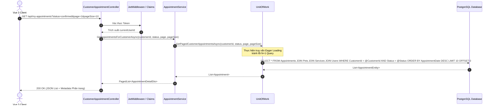
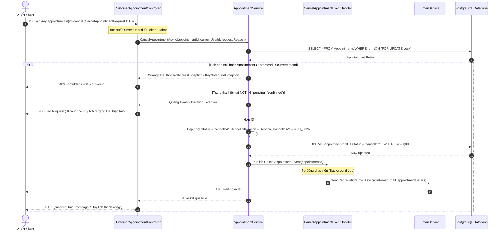
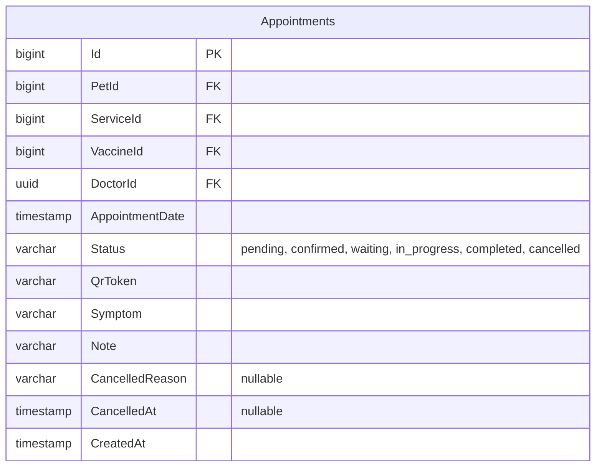

# 🛠️ Technical Specification - Customer Appointment Management

## 1. Luồng xử lý Kỹ thuật (Sequence Diagrams)

### A. Luồng Xem danh sách & Lọc trạng thái Lịch hẹn
Dưới đây là quy trình tải dữ liệu tối ưu hóa cho Dashboard:



### B. Luồng Hủy lịch hẹn & Giải phóng ca trực Bác sĩ
Quy trình hủy lịch kiểm tra IDOR nghiêm ngặt và giải phóng ca làm việc:



---

## 2. Đặc tả Mô hình Cơ sở dữ liệu Mở rộng (Database Schema)

Để hỗ trợ ghi nhận lý do hủy và quản lý dòng thời gian chi tiết của lịch hẹn:



### SQL DDL cập nhật bảng Appointments:
```sql
-- Thêm các trường hỗ trợ hủy lịch hẹn vào bảng Appointments
ALTER TABLE "Appointments" ADD COLUMN IF NOT EXISTS "CancelledReason" VARCHAR(500) NULL;
ALTER TABLE "Appointments" ADD COLUMN IF NOT EXISTS "CancelledAt" TIMESTAMP NULL;

-- Cập nhật ràng buộc Check Constraint cho cột Status
ALTER TABLE "Appointments" DROP CONSTRAINT IF EXISTS "chk_appointments_status";
ALTER TABLE "Appointments" ADD CONSTRAINT "chk_appointments_status" 
CHECK ("Status" IN ('pending', 'confirmed', 'waiting', 'in_progress', 'completed', 'cancelled'));
```

---

## 3. Đặc tả DTOs & Validation Rules

### A. CancelAppointmentRequest (DTO gửi yêu cầu hủy)
```csharp
namespace MyPetClinic.Application.DTOs
{
    public class CancelAppointmentRequest
    {
        public string Reason { get; set; } = string.Empty;
    }
}
```

### B. FluentValidation C# Rules
```csharp
using FluentValidation;
using MyPetClinic.Application.DTOs;

namespace MyPetClinic.Application.Validators
{
    public class CancelAppointmentRequestValidator : AbstractValidator<CancelAppointmentRequest>
    {
        public CancelAppointmentRequestValidator()
        {
            RuleFor(x => x.Reason)
                .NotEmpty().WithMessage("Vui lòng nhập lý do hủy lịch hẹn.")
                .MinimumLength(10).WithMessage("Lý do hủy lịch phải chứa tối thiểu 10 ký tự.")
                .MaximumLength(500).WithMessage("Lý do hủy lịch không được vượt quá 500 ký tự.");
        }
    }
}
```
