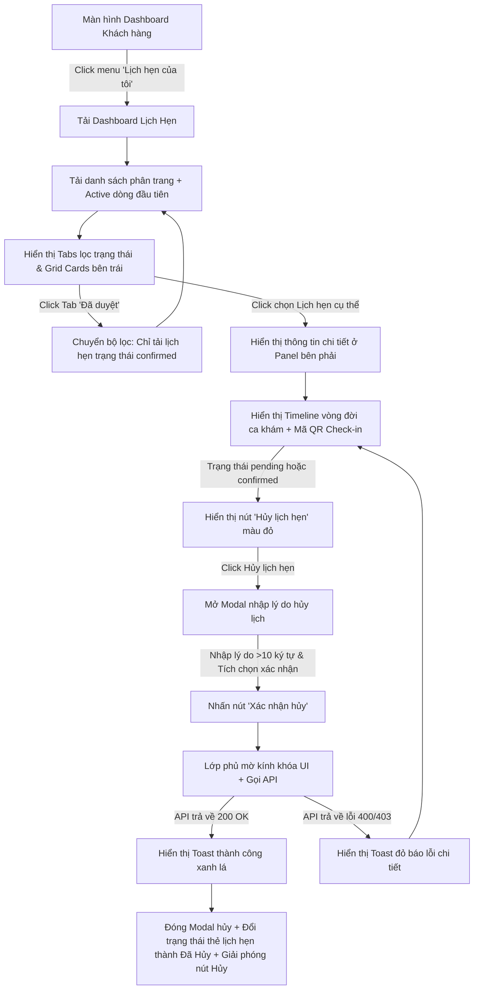

# 📐 UX Flow & State Transitions - Customer Appointment Management

Tài liệu này đặc tả chi tiết luồng trải nghiệm người dùng (User Experience Flow) xuyên suốt bảng điều khiển quản lý lịch hẹn của khách hàng tại phòng khám **MyPetClinic**.

---

## 1. Dòng Trải nghiệm Người dùng từng bước (UX Walkthrough Flow)

---

## 2. Đặc tả các Điểm chạm Giao diện y tế (UI Touchpoints Details)

### A. Bộ lọc Tab Trạng thái Lịch hẹn (Smart Tabs Filter)
* Thiết kế thanh chuyển đổi tab phẳng mờ kính, có gờ phân cách mỏng.
* Mỗi tab hiển thị tên trạng thái kèm số lượng bản ghi thực tế trong ngoặc đơn (Ví dụ: `Chờ duyệt (1)`, `Đã duyệt (2)`). Số lượng này giúp chủ nuôi biết ngay có lịch hẹn nào đang cần chú ý mà không cần click vào từng tab để kiểm tra.

### B. Thẻ Lịch hẹn (Appointment Card Layout)
* Trình bày thông tin tối giản nhưng đầy đủ:
  * Icon loài vật (`🐶` cho chó, `🐱` cho mèo) cạnh tên thú cưng.
  * Tên dịch vụ y tế chính hiển thị đậm (Bold).
  * Ngày giờ hẹn được format thân thiện tiếng Việt: `10:00 - Thứ 2, 15/06/2026`.
  * Badge trạng thái bo tròn góc, sử dụng bảng màu HSL mờ kính nhẹ tương ứng (Vàng cho Chờ duyệt, Xanh dương cho Đã duyệt, Đỏ cho Đã hủy).

### C. Khung hiển thị chi tiết (Slide-out Detail Panel)
* Trên máy tính, đây là panel cố định bên phải. Trên điện thoại, đây là một Bottom Sheet trượt lên toàn màn hình.
* **Timeline ca khám trực quan (Medical Timeline):**
  * Thiết kế sơ đồ tiến trình dạng chuỗi chấm tròn liên kết bằng đường kẻ nét đứt. Chấm tròn của trạng thái hiện tại sẽ nhấp nháy phát sáng (Pulse effect).
  * Giúp chủ nuôi theo dõi thời gian thực thú cưng của mình đang ở bước nào (Ví dụ: Đã check-in chờ khám -> Đang khám -> Đã hoàn thành).
* **Khu vực QR Code Check-in:**
  * Mã QR code được hiển thị ở chính giữa khung chi tiết, bao bọc bởi khung viền kính mờ tinh tế.
  * Bên dưới QR Code có nút bấm "Tải mã QR về máy" để lưu ảnh offline hoặc hiển thị nút phóng to mã QR trên toàn bộ màn hình điện thoại giúp nhân viên quét dễ dàng hơn dưới ánh sáng mạnh tại clinic.

### D. Hộp thoại Hủy lịch (Cancel Appointment Dialog Flow)
* Khi bấm nút hủy, Modal mở ra với hiệu ứng chuyển động mượt mà (Fade-in Zoom).
* Ô nhập lý do hủy có placeholder hướng dẫn: *"Xin vui lòng chia sẻ lý do hủy lịch hẹn y tế này để phòng khám cải thiện dịch vụ (ví dụ: bận ca trực đột xuất, thú cưng khỏe lại)..."*.
* Phía dưới ô nhập có bộ đếm ký tự động dạng `[đỏ]` nếu nhỏ hơn 10 ký tự, chuyển sang `[xanh]` khi đạt yêu cầu, giúp người dùng tự khắc phục lỗi validation trước khi submit.
