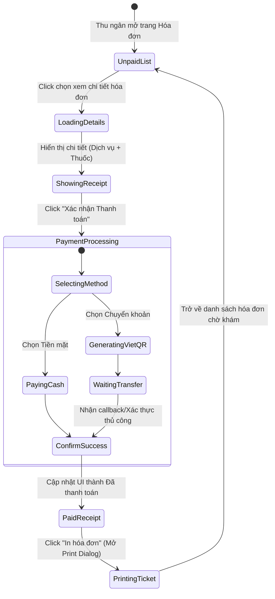

# 🎭 Behavioral Specification - Cashier & Invoicing

## 1. Biểu đồ Trạng thái Xử lý Hóa đơn của Thu ngân (Billing State Machine)

---

## 2. Ràng buộc Hành vi & Giao diện (Behavior Constraints)
- **VietQR Generation Dynamic:** Nếu chọn phương thức `Chuyển khoản (BankTransfer)`, hệ thống tự động sinh mã QR động theo định dạng tiêu chuẩn Napas 247, mã hóa đầy đủ số tiền thanh toán thực tế của hóa đơn để tránh khách hàng chuyển khoản sai số tiền.
- **Double Click Prevention:** Vô hiệu hóa nút "Xác nhận thanh toán" ngay khi vừa nhấn để tránh gửi trùng lặp request thanh toán lên server.
