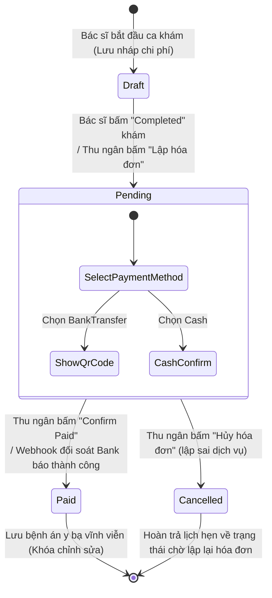

# 📊 Behavioral Specification - Cashier & Invoicing

Tài liệu đặc tả hành vi hệ thống, mô hình máy trạng thái hữu hạn (FSM) và các điều kiện ràng buộc chuyển đổi trạng thái của thực thể Hóa đơn.

---

## 1. Biểu đồ Máy Trạng thái Hóa đơn (Finite State Machine - FSM)

Trạng thái vòng đời của một hóa đơn (`Invoice`) trong hệ thống MyPetClinic được quản lý chặt chẽ theo sơ đồ Mermaid dưới đây:

---

## 2. Diễn giải chi tiết các chuyển dịch trạng thái (Transitions)

### 1. Khởi tạo nháp (`Draft`) sang Chờ thanh toán (`Pending`)
- **Tác nhân:** Bác sĩ thú y hoặc Lễ tân/Thu ngân.
- **Điều kiện kích hoạt:** Bác sĩ hoàn thành chẩn đoán và bấm kết thúc ca khám (`AppointmentStatus = Completed`).
- **Hành vi hệ thống:**
  - Hệ thống gom toàn bộ phí khám, giá thuốc, giá vắc-xin.
  - Tạo bản ghi `Invoice` mới ở trạng thái `Pending`, sinh số hóa đơn duy nhất `INV-yyyyMMdd-XXXX`.
  - Cập nhật trạng thái thanh toán của Lịch hẹn (`Appointment.PaymentStatus`) thành `Unpaid`.

### 2. Chờ thanh toán (`Pending`) sang Đã thanh toán (`Paid`)
- **Tác nhân:** Lễ tân/Thu ngân (hoặc hệ thống ngân hàng tự động).
- **Điều kiện kích hoạt:** Khách hàng thanh toán tiền mặt và thu ngân bấm xác nhận, hoặc khách quét mã QR động chuyển khoản thành công.
- **Hành vi hệ thống:**
  - Chạy Database Transaction:
    - Cập nhật `Invoice.Status = 'Paid'`.
    - Cập nhật `Invoice.PaidAt = DateTime.UtcNow`.
    - Cập nhật `Appointment.PaymentStatus = 'Paid'`.
  - Khóa vĩnh viễn hóa đơn, không cho phép sửa đổi chi tiết hóa đơn (`InvoiceItems`).
  - Ghi nhận doanh thu vào báo cáo tài chính phòng khám.

### 3. Chờ thanh toán (`Pending`) sang Đã hủy (`Cancelled`)
- **Tác nhân:** Thu ngân hoặc Admin.
- **Điều kiện kích hoạt:** Phát hiện bác sĩ kê sai thuốc, nhập thừa dịch vụ hoặc khách hàng từ chối dịch vụ trước khi thanh toán.
- **Hành vi hệ thống:**
  - Cập nhật `Invoice.Status = 'Cancelled'`.
  - Giải phóng lịch hẹn (`Appointment.PaymentStatus = 'Unpaid'`) để bác sĩ có thể điều chỉnh lại bệnh án lâm sàng hoặc lễ tân tiến hành lập lại hóa đơn đúng.

---

## 3. Các quy tắc ràng buộc bảo mật và nghiệp vụ (Business Rules Constraints)

- **Ngăn chặn thanh toán kép (Double Payment Prevention):**
  - Không cho phép gọi API `PUT /pay` nếu hóa đơn đã ở trạng thái `Paid`. Phải trả về lỗi `400 Bad Request` ngay tại tầng Service.
- **Khóa dữ liệu lịch sử (Immutability of Paid Invoices):**
  - Một khi hóa đơn đã chuyển sang trạng thái `Paid`, tất cả các API cập nhật hoặc xóa hóa đơn, xóa dòng tiền (`InvoiceItems`) đều bị cấm tuyệt đối đối với mọi vai trò người dùng (kể cả Admin). Điều này nhằm bảo toàn lịch sử sổ sách tài chính phục vụ quyết toán thuế cuối kỳ.
- **Đồng bộ hóa trạng thái khám bệnh:**
  - Hóa đơn chỉ được tạo khi trạng thái khám bệnh của lịch hẹn là `Completed`. Chặn đứng mọi hành vi lập hóa đơn cho các lịch hẹn khám còn đang trong trạng thái `Confirmed` (chờ khám) hoặc `InRoom` (đang khám lâm sàng).
- **Thời hạn thanh toán hóa đơn:**
  - Hóa đơn `Pending` quá **24 giờ** không có giao dịch xác nhận thanh toán sẽ tự động chuyển sang trạng thái `Cancelled` thông qua một Background Job tự động quét database lúc 00:00 hàng ngày, nhằm giải phóng hàng tồn kho thuốc bị giữ ảo.
