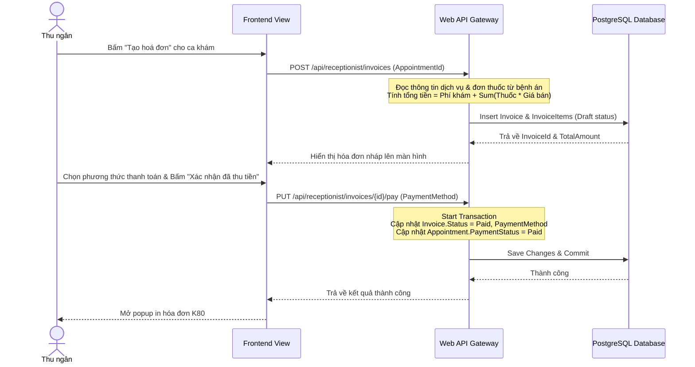

# 🛠️ Technical Specification - Cashier & Invoicing

## 🔗 Skills Liên Quan
- **BE-F02 (SOLID - SRP):** Tách biệt logic tính toán giá tiền hóa đơn (`InvoiceCalculator`) và logic xử lý giao dịch thanh toán (`PaymentProcessor`).
- **BE-A02 (Unit of Work / Transaction):** Đảm bảo ghi nhận thanh toán hóa đơn và cập nhật trạng thái thanh toán của lịch hẹn diễn ra đồng bộ, không bị lệch dữ liệu nếu mất kết nối giữa chừng.
- **BE-C02 (EF Core):** Sử dụng các thuộc tính Calculated/Sum trong database hoặc thực hiện tính toán trên bộ nhớ để đảm bảo hiệu năng tối ưu.

---

## 1. Sequence Diagram: Tạo & Xác nhận Thanh toán Hóa đơn



---

## 2. API Schema & DTOs

```csharp
public class CreateInvoiceRequest
{
    public Guid AppointmentId { get; set; }
}

public class PayInvoiceRequest
{
    public string PaymentMethod { get; set; } // Cash, BankTransfer
}

public class InvoiceDto
{
    public Guid Id { get; set; }
    public string InvoiceNumber { get; set; } // HĐ-20260610-001
    public Guid AppointmentId { get; set; }
    public decimal ServiceAmount { get; set; }
    public decimal MedicineAmount { get; set; }
    public decimal TotalAmount { get; set; }
    public string Status { get; set; } // Unpaid, Paid, Cancelled
    public string PaymentMethod { get; set; }
    public DateTime CreatedAt { get; set; }
    public List<InvoiceItemDto> Items { get; set; }
}

public class InvoiceItemDto
{
    public string Name { get; set; }
    public int Quantity { get; set; }
    public decimal UnitPrice { get; set; }
    public decimal TotalPrice { get; set; }
}
```
