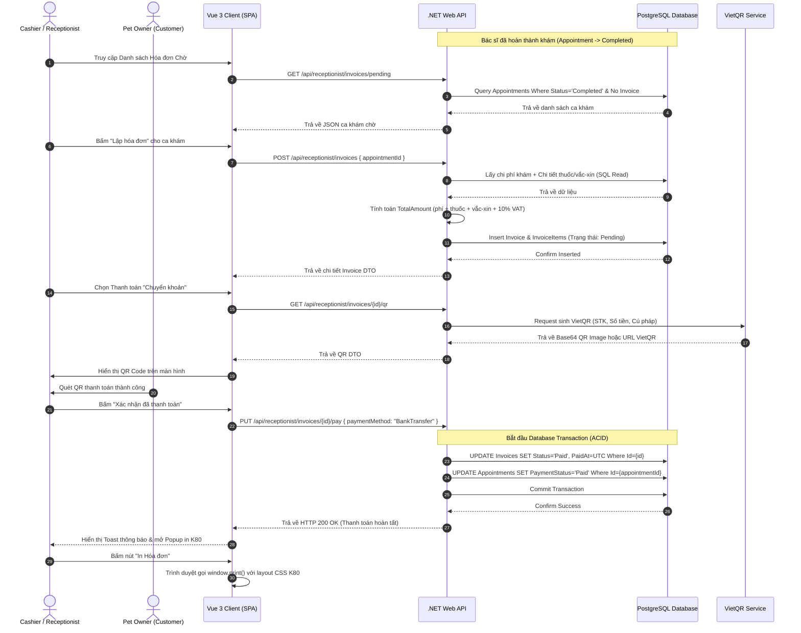

# 🛠️ Technical Specification - Cashier & Invoicing

Tài liệu thiết kế kỹ thuật chi tiết cho tính năng Lập hóa đơn và Thanh toán phòng khám thú y MyPetClinic.

---

## 1. Kiến trúc Tổng quát & Sơ đồ Tuần tự (Sequence Diagram)

Sơ đồ dưới đây mô tả luồng dữ liệu từ khi Bác sĩ hoàn thành ca khám, Thu ngân tạo hóa đơn nháp, hiển thị QR Code động, xác nhận thanh toán và cập nhật cơ sở dữ liệu đồng bộ.



---

## 2. Đặc tả Cơ sở Dữ liệu (Database Schema)

### Thực thể `Invoices` (Hóa đơn)
Lưu thông tin tổng hợp tài chính của một hóa đơn.

| Tên cột | Kiểu dữ liệu | Ràng buộc | Mô tả |
| :--- | :--- | :--- | :--- |
| **Id** | UUID / uniqueidentifier | Primary Key | Khóa chính hóa đơn |
| **AppointmentId** | UUID / uniqueidentifier | Foreign Key, Unique | Liên kết 1-1 với Lịch hẹn khám |
| **InvoiceNumber** | VARCHAR(50) | Not Null, Unique | Số hóa đơn tự sinh dạng `INV-yyyyMMdd-XXXX` |
| **TotalAmount** | DECIMAL(18, 2) | Not Null | Tổng tiền cần thanh toán (đã gồm VAT) |
| **PaymentMethod** | VARCHAR(20) | Nullable | Phương thức: `Cash`, `BankTransfer` |
| **Status** | VARCHAR(20) | Not Null | Trạng thái: `Pending`, `Paid`, `Cancelled` |
| **CreatedAt** | TIMESTAMP WITH TIME ZONE | Not Null | Thời điểm tạo hóa đơn |
| **PaidAt** | TIMESTAMP WITH TIME ZONE | Nullable | Thời điểm thanh toán thực tế |
| **CashierId** | UUID / uniqueidentifier | Foreign Key | Nhân viên xử lý thanh toán |

### Thực thể `InvoiceItems` (Chi tiết hóa đơn)
Lưu chi tiết từng dòng tiền trên hóa đơn để làm căn cứ in biên lai và đối soát kho.

| Tên cột | Kiểu dữ liệu | Ràng buộc | Mô tả |
| :--- | :--- | :--- | :--- |
| **Id** | UUID / uniqueidentifier | Primary Key | Khóa chính chi tiết hóa đơn |
| **InvoiceId** | UUID / uniqueidentifier | Foreign Key | Liên kết với bảng `Invoices` (Cascade Delete) |
| **ItemName** | VARCHAR(250) | Not Null | Tên dịch vụ hoặc tên thuốc/vắc-xin |
| **ItemType** | VARCHAR(30) | Not Null | Phân loại: `Service`, `Medicine`, `Vaccine` |
| **ReferenceId** | UUID / uniqueidentifier | Nullable | Khóa ngoại tham chiếu (ServiceId hoặc MedicineId) |
| **Quantity** | INT | Not Null | Số lượng sử dụng |
| **UnitPrice** | DECIMAL(18, 2) | Not Null | Đơn giá bán lẻ tại thời điểm xuất hóa đơn |
| **SubTotal** | DECIMAL(18, 2) | Not Null | Thành tiền dòng: `Quantity * UnitPrice` |

### Script SQL Khởi Tạo PostgreSQL
```sql
-- Tạo bảng Invoices
CREATE TABLE Invoices (
    Id UUID PRIMARY KEY DEFAULT gen_random_uuid(),
    AppointmentId UUID NOT NULL UNIQUE,
    InvoiceNumber VARCHAR(50) NOT NULL UNIQUE,
    TotalAmount DECIMAL(18, 2) NOT NULL CHECK (TotalAmount >= 0),
    PaymentMethod VARCHAR(20) NULL,
    Status VARCHAR(20) NOT NULL DEFAULT 'Pending',
    CreatedAt TIMESTAMP WITH TIME ZONE NOT NULL DEFAULT CURRENT_TIMESTAMP,
    PaidAt TIMESTAMP WITH TIME ZONE NULL,
    CashierId UUID NULL,
    CONSTRAINT fk_invoice_appointment FOREIGN KEY (AppointmentId) REFERENCES Appointments(Id) ON DELETE RESTRICT
);

-- Tạo bảng InvoiceItems
CREATE TABLE InvoiceItems (
    Id UUID PRIMARY KEY DEFAULT gen_random_uuid(),
    InvoiceId UUID NOT NULL,
    ItemName VARCHAR(250) NOT NULL,
    ItemType VARCHAR(30) NOT NULL CHECK (ItemType IN ('Service', 'Medicine', 'Vaccine')),
    ReferenceId UUID NULL,
    Quantity INT NOT NULL CHECK (Quantity > 0),
    UnitPrice DECIMAL(18, 2) NOT NULL CHECK (UnitPrice >= 0),
    SubTotal DECIMAL(18, 2) NOT NULL GENERATED ALWAYS AS (Quantity * UnitPrice) STORED,
    CONSTRAINT fk_invoice_items_invoice FOREIGN KEY (InvoiceId) REFERENCES Invoices(Id) ON DELETE CASCADE
);

-- Tạo Index tối ưu tìm kiếm và truy vấn báo cáo
CREATE INDEX idx_invoices_status ON Invoices(Status);
CREATE INDEX idx_invoices_number ON Invoices(InvoiceNumber);
CREATE INDEX idx_invoices_created_at ON Invoices(CreatedAt DESC);
CREATE INDEX idx_invoice_items_invoice_id ON InvoiceItems(InvoiceId);
```

---

## 3. Đặc tả C# DTOs & Validation

### CreateInvoiceRequest.cs
```csharp
using System.ComponentModel.DataAnnotations;

namespace MyPetClinic.Application.DTOs.Invoice
{
    public class CreateInvoiceRequest
    {
        [Required(ErrorMessage = "Mã lịch hẹn không được để trống")]
        public Guid AppointmentId { get; set; }
    }
}
```

### ConfirmPaymentRequest.cs
```csharp
using System.ComponentModel.DataAnnotations;

namespace MyPetClinic.Application.DTOs.Invoice
{
    public class ConfirmPaymentRequest
    {
        [Required(ErrorMessage = "Phương thức thanh toán bắt buộc nhập")]
        [RegularExpression("^(Cash|BankTransfer)$", ErrorMessage = "Phương thức thanh toán phải là Cash hoặc BankTransfer")]
        public string PaymentMethod { get; set; } = null!;
    }
}
```

### InvoiceDto.cs
```csharp
namespace MyPetClinic.Application.DTOs.Invoice
{
    public class InvoiceDto
    {
        public Guid Id { get; set; }
        public Guid AppointmentId { get; set; }
        public string InvoiceNumber { get; set; } = null!;
        public decimal TotalAmount { get; set; }
        public string? PaymentMethod { get; set; }
        public string Status { get; set; } = null!;
        public DateTime CreatedAt { get; set; }
        public DateTime? PaidAt { get; set; }
        public string CustomerName { get; set; } = null!;
        public string PetName { get; set; } = null!;
        public List<InvoiceItemDto> Items { get; set; } = new();
    }

    public class InvoiceItemDto
    {
        public Guid Id { get; set; }
        public string ItemName { get; set; } = null!;
        public string ItemType { get; set; } = null!;
        public int Quantity { get; set; }
        public decimal UnitPrice { get; set; }
        public decimal SubTotal { get; set; }
    }
}
```
