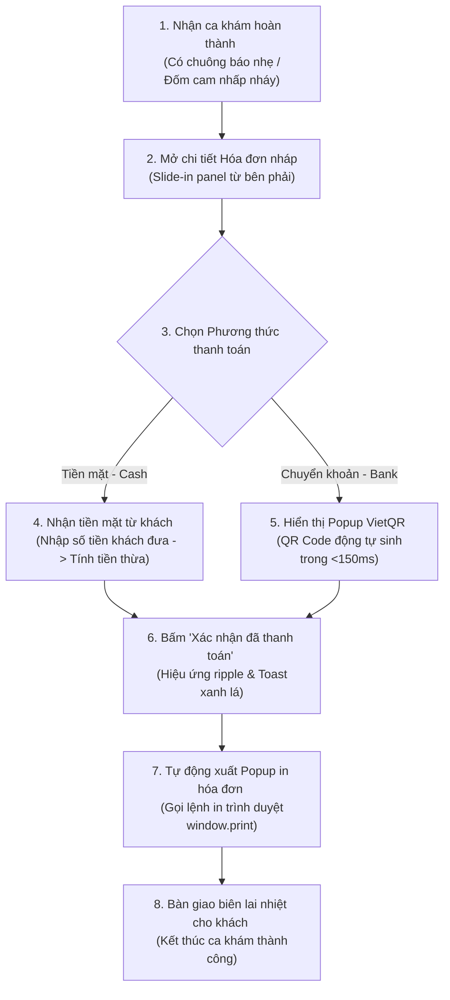

# 🗺️ UX Flow & Interactions - Cashier & Invoicing

Tài liệu đặc tả luồng trải nghiệm người dùng (UX Journey Map), các điểm chạm tương tác và hiệu ứng giao diện (Micro-animations) dành cho Thu ngân khi lập và thanh toán hóa đơn.

---

## 1. Bản đồ Hành trình Trải nghiệm của Thu ngân (User Journey Map)



---

## 2. Chi tiết các Bước Tương tác & Điểm chạm (Touchpoints)

### Bước 1: Thông báo ca khám mới cần thu tiền
- **Hiện tượng UI:** Khi bác sĩ hoàn thành ca khám lâm sàng ở phòng khám trong, tại màn hình Dashboard của Lễ tân/Thu ngân sẽ lập tức hiển thị một đốm sáng nhấp nháy màu cam (Pulse Animation) tại tab "Hóa đơn".
- **Hành vi:** Thu ngân click vào tab này để load danh sách hóa đơn chờ thanh toán.

### Bước 2: Xem chi tiết hóa đơn nháp (Draft Invoice View)
- **Tương tác:** Thu ngân click chọn dòng hóa đơn chờ trong danh sách.
- **Hiệu ứng:** Vùng chi tiết hóa đơn bên phải sẽ thực hiện một hiệu ứng chuyển động trượt nhẹ (Slide-in) từ phải qua trái trong 250ms với độ mờ mượt mà.
- **Thiết kế giao diện:** Chi tiết hóa đơn được hiển thị dạng thẻ mờ kính (Glassmorphism) với nền mờ và viền phát sáng nhẹ, giúp thu ngân tập trung hoàn toàn vào nội dung hóa đơn mà không bị rối mắt bởi các thành phần khác.

### Bước 3: Lựa chọn hình thức và thực hiện thanh toán
- **Tương tác:** Thu ngân chọn radio button: `Tiền mặt` hoặc `Chuyển khoản QR`.
- **Phản hồi giao diện:**
  - Nếu chọn `Tiền mặt`: Hiện ô nhập nhanh "Số tiền khách đưa" (Cash Received). Hệ thống tự động tính toán số tiền thừa trả khách theo thời gian thực (Real-time calculation) để tránh tính nhẩm sai.
  - Nếu chọn `Chuyển khoản`: Mở một cửa sổ Popup (Modal) mờ kính phủ mờ phần nền sau (Backdrop Blur: 8px). Trên Popup hiển thị mã VietQR động cùng thông tin chuyển khoản rõ ràng. Có một biểu tượng Loading xoay tròn nhẹ thể hiện hệ thống đang chờ tín hiệu giao dịch.

### Bước 4: Hoàn tất thanh toán và In hóa đơn
- **Tương tác:** Thu ngân bấm nút "Xác nhận đã thanh toán" màu xanh ngọc.
- **Hiệu ứng:** 
  - Nút bấm sẽ thực hiện hiệu ứng gợn sóng (Ripple Effect).
  - Xuất hiện Toast Notification màu xanh lá dịu mắt góc trên bên phải màn hình: *"Thanh toán thành công hóa đơn INV-20260611-0001!"* trong 3 giây.
  - Lập tức kích hoạt popup xem trước bản in nhiệt K80 và mở hộp thoại in mặc định của hệ điều hành. Thu ngân chỉ cần nhấn `Enter` là máy in nhiệt bàn lễ tân sẽ in biên lai ra ngay.

---

## 3. Đặc tả Các hiệu ứng Chuyển động (CSS Micro-animations)

Đoạn mã CSS dưới đây quy định các hiệu ứng chuyển động sinh động cho nút bấm và popup trong luồng thanh toán:

```css
/* Hiệu ứng nhấp nháy báo hiệu hóa đơn mới cần thanh toán */
@keyframes pulse-orange {
  0% {
    box-shadow: 0 0 0 0 rgba(249, 115, 22, 0.4);
  }
  70% {
    box-shadow: 0 0 0 10px rgba(249, 115, 22, 0);
  }
  100% {
    box-shadow: 0 0 0 0 rgba(249, 115, 22, 0);
  }
}

.pulse-badge {
  background-color: hsl(20, 95%, 50%);
  border-radius: 50%;
  animation: pulse-orange 2s infinite;
}

/* Hiệu ứng trượt mượt mà cho panel chi tiết hóa đơn */
.slide-in-detail {
  transform: translateX(100%);
  animation: slideIn 0.3s cubic-bezier(0.16, 1, 0.3, 1) forwards;
}

@keyframes slideIn {
  to {
    transform: translateX(0);
  }
}

/* Hiệu ứng xuất hiện Popup QR Code */
.modal-fade-in {
  opacity: 0;
  transform: scale(0.95);
  animation: modalEnter 0.2s ease-out forwards;
}

@keyframes modalEnter {
  to {
    opacity: 1;
    transform: scale(1);
  }
}
```
