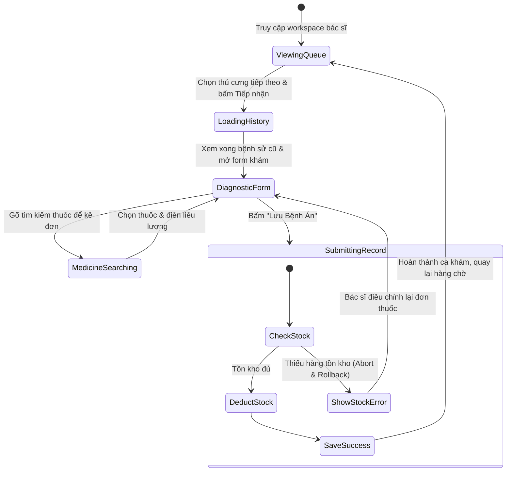

# 🎭 Behavioral Specification - Clinical Diagnosis & Treatment

## 1. Biểu đồ Trạng thái Màn hình làm việc của Bác sĩ (Doctor Clinic Flow)

---

## 2. Các Ràng buộc Phản ứng Giao diện (Interactive Constraints)
- **Real-time Input Validation:** Ô số lượng thuốc kê đơn không được phép nhận số âm hoặc số 0.
- **Stock Limit Alert:** Ngay khi bác sĩ nhập số lượng lớn hơn tồn kho hiện hữu, viền của dòng thuốc đó phải lập tức chuyển sang màu đỏ kèm tooltip: `"Vượt quá số lượng tồn kho còn lại!"`.
